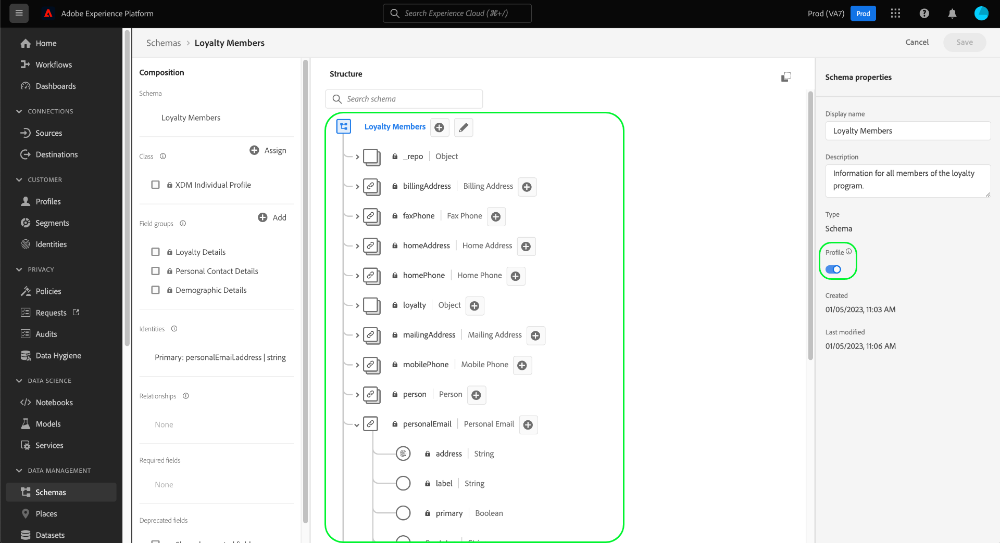
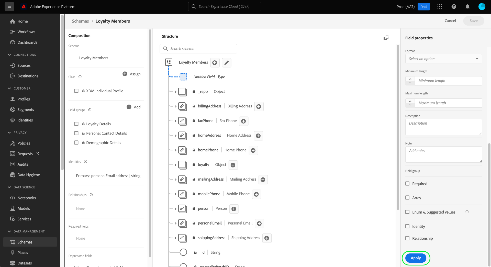
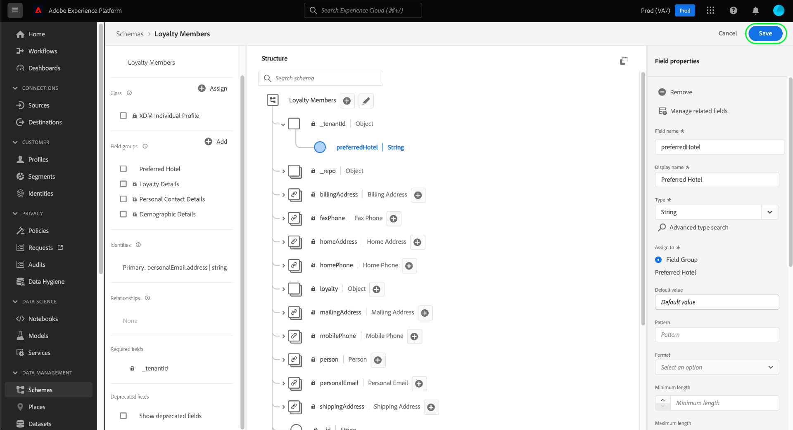

# Bepaal een verhouding tussen twee schema&#39;s gebruikend de Redacteur van het Schema

De mogelijkheid om de relaties tussen uw klanten en hun interactie met uw merk op verschillende kanalen te begrijpen is een belangrijk onderdeel van het Adobe Experience Platform. Het bepalen van deze verhoudingen binnen de structuur van uw schema&#39;s van de Gegevens van de Ervaring van het Model (XDM) staat u toe om complexe inzichten in uw klantengegevens te bereiken.

Dit document verstrekt een zelfstudie voor het bepalen van een één-op-één verhouding tussen twee schema&#39;s die door uw organisatie worden bepaald gebruikend de Redacteur van het Schema in het gebruikersinterface van het Platform van de Ervaring. Voor stappen bij het bepalen van schemaverhoudingen gebruikend API, zie de zelfstudie over het [bepalen van een verhouding gebruikend de Registratie API](relationship-api.md)van het Schema.

## Aan de slag

Deze zelfstudie vereist een goed begrip van XDM System en de Schema Editor in de interface van het Experience Platform. Lees de volgende documentatie voordat u met deze zelfstudie begint:

* [XDM-systeem in ervaringsplatform](../home.md): Een overzicht van XDM en zijn implementatie in het Platform van de Ervaring.
* [Basisbeginselen van de schemacompositie](../schema/composition.md): Een inleiding van de bouwstenen van schema&#39;s XDM.
* [Een schema maken met de Schema-editor](create-schema-ui.md): Een zelfstudie over de basisbeginselen van het werken met de Schema-editor.

## Een bron- en doelschema definiëren

Verwacht wordt dat u reeds de twee schema&#39;s hebt gecreeerd die in de verhouding zullen worden bepaald. Voor demonstratiedoeleinden creëert deze zelfstudie een relatie tussen leden van het loyaliteitsprogramma van een organisatie (gedefinieerd in een schema &quot;Loyalty Member&quot;) en hun favoriete hotels (gedefinieerd in een &quot;Hotels&quot;-schema).

De verhoudingen van het schema worden vertegenwoordigd door een **bronschema** die een gebied hebben dat naar een ander gebied binnen een **bestemmingsschema** verwijst. In de stappen die volgen, zullen de &quot;Leden van de Loyalty&quot;het bronschema zijn, terwijl &quot;Hotels&quot;als bestemmingsschema zal handelen.

Voor verwijzingsdoeleinden, beschrijven de volgende secties de structuur van elk schema dat in dit leerprogramma wordt gebruikt alvorens een verhouding is bepaald.

### Schema voor leden van Loyalty

Het bronschema &quot;Leden van de Loyalty&quot;is het schema dat in het leerprogramma voor het [creëren van een schema in UI](create-schema-ui.md)werd geconstrueerd. Het omvat een &quot;loyalty&quot;voorwerp onder zijn \_huurderId&quot;namespace, die verscheidene loyaliteitspecifieke gebieden omvat. Één van deze gebieden, &quot;loyaltyId&quot;, dient als primaire identiteit voor het schema onder &quot;E-mail&quot;namespace. Zoals gezien onder de Eigenschappen _van het_ Schema, is dit schema toegelaten voor gebruik in het Profiel [van de Klant in](../../profile/home.md)real time.

### Hotelschema

Het bestemmingsschema &quot;Hotels&quot;bevat gebieden die een hotel beschrijven, zijn adres, merk, aantal ruimten, en sterclassificatie omvatten. Het veld &quot;hotelId&quot; fungeert als primaire identiteit voor het schema onder de naamruimte &quot;ECID&quot;. In tegenstelling tot &quot;Loyalty Leden&quot;, is dit schema niet toegelaten voor het Profiel van de Klant in real time.

## Een relatie-mix maken

>[!NOTE] Deze stap wordt slechts vereist als uw bronschema geen specifiek koord-type gebied heeft dat als verwijzing naar een ander schema moet worden gebruikt. Als dit veld al in uw bronschema is gedefinieerd, gaat u verder met de volgende stap voor het [definiëren van een relatieveld](#relationship-field).

Om een verband tussen twee schema&#39;s te bepalen, moet het bronschema een specifiek gebied hebben dat als verwijzing naar het bestemmingsschema moet worden gebruikt. U kunt dit veld toevoegen aan het bronschema door een nieuwe mix te maken.

Klik eerst op **Toevoegen** in de sectie _Mixins_ .

Het dialoogvenster _Mixin_ toevoegen wordt weergegeven. Klik hier op **Nieuwe mixer** maken. Voer in de tekstvelden die worden weergegeven een weergavenaam en beschrijving in voor de nieuwe mix. Klik op **Mixin** toevoegen wanneer u klaar bent.

 

Het canvas verschijnt weer met de tekst &#39;Loyalty Relationship&#39; in de sectie _Mixins_ . Klik op de mixnaam en klik vervolgens op Veld **** toevoegen naast het veld &#39;Loyalty-leden&#39; op hoofdniveau.

Er wordt een nieuw veld weergegeven op het canvas onder de naamruimte &quot;\_huurderId&quot;. Geef onder _Veldeigenschappen_ een veldnaam en weergavenaam voor het veld op en stel het type in op &quot;String&quot;.

Klik op **Toepassen** als u klaar bent.

Het bijgewerkte veld &quot;loyaltyRelationship&quot; wordt weergegeven op het canvas. Klik op **Opslaan** om de wijzigingen in het schema te voltooien.

## Een relatieveld definiëren voor het bronschema {#relationship-field}

Zodra uw bronschema een specifiek die verwijzingsgebied heeft wordt bepaald, kunt u het als relatiegebied aanwijzen.

Klik op het referentieveld op het canvas en schuif omlaag onder _Veldeigenschappen_ totdat het selectievakje **Relatie** wordt weergegeven. Schakel het selectievakje in om de vereiste parameters voor het configureren van een relatieveld weer te geven.

Klik dropdown voor het Schema **van de** Verwijzing en selecteer het bestemmingsschema voor de verhouding (&quot;Hotels&quot;in dit voorbeeld). Als het bestemmingsschema unie-toegelaten is, wordt het gebied van Namespace van de Identiteit van de **Verwijzing** automatisch geplaatst aan namespace van de primaire identiteit van het bestemmingsschema. Als voor het schema geen primaire identiteit is gedefinieerd, moet u de naamruimte die u wilt gebruiken handmatig selecteren in het vervolgkeuzemenu. Klik op **Toepassen** als u klaar bent.

Het veld wordt weergegeven als een relatie op het canvas met de naam en naamruimte voor de referentie-id van het doelschema. Klik op **Opslaan** om de wijzigingen op te slaan en de workflow te voltooien.

## Volgende stappen

Door dit leerprogramma te volgen, hebt u met succes een één-op-één verhouding tussen twee schema&#39;s gebruikend de Redacteur van het Schema gecreeerd. Voor stappen op hoe te om verhoudingen te bepalen die API gebruiken, zie de zelfstudie over het [bepalen van een verhouding gebruikend de Registratie API](relationship-api.md)van het Schema.