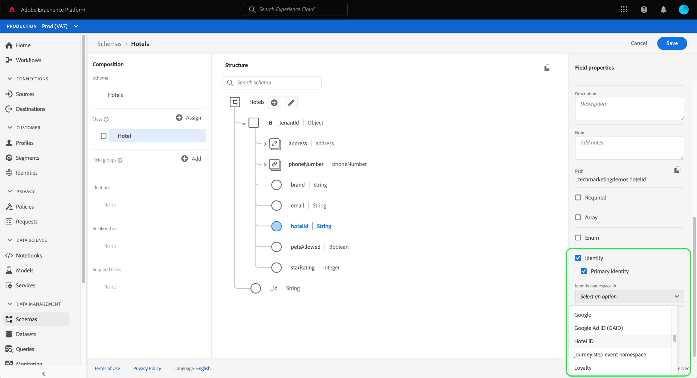

# Bepaal een één-op-één verhouding tussen twee schema&#39;s gebruikend [!DNL Schema Editor] {#relationship-ui}

>[!CONTEXTUALHELP]
>id="platform_schemas_relationships"
>title="Schema-relaties"
>abstract="Schema&#39;s die tot verschillende klassen behoren, kunnen via relatievelden contextueel worden gekoppeld, zodat u complexere segmentatieregels kunt maken. Zie de documentatie voor meer informatie over schemaverhoudingen."

>[!CONTEXTUALHELP]
>id="platform_xdm_1to1_reference_schema"
>title="Referentieschema"
>abstract="Selecteer het schema waarmee u een relatie wilt maken. Dit schema kan een andere klasse zijn dan het huidige schema. Zie de documentatie voor meer informatie over schemaverhoudingen."

>[!CONTEXTUALHELP]
>id="platform_xdm_1to1_identity_namespace"
>title="Naamruimte van verwijzing"
>abstract="De naamruimte (type) voor het primaire identiteitsveld van het referentieschema. Het referentieschema moet een bestaand primair identiteitsveld hebben om aan een relatie te kunnen deelnemen. Zie de documentatie voor meer informatie over schemaverhoudingen."

De mogelijkheid om de relaties tussen uw klanten en hun interactie met uw merk op verschillende kanalen te begrijpen is een belangrijk onderdeel van Adobe Experience Platform. Deze relaties definiëren binnen de structuur van uw [!DNL Experience Data Model] (XDM) schema&#39;s staan u toe om complexe inzichten in uw klantengegevens te bereiken.

Hoewel schemarelaties kunnen worden afgeleid door het gebruik van het union-schema en [!DNL Real-time Customer Profile]Dit geldt alleen voor schema&#39;s die dezelfde klasse delen. Om een verband tussen twee schema&#39;s te vestigen die tot verschillende klassen behoren, moet een specifiek relatiegebied aan een bronschema worden toegevoegd, dat de identiteit van een bestemmingsschema van verwijzingen voorziet.

Dit document bevat een zelfstudie voor het definiëren van een relatie tussen twee schema&#39;s met behulp van de Schema-editor in het dialoogvenster [!DNL Experience Platform] gebruikersinterface. Raadpleeg de zelfstudie voor meer informatie over het definiëren van schema-relaties met de API [een relatie definiëren met de API voor het schemaregister](relationship-api.md).

>[!NOTE]
>
>Raadpleeg de handleiding voor meer informatie over het maken van een vele-op-één relatie in Adobe Real-time Customer Data Platform B2B Edition [B2B-relaties maken](./relationship-b2b.md).

## Aan de slag

Deze zelfstudie vereist een goed begrip van [!DNL XDM System] en de Schema-editor in de [!DNL Experience Platform] UI. Lees de volgende documentatie voordat u met deze zelfstudie begint:

* [XDM-systeem in Experience Platform](../home.md): Een overzicht van XDM en zijn implementatie in [!DNL Experience Platform].
* [Basisbeginselen van de schemacompositie](../schema/composition.md): Een inleiding van de bouwstenen van schema&#39;s XDM.
* [Een schema maken met de opdracht [!DNL Schema Editor]](create-schema-ui.md): Een zelfstudie waarin de basisbeginselen van het werken met de [!DNL Schema Editor].

## Een bron- en doelschema definiëren

Verwacht wordt dat u reeds de twee schema&#39;s hebt gecreeerd die in de verhouding zullen worden bepaald. Voor demonstratiedoeleinden creëert deze zelfstudie een relatie tussen leden van het loyaliteitsprogramma van een organisatie (gedefinieerd in een &quot;[!DNL Loyalty Members]&quot; schema) en hun favoriete hotel (gedefinieerd in &quot;[!DNL Hotels]&quot; schema).

>[!IMPORTANT]
>
>Om een relatie tot stand te brengen, moeten beide schema&#39;s primaire identiteiten hebben bepaald en geschikt zijn gemaakt voor [!DNL Real-time Customer Profile]. Zie de sectie over [een schema inschakelen voor gebruik in profiel](./create-schema-ui.md#profile) in de zelfstudie van de schemaverwezenlijking als u begeleiding op hoe te om uw schema&#39;s dienovereenkomstig te vormen vereist.

Schemarelaties worden vertegenwoordigd door een specifiek veld binnen een **bronschema** dat verwijst naar een ander veld binnen een **doelschema**. In de volgende stappen: &quot;[!DNL Loyalty Members]&quot; wordt het bronschema, terwijl &quot;[!DNL Hotels]&quot; fungeert als het doelschema.

Voor verwijzingsdoeleinden, beschrijven de volgende secties de structuur van elk schema dat in dit leerprogramma wordt gebruikt alvorens een verhouding is bepaald.

### [!DNL Loyalty Members] schema

Het bronschema &quot;[!DNL Loyalty Members]&quot; is gebaseerd op de [!DNL XDM Individual Profile] en is het schema dat in de zelfstudie voor [het creëren van een schema in UI](create-schema-ui.md). Het omvat een `loyalty` object onder `_tenantId` namespace, die verscheidene loyaliteitsspecifieke gebieden omvat. Een van deze velden, `loyaltyId`, dient als primaire identiteit voor het schema onder het [!UICONTROL Email] naamruimte. Zoals onder **[!UICONTROL Schema Properties]**, is dit schema ingeschakeld voor gebruik in [!DNL Real-time Customer Profile].

### [!DNL Hotels] schema

Het doelschema &quot;[!DNL Hotels]&quot; is gebaseerd op een aangepaste &quot;[!DNL Hotels]&quot; en bevat velden die een hotel beschrijven.

Om aan een verhouding deel te nemen, moet het bestemmingsschema een primaire identiteit hebben. In dit voorbeeld wordt `hotelId` wordt gebruikt als primaire identiteit, gebruikend een douane &quot;identiteitskaart van het Hotel namespace.

>[!NOTE]
>
>Als u wilt leren hoe u aangepaste naamruimten kunt maken, raadpleegt u de [Identiteitsdocumentatie](../../identity-service/namespaces.md#manage-namespaces).

Zodra de primaire identiteit is geplaatst, moet het bestemmingsschema dan worden toegelaten voor [!DNL Real-time Customer Profile].

## Een veldgroep met een relatieschema maken

>[!NOTE]
>
>Deze stap wordt slechts vereist als uw bronschema geen specifiek tekenreeks-type gebied heeft dat als verwijzing naar het bestemmingsschema moet worden gebruikt. Als dit veld al in uw bronschema is gedefinieerd, gaat u verder met de volgende stap van [relatieveld definiëren](#relationship-field).

Om een verband tussen twee schema&#39;s te bepalen, moet het bronschema een specifiek gebied hebben dat als verwijzing naar het bestemmingsschema moet worden gebruikt. U kunt dit gebied aan het bronschema toevoegen door een nieuwe groep van het schemagebied te creëren.

Begin door te selecteren **[!UICONTROL Add]** in de **[!UICONTROL Field groups]** sectie.

De [!UICONTROL Add field group] wordt weergegeven. Selecteer **[!UICONTROL Create new field group]**. Voer in de tekstvelden die worden weergegeven een weergavenaam en beschrijving in voor de nieuwe veldgroep. Selecteren **[!UICONTROL Add field groups]** wanneer gereed.

Het canvas verschijnt opnieuw met &quot;[!DNL Favorite Hotel]&quot; weergegeven in de **[!UICONTROL Field groups]** sectie. Selecteer de naam van de veldgroep en selecteer **[!UICONTROL Add field]** naast het hoofdniveau `Loyalty Members` veld.

Er wordt een nieuw veld weergegeven op het canvas onder de `_tenantId` naamruimte. Onder **[!UICONTROL Field properties]** geeft u een veldnaam en weergavenaam voor het veld op en stelt u het type in op &quot;[!UICONTROL String]&quot;.

Als u klaar bent, selecteert u **[!UICONTROL Apply]**.

De bijgewerkte `favoriteHotel` wordt weergegeven op het canvas. Selecteren **[!UICONTROL Save]** om uw wijzigingen in het schema te voltooien.

## Een relatieveld definiëren voor het bronschema {#relationship-field}

Zodra uw bronschema een specifiek die verwijzingsgebied heeft wordt bepaald, kunt u het als relatiegebied aanwijzen.

>[!NOTE]
>
>In de onderstaande stappen wordt beschreven hoe u een relatieveld definieert met behulp van de besturingselementen voor rechterspoor op het canvas. Als u toegang hebt tot de Real-Time CDP B2B Edition, kunt u ook een een-op-een relatie definiëren met behulp van de [zelfde dialoogvenster](./relationship-b2b.md#relationship-field) zoals wanneer het creëren van vele-aan-één verhoudingen.

Selecteer `favoriteHotel` veld op het canvas, schuiven vervolgens omlaag onder **[!UICONTROL Field properties]** tot de **[!UICONTROL Relationship]** wordt weergegeven. Schakel het selectievakje in om de vereiste parameters voor het configureren van een relatieveld weer te geven.

Vervolgkeuzelijst selecteren voor **[!UICONTROL Reference schema]** en selecteer het bestemmingsschema voor de verhouding (&quot;[!DNL Hotels]&quot; in dit voorbeeld). Als het doelschema is ingeschakeld voor [!DNL Profile]de **[!UICONTROL Reference identity namespace]** wordt het veld automatisch ingesteld op de naamruimte van de primaire identiteit van het doelschema. Als voor het schema geen primaire identiteit is gedefinieerd, moet u de naamruimte die u wilt gebruiken handmatig selecteren in het vervolgkeuzemenu. Selecteren **[!UICONTROL Apply]** wanneer gereed.

De `favoriteHotel` Het veld wordt nu gemarkeerd als een relatie op het canvas en geeft de naam en naamruimte voor de referentie-id van het doelschema weer. Selecteren **[!UICONTROL Save]** om uw wijzigingen op te slaan en de workflow te voltooien.

## Volgende stappen

Door dit leerprogramma te volgen, hebt u met succes een één-aan-één verhouding tussen twee schema&#39;s gecreeerd gebruikend [!DNL Schema Editor]. Raadpleeg de zelfstudie voor meer informatie over het definiëren van relaties met de API [een relatie definiëren met de API voor het schemaregister](relationship-api.md).
