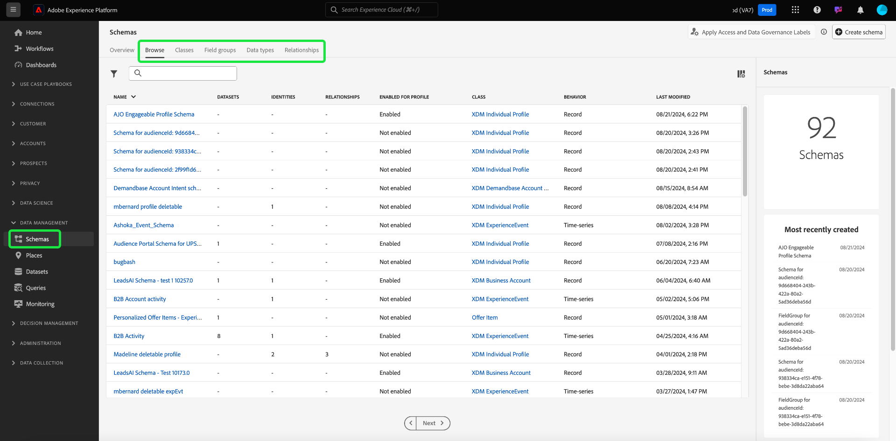

# XDM-bronnen verkennen in de gebruikersinterface

In Adobe Experience Platform worden alle XDM-bronnen (Experience Data Model) opgeslagen in de [!DNL Schema Library], inclusief standaardbronnen die worden geleverd door Adobe en aangepaste bronnen die zijn gedefinieerd door uw organisatie. In het Experience Platform UI, kunt u de structuur en de gebieden van om het even welk bestaand schema, klasse bekijken, mixin, of gegevenstype in [!DNL Schema Library]. Dit is vooral nuttig wanneer het plannen van en het voorbereidingen treffen voor gegevensopname, aangezien UI informatie over de verwachte gegevenstypes en gebruiksgevallen van elk gebied verstrekt door deze middelen XDM verstrekt.

Deze zelfstudie behandelt de stappen voor het verkennen van bestaande schema&#39;s, klassen, mixins, en gegevenstypes in Experience Platform UI.

## Een XDM-resource {#lookup} opzoeken

Selecteer **[!UICONTROL Schema&#39;s]** in de linkernavigatie in de interface van het Platform. De [!UICONTROL Schemas] werkruimte verstrekt een **[!UICONTROL Browse]** lusje om alle bestaande middelen XDM in uw organisatie, samen met extra specifieke lusjes voor het onderzoeken van **[!UICONTROL Klassen]**, **[!UICONTROL Mixins]**, en **[!UICONTROL Gegevenstypes]** specifiek te onderzoeken.

Op [!UICONTROL Browse] lusje, kunt u het filterpictogram () gebruiken om controles in de linkerspoorstaaf te openbaren om onderaan vermelde resultaten te beperken.

Als u bijvoorbeeld de lijst wilt filteren zodat alleen standaardgegevenstypen worden weergegeven die door Adobe worden geleverd, selecteert u **[!UICONTROL Datatype]** en **[!UICONTROL Adobe]** onder respectievelijk **[!UICONTROL Type]** en **[!UICONTROL Eigenaar]**.

Met de schakeloptie **[!UICONTROL Opgenomen in profiel]** kunt u resultaten filteren om alleen bronnen weer te geven die worden gebruikt in schema&#39;s die zijn ingeschakeld voor gebruik in [Real-time klantprofiel](../../profile/home.md).

U kunt de zoekbalk ook gebruiken om de resultaten verder omlaag te brengen. Wanneer u naar een termijn zoekt, vertegenwoordigen de hoogste punten middelen de waarvan namen de onderzoeksvraag aanpassen. Onder deze punten, onder **[!UICONTROL Standaard Gebieden]**, zullen om het even welke middelen die gebieden bevatten die de vraag aanpassen worden vermeld. Dit staat u toe om naar middelen te zoeken XDM die op het type van gegevens worden gebaseerd zij bevatten, zonder het moeten de naam van het middel vooraf kennen.

Wanneer u de bron hebt gevonden die u wilt verkennen, selecteert u de naam in de lijst om de structuur ervan op het canvas weer te geven.

## Een XDM-bron zoeken op het canvas {#explore}

Wanneer u een bron hebt geselecteerd, wordt de structuur ervan geopend in het canvas.

Alle objecten-type gebieden die sub-eigenschappen bevatten worden doen ineenstorten door gebrek wanneer zij eerst in het canvas verschijnen. Als u de subeigenschappen van een veld wilt weergeven, selecteert u het pictogram naast de naam.

### Door het systeem gegenereerde velden {#system-fields}

Sommige veldnamen worden voorafgegaan door een onderstrepingsteken, zoals `_repo` en `_id`. Deze vertegenwoordigen placeholders voor gebieden die het systeem automatisch zal produceren en toewijzen aangezien de gegevens worden opgenomen.

Daarom moeten de meeste van deze velden van de gegevensstructuur worden uitgesloten wanneer u gegevens in het Platform opneemt. De belangrijkste uitzondering op deze regel is het [`_{TENANT_ID}` gebied](../api/getting-started.md#know-your-tenant_id), dat alle gebieden XDM die onder uw organisatie worden gecreeerd namespaced onder moeten zijn.

### Datatypen {#data-types}

Voor elk veld dat op het canvas wordt weergegeven, wordt het corresponderende gegevenstype naast de naam weergegeven en wordt in één oogopslag het type gegevens aangegeven dat het veld verwacht voor opname.

Om het even welk gegevenstype dat met vierkante haakjes (`[]`) wordt toegevoegd vertegenwoordigt een serie van dat bepaalde gegevenstype. Een gegevenstype van **[!UICONTROL String]\[]** geeft bijvoorbeeld aan dat het veld een array van tekenreekswaarden verwacht. Een gegevenstype van **[!UICONTROL Payment Item]\[]** geeft een array van objecten aan die voldoen aan het gegevenstype [!UICONTROL Payment Item].

Als een arrayveld is gebaseerd op een objecttype, kunt u het pictogram ervan op het canvas selecteren om de verwachte kenmerken voor elk arrayitem weer te geven.

### [!UICONTROL Veldeigenschappen] {#field-properties}

Wanneer u de naam van een veld op het canvas selecteert, wordt het rechterspoor bijgewerkt om details over dat veld weer te geven onder **[!UICONTROL Veldeigenschappen]**. Dit kan een beschrijving bevatten van het bedoelde gebruiksgeval van het veld, standaardwaarden, patronen, indelingen, of het veld al dan niet is vereist, enzovoort.

Als het veld dat u inspecteert een opsommingsveld is, geeft de rechterspoorstaaf ook de acceptabele waarden weer die het veld verwacht te ontvangen.

### Identiteitsvelden {#identity}

Wanneer het inspecteren van schema&#39;s die identiteitsgebieden bevatten, zijn deze gebieden vermeld in het linkerspoor onder de klasse of de mengeling die hen aan het schema verstrekt. Selecteer de naam van het identiteitsveld in de linkerrail om het veld op het canvas weer te geven, ongeacht hoe diep het veld is genest.

Identiteitsvelden worden op het canvas gemarkeerd met een vingerafdrukpictogram (). Als u de naam van het identiteitsgebied selecteert, kunt u extra informatie zoals [identity namespace](../../identity-service/namespaces.md) bekijken en of het gebied de primaire identiteit voor het schema is of niet.

>[!NOTE]
>
>Zie de handleiding bij [het definiëren van identiteitsvelden](./fields/identity.md) voor meer informatie over identiteitsvelden en hun relatie met services voor downstreamPlatforms.

### Relatievelden {#relationship}

Als u een schema inspecteert dat een relatiegebied bevat, zal het gebied in de linkerspoorstaaf onder **[!UICONTROL Verhoudingen]** worden vermeld. Selecteer de naam van het relatieveld in de linkerrail om het veld op het canvas weer te geven, ongeacht hoe diep het veld is genest.

De gebieden van de verhouding worden ook uniek benadrukt in het canvas, die de naam van het bestemmingsschema tonen dat de gebiedsverwijzingen. Als u de naam van het relatieveld selecteert, kunt u de identiteitsnaamruimte van de primaire identiteit van het bestemmingsschema in het juiste spoor bekijken.

>[!NOTE]
>
>Zie het leerprogramma op [het creëren van een verhouding in UI](../tutorials/create-schema-ui.md) voor meer informatie over het gebruik van verhoudingen in schema&#39;s XDM.

## Volgende stappen

In dit document wordt beschreven hoe u bestaande XDM-bronnen kunt verkennen in de gebruikersinterface van het Experience Platform. Voor meer informatie over de verschillende eigenschappen van [!UICONTROL Schemas] werkruimte en [!DNL Schema Editor], zie [[!UICONTROL Schemas] werkruimteoverzicht](./overview.md).