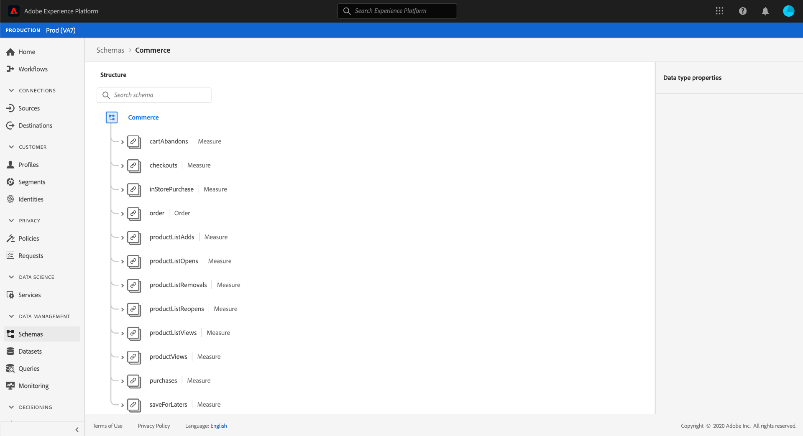

# Schema-bronnen in de gebruikersinterface verkennen

In Adobe Experience Platform worden alle XDM-schemabronnen (Experience Data Model) opgeslagen in de [!DNL Schema Library] , inclusief standaardbronnen die worden geleverd door Adobe en aangepaste bronnen die zijn gedefinieerd door uw organisatie. In Experience Platform UI, kunt u de structuur en de gebieden van om het even welk bestaand schema, klasse, gebiedsgroep, of gegevenstype in [!DNL Schema Library] bekijken. Dit is vooral nuttig wanneer het plannen van en het voorbereidingen treffen voor gegevensopname, aangezien UI informatie over de verwachte gegevenstypes en gebruiksgevallen van elk gebied verstrekt door deze middelen XDM verstrekt.

Deze zelfstudie behandelt de stappen voor het verkennen van bestaande schema&#39;s, klassen, veldgroepen en gegevenstypen in de gebruikersinterface van Experience Platform.

## Een schemabron opzoeken {#lookup}

Selecteer **[!UICONTROL Schemas]** in de gebruikersinterface van Experience Platform in de linkernavigatie. De werkruimte van [!UICONTROL Schemas] biedt een tabblad **[!UICONTROL Browse]** waarin alle schema&#39;s in uw organisatie worden verkend, samen met extra specifieke tabbladen voor respectievelijk **[!UICONTROL Classes]** , **[!UICONTROL Field groups]** , **[!UICONTROL Data types]** en **[!UICONTROL Relationships]** .

Het filterpictogram () openbaart controles in het linkerspoor om onderaan vermelde resultaten te versmallen. Bronfilters zijn beschikbaar voor schema&#39;s en relaties op de tabbladen **[!UICONTROL Browse]** en **[!UICONTROL Relationships]** .

Op het tabblad [!UICONTROL Browse] van de [!UICONTROL Schemas] -werkruimte kunt u de schemavoorraad filteren. Gebruik **[!UICONTROL Included in Profile]** knevel om schema&#39;s slechts te tonen die voor gebruik in [ Real-Time Profiel van de Klant ](../../profile/home.md) zijn toegelaten. Met de schakeloptie **[!UICONTROL Show adhoc schemas]** kunt u de lijst met schema&#39;s filteren die zijn gemaakt met velden die zijn benoemd voor gebruik met slechts één gegevensset.

![ het [!UICONTROL Schemas] werkruimte [!UICONTROL Browse] lusje met het benadrukte filterenpaneel.](../images/ui/explore/filters.png)

Op het tabblad [!UICONTROL Relationship] van de [!UICONTROL Schemas] -werkruimte kunt u de lijst met relaties filteren op basis van vier criteria. De filters omvatten [!UICONTROL Source schema] , [!UICONTROL Destination schema] , [!UICONTROL Source class] en [!UICONTROL Destination class] . De onderstaande tabel bevat een beschrijving van de filters.

| Filter | Beschrijving |
|-----------------------------------|------------|
| [!UICONTROL Source schema] | Selecteer een schema in het vervolgkeuzemenu [!UICONTROL Source schema] om alle relaties te zien waar het geselecteerde schema het beginpunt of de &quot;bron&quot; is. |
| [!UICONTROL Destination schema] | Selecteer een schema in het vervolgkeuzemenu [!UICONTROL Destination schema] om alle relaties weer te geven waarin het geselecteerde schema het doel of de bestemming is. |
| [!UICONTROL Source class] | Als u relaties wilt filteren op basis van de klasse van het initiërende schema, selecteert u een klasse in het vervolgkeuzemenu [!UICONTROL Source class] . |
| [!UICONTROL Destination class] | Als u relaties wilt weergeven die eindigen met schema&#39;s van een specifieke klasse, selecteert u een klasse in het vervolgkeuzemenu [!UICONTROL Destination class] . |

{style="table-layout:auto"}

U kunt de zoekbalk ook gebruiken om de resultaten verder omlaag te brengen.

De middelen die in onderzoeksresultaten worden getoond worden bevolen eerst door titelgelijken, dan door beschrijvingsgelijken. Hoe meer woorden in een van deze categorieën overeenkomen, hoe hoger de bron in de lijst.

Wanneer u de bron hebt gevonden die u wilt verkennen, selecteert u de naam in de lijst om de structuur ervan op het canvas weer te geven.

## Schema&#39;s, klassen, veldgroepen en gegevenstypen beheren: handelingen en verwijderen {#xdm-resource-actions}

Gebruik deze sectie wanneer u XDM-bronnen moet beheren of verwijderen, of wanneer een handeling (zoals verwijderen) niet beschikbaar is en u moet begrijpen waarom.

### Waar kunt u handelingen zoeken (inline versus detailpagina) {#where-to-find-actions}

Als u handelingen wilt uitvoeren, zoals verwijderen, exporteren of kopiëren van een bron, gebruikt u een van de volgende ingangspunten:

Op de tabbladen **[!UICONTROL Browse]** , **[!UICONTROL Classes]** , **[!UICONTROL Field groups]** en **[!UICONTROL Data types]** zijn beheeracties beschikbaar op twee locaties:

- **Gealigneerd in de lijst**: Elke middelrij omvat een actiemenu (bijvoorbeeld, **[!UICONTROL …]**) dat directe toegang tot beschikbare acties verleent.

- **het detailmening van het Middel**: Om tot volledige acties in de detailmening toegang te hebben, moet u a **douane (huurder-bepaalde)** middel selecteren. Standaard (door Adobe verschafte) bronnen hebben beperkte handelingen en tonen geen opties zoals Verwijderen, JSON-structuur kopiëren of Toevoegen aan pakket. Selecteer een aangepaste bron in de inventaris om de detailweergave te openen en gebruik vervolgens het menu **[!UICONTROL More]** in de paginakoptekst om toegang te krijgen tot dezelfde beschikbare handelingen.

Deze acties zijn consistent op beide ingangspunten voor ondersteunde middeltypen (schema&#39;s, klassen, veldgroepen en gegevenstypen).

### Beschikbare acties {#available-actions}

Afhankelijk van het middeltype en uw toestemmingen, kunnen de volgende acties beschikbaar zijn:

- **[!UICONTROL Delete]** — Verwijder permanent een aangepaste bron van uw organisatie (wanneer beperkingen dit toestaan). Als schrapping wordt geblokkeerd, zie [ Beperkingen ](#delete-constraints).
- **[!UICONTROL Download sample file]** — Genereer een bestand met voorbeeldgegevens op basis van de bronstructuur. Stap-voor-stap: [ produceer steekproefXDM gegevens ](./sample.md).
- **[!UICONTROL Copy JSON structure]** — Kopieer de brondefinitie in JSON-indeling voor hergebruik, export of inspectie. Stap-voor-stap: [ de schema&#39;s van XDM van de Uitvoer ](./export.md).
- **[!UICONTROL Add to package]** — Neem de bron op in een sandboxpakket voor het exporteren of importeren tussen sandboxen. Stap-voor-stap: [ de voorwerpen van de Uitvoer in een pakket ](../../sandboxes/ui/sandbox-tooling.md#export-objects).

Het volgende is op verschillende middeltypes van toepassing:

- Voor **douane (huurder-bepaalde)** schema&#39;s, klassen, gebiedsgroepen, en gegevenstypes, kunnen alle hierboven vermelde acties beschikbaar zijn.
- Voor **standaard (Adobe-bepaald)** klassen, gebiedsgroepen, en gegevenstypes:
   - Alleen **[!UICONTROL Download sample file]** is beschikbaar.
   - **Schrapping**, **de structuur van JSON van het Exemplaar**, en **voeg aan pakket** toe zijn niet beschikbaar.

### Gedrag verwijderen {#delete-behavior}

Gebruik de handeling **[!UICONTROL Delete]** wanneer u een aangepaste bron wilt verwijderen die u niet meer nodig hebt.

>[!IMPORTANT]
>
> Als u een bron verwijdert, wordt deze definitief van uw organisatie verwijderd en kan de bewerking niet ongedaan worden gemaakt. Sommige bronnen kunnen niet worden verwijderd vanwege gebruik, machtigingen of systeembeperkingen.

Een bron verwijderen:

1. Zoek de bron in de tabel of open de detailweergave.
2. Selecteer het menu Handelingen (**[!UICONTROL …]** of **[!UICONTROL More]** ).
3. Selecteer **[!UICONTROL Delete]**.
4. Bevestig de actie in het dialoogvenster door nogmaals **[!UICONTROL Delete]** te selecteren.

De bron wordt na bevestiging definitief verwijderd uit uw organisatie.

Als een bron niet kan worden verwijderd, wordt de optie uitgeschakeld met knopinfo waarin wordt uitgelegd waarom de handeling niet kan worden uitgevoerd.

### Restricties (dataset, Profiel, RBAC, huurder versus global) {#delete-constraints}

Als een handeling zoals **[!UICONTROL Delete]** niet beschikbaar of uitgeschakeld is, is deze doorgaans het gevolg van een van de volgende voorwaarden:

- **Toestemmingen (RBAC)**: U moet de vereiste toestemmingen (zoals **[!UICONTROL Manage Schemas]**) hebben om beheersacties uit te voeren. Als er machtigingen ontbreken, worden handelingen weergegeven als uitgeschakeld met knopinfo. Leren hoe de toestemmingen worden gevormd, zie het [ overzicht van toegangsbeheer UI ](../../access-control/ui/overview.md).

- **vereniging van de Dataset**: De middelen die door één of meerdere datasets (zoals schema&#39;s verbonden aan datasets) worden gebruikt kunnen niet worden geschrapt. Om datasetgebiedsdelen te identificeren en te verwijderen, zie [ een dataset ](../../catalog/datasets/user-guide.md#delete) schrappen.

- **enablement van het Profiel**: De schema&#39;s die voor het Profiel van de Klant in real time worden toegelaten kunnen niet worden geschrapt. Voor begeleiding op hoe de activering van het Profiel uw schema beïnvloedt, zie [ Planning voor toe:laten van het Profiel van de Klant in real time ](../schema/profile-enablement-planning.md).

- **Aannemer vs globale middelen**: De gespannen-bepaalde (douane) middelen kunnen (behoudens beperkingen) worden geschrapt, terwijl de standaard (Adobe-Geleide) klassen, gebiedsgroepen, en gegevenstypes niet kunnen worden geschrapt.

Deze beperkingen worden direct weerspiegeld in UI. Wanneer een handeling niet beschikbaar is, wordt deze uitgeschakeld en bevat knopinfo met uitleg over de specifieke beperking.

Als u een middel niet kunt schrappen, herzie de voorwaarden hierboven om te bepalen of u toestemmingen moet bijwerken, gebiedsdelen verwijderen, of uw gegevensmodel aanpassen.

Voor extra schema het uitgeven werkschema&#39;s in het canvas, zie [ schema&#39;s in UI ](./resources/schemas.md) creëren en uitgeven.

## Een XDM-resource verkennen in het canvas {#explore}

Wanneer u een bron hebt geselecteerd, wordt de structuur ervan geopend in het canvas.

Alle objecten-type gebieden die sub-eigenschappen bevatten worden doen ineenstorten door gebrek wanneer zij eerst in het canvas verschijnen. Als u de subeigenschappen van een veld wilt weergeven, selecteert u het pictogram naast de naam.

### Standaardklasse- en veldgroepindicator {#standard-class-and-field-group-indicator}

Binnen de Redacteur van het Schema, worden de standaard (Adobe-geproduceerde) klassen en de gebiedsgroepen vermeld met het hangslotpictogram (. Het hangslot verschijnt in de linkerspoorstaaf naast de klasse of de naam van de gebiedsgroep, evenals naast om het even welk gebied in het schemadiagram dat een deel van een systeem-geproduceerde middel is.

Zie [ douanegebieden aan standaardgebiedsgroepen ](./resources/schemas.md) documentatie voor begeleiding toevoegen. U kunt een standaardklasse niet bewerken.

### Door het systeem gegenereerde velden {#system-fields}

Sommige veldnamen worden voorafgegaan door een onderstrepingsteken, zoals `_repo` en `_id` . Deze vertegenwoordigen placeholders voor gebieden die het systeem automatisch zal produceren en toewijzen aangezien de gegevens worden opgenomen.

Daarom moeten de meeste van deze velden van de gegevensstructuur worden uitgesloten wanneer u ze in Experience Platform plaatst. De belangrijkste uitzondering op deze regel is het [`_{TENANT_ID}` gebied ](../api/getting-started.md#know-your-tenant_id), dat alle gebieden XDM die onder uw organisatie worden gecreeerd namespaced onder moeten zijn.

### Datatypen {#data-types}

Voor elk veld dat op het canvas wordt weergegeven, wordt het corresponderende gegevenstype naast de naam weergegeven en wordt in één oogopslag het type gegevens aangegeven dat het veld verwacht voor opname.

Om het even welk gegevenstype dat met vierkante haakjes (`[]`) wordt toegevoegd vertegenwoordigt een serie van dat bepaalde gegevenstype. Bijvoorbeeld, wijst een gegevenstype van **[!UICONTROL String]\ []** erop dat het gebied een serie van koordwaarden verwacht. Een gegevenstype van **[!UICONTROL Payment Item]\ []** wijst op een serie van voorwerpen die met het [!UICONTROL Payment Item] gegevenstype in overeenstemming zijn.

Als een arrayveld is gebaseerd op een objecttype, kunt u het pictogram ervan op het canvas selecteren om de verwachte kenmerken voor elk arrayitem weer te geven.

### [!UICONTROL Field properties] {#field-properties}

Wanneer u de naam van een veld op het canvas selecteert, wordt de rechterrails bijgewerkt en worden details over dat veld onder **[!UICONTROL Field properties]** weergegeven. Dit kan een beschrijving bevatten van het bedoelde gebruiksgeval van het veld, standaardwaarden, patronen, indelingen, of het veld al dan niet is vereist, enzovoort.

Als het veld dat u inspecteert een opsommingsveld is, geeft de rechterspoorstaaf ook de acceptabele waarden weer die het veld verwacht te ontvangen.

### Identiteitsvelden {#identity}

Wanneer het inspecteren van schema&#39;s die identiteitsgebieden bevatten, zijn deze gebieden vermeld in het linkerspoor onder de klasse of de gebiedsgroep die hen aan het schema verstrekt. Selecteer de naam van het identiteitsveld in de linkerrail om het veld op het canvas weer te geven, ongeacht hoe diep het veld is genest.

De gebieden van de identiteit worden benadrukt in het canvas met een vingerafdrukpictogram (). Als u de naam van het identiteitsgebied selecteert, kunt u extra informatie zoals [ identiteitsnamespace ](../../identity-service/features/namespaces.md) bekijken en of het gebied al dan niet de primaire identiteit voor het schema is.

>[!NOTE]
>
>Zie de gids op [ bepalend identiteitsgebieden ](./fields/identity.md) voor meer informatie over identiteitsgebieden en hun verhouding met de stroomafwaartse diensten van Experience Platform.

### Relatievelden {#relationship}

Als u een schema inspecteert dat een relatieveld bevat, zal het gebied in de linkerspoorstaaf onder **[!UICONTROL Relationships]** worden vermeld. Selecteer de naam van het relatieveld in de linkerrail om het veld op het canvas weer te geven, ongeacht hoe diep het veld is genest. Relatievelden worden ook op unieke wijze gemarkeerd op het canvas en tonen de naam van het referentieschema waarnaar het veld koppelt. Voor organisaties met B2B-mogelijkheden kunnen aangepaste relatienamen worden geschreven en in deze gevallen worden weergegeven op het canvas.

Als u de naamruimte voor identiteit van de primaire identiteit van het referentieschema wilt weergeven, selecteert u het relatieveld en vervolgens **[!UICONTROL Edit relationship]** in de zijbalk van [!UICONTROL Field properties] . De parameters voor de relatie worden weergegeven in het dialoogvenster [!UICONTROL Edit relationship] dat wordt weergegeven.

Zie het leerprogramma op [ creërend een verband in UI ](../tutorials/relationship-ui.md) voor meer informatie over het gebruik van verhoudingen in schema&#39;s XDM.

## Volgende stappen

In dit document wordt beschreven hoe u bestaande XDM-bronnen in de gebruikersinterface van Experience Platform kunt verkennen. Zie het [!UICONTROL Schemas] overzicht van de werkruimte [!DNL Schema Editor] voor meer informatie over de verschillende functies van de [[!UICONTROL Schemas] -werkruimte en ](./overview.md) .
