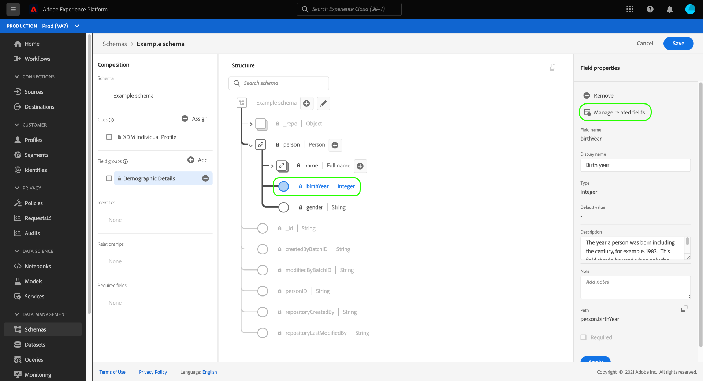
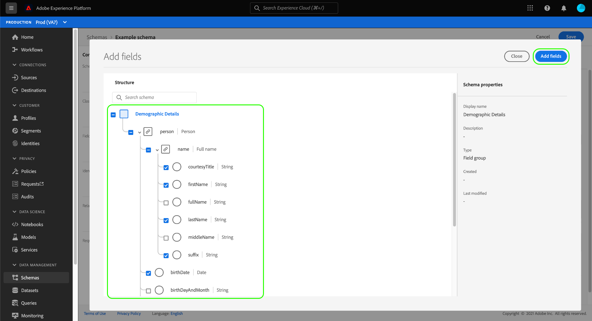
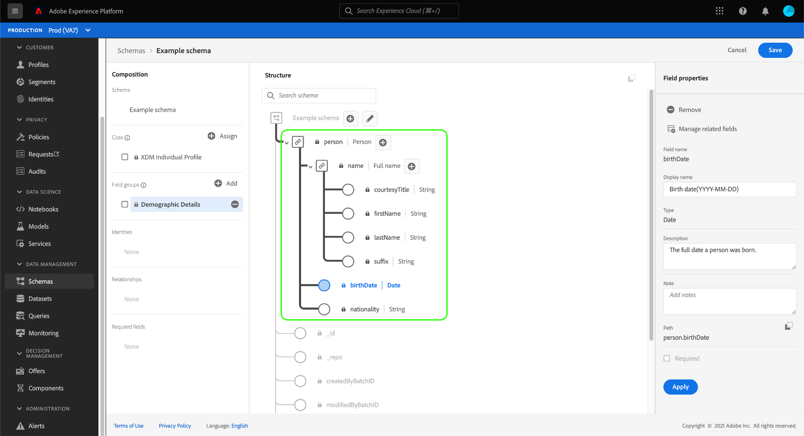
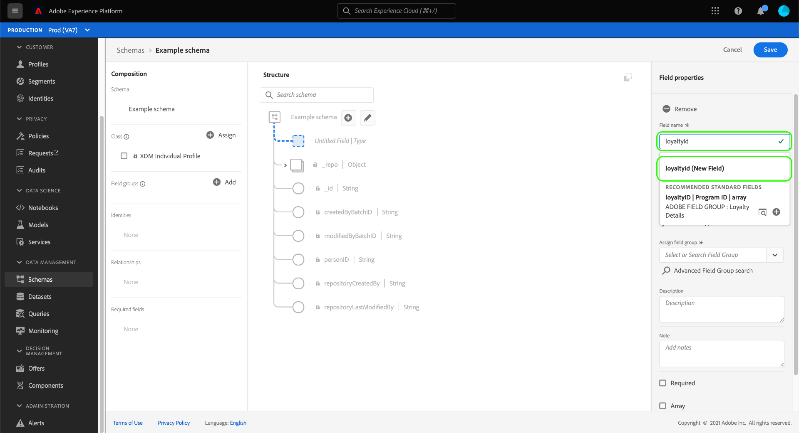

# Field-based workflows in the Schema Editor (Beta)

>[!IMPORTANT]
>
>The workflows described in this document are currently in beta and your organization may not have access to them yet. De functionaliteit die in deze documentatie wordt beschreven, kan worden gewijzigd.

Adobe Experience Platform provides a robust set of standardized [field groups](../schema/composition.md#field-group) for use in Experience Data Model (XDM) schemas. De structuur en de semantiek achter deze veldgroepen zijn zorgvuldig afgestemd op een grote verscheidenheid aan segmentatiegebruikstoepassingen en andere downstreamtoepassingen in Platform. You can also define your own custom field groups to address unique business needs.

Wanneer u een veldgroep aan een schema toevoegt, erft dat schema alle gebieden in die groep. However, you can now add individual fields to your schema without needing to include other fields from the associated field group that you may not necessarily use.

This guide covers the different methods for adding individual fields to a schema in the Platform UI.

## Vereisten

Deze zelfstudie veronderstelt dat u met [samenstelling van XDM schema&#39;s](../schema/composition.md) vertrouwd bent en hoe te om de Redacteur van het Schema in Platform UI te gebruiken. Als u de stappen wilt volgen, moet u het proces starten van [het maken van een nieuw schema](./resources/schemas.md) en het toewijzen aan een standaardklasse voordat u doorgaat met deze handleiding.

## Velden verwijderen die zijn toegevoegd uit standaardveldgroepen

Nadat u een standaardveldgroep aan een schema hebt toegevoegd, kunt u alle standaardvelden verwijderen die u niet nodig hebt.

>[!NOTE]
>
>Het verwijderen van velden uit een standaardveldgroep heeft alleen invloed op het schema waaraan wordt gewerkt en heeft geen invloed op de veldgroep zelf. Als u standaardvelden in één schema verwijdert, zijn deze velden nog steeds beschikbaar in alle andere schema&#39;s waarin dezelfde veldgroep wordt gebruikt.

In het volgende voorbeeld is de standaardveldgroep **[!UICONTROL Demographic Details]** toegevoegd aan een schema. Als u één veld wilt verwijderen, zoals `taxId`, selecteert u het veld op het canvas en selecteert u **[!UICONTROL Remove]** in de rechtertrack.

Als er meerdere velden zijn die u wilt verwijderen, kunt u de veldgroep als geheel beheren. Selecteer een veld dat tot de groep behoort op het canvas en selecteer vervolgens **[!UICONTROL Manage related fields]** in de rechtertrack.

Er verschijnt een dialoogvenster met de structuur van de veldgroep in kwestie. Hier kunt u de beschikbare selectievakjes gebruiken om de velden die u nodig hebt in of uit te schakelen. When you are satisfied, select **[!UICONTROL Confirm]**.

The canvas reappears with only the selected fields present in the schema structure.

## Add standard fields directly to a schema

U kunt velden van standaardveldgroepen rechtstreeks aan een schema toevoegen zonder dat u eerst de corresponderende veldgroep hoeft te kennen. To add a standard field to a schema, select the plus (**+**) icon next to the schema&#39;s name in the canvas. Er wordt een tijdelijke aanduiding **[!UICONTROL Untitled Field]** weergegeven in de schemastructuur en de juiste spoorwegupdates om besturingselementen voor de configuratie van het veld zichtbaar te maken.

Under **[!UICONTROL Field name]**, start typing the name of the field you wish to add. Het systeem zoekt automatisch naar standaardvelden die overeenkomen met de query en geeft deze weer onder **[!UICONTROL Recommended Standard Fields]**, inclusief de veldgroepen waartoe ze behoren.

Sommige standaardvelden hebben dezelfde naam, maar de structuur van deze velden kan afhankelijk zijn van de veldgroep waaruit ze afkomstig zijn. Als een standaardveld is genest in een bovenliggend object in de veldgroepsstructuur, wordt het bovenliggende veld ook opgenomen in het schema als het onderliggende veld wordt toegevoegd.

Selecteer het voorvertoningspictogram () naast een standaardveld om de structuur van de veldgroep weer te geven en beter te begrijpen hoe deze kan worden genest. Om het standaardgebied aan het schema toe te voegen, selecteer het plusteken ().

Het canvas wordt bijgewerkt om het standaardveld weer te geven dat aan het schema is toegevoegd, inclusief bovenliggende velden die het is genest onder de veldgroepsstructuur. De naam van de veldgroep wordt ook vermeld onder **[!UICONTROL Field groups]** in de linkertrack. Als u meer velden van dezelfde veldgroep wilt toevoegen, selecteert u **[!UICONTROL Manage related fields]** in de rechtertrack.

## Add custom fields directly to a schema

Net als bij de workflow voor standaardvelden kunt u ook uw eigen aangepaste velden rechtstreeks aan een schema toevoegen.

Als u velden wilt toevoegen aan het hoofdniveau van een schema, selecteert u de plusknop (**+**) naast de naam van het schema in het canvas. Er wordt een tijdelijke aanduiding **[!UICONTROL Untitled Field]** weergegeven in de schemastructuur en de juiste spoorwegupdates om besturingselementen voor de configuratie van het veld zichtbaar te maken.

Typ de naam van het veld dat u wilt toevoegen en het systeem zoekt automatisch naar de desbetreffende standaardvelden. To create a new custom field instead, select the top option appended with **([!UICONTROL New Field])**.

From here, provide a display name and data type for the field. Onder **[!UICONTROL Assign field group]** moet u een veldgroep selecteren waaraan het nieuwe veld moet worden gekoppeld. Start typing in the name of the field group, and if you have previously [created custom field groups](./resources/field-groups.md#create) they will appear in the dropdown list. U kunt ook een unieke naam in het veld typen om een nieuwe veldgroep te maken.

>[!WARNING]
>
>Als u een bestaande aangepaste veldgroep selecteert, nemen alle andere schema&#39;s die die veldgroep gebruiken ook het nieuwe toegevoegde veld over nadat u de wijzigingen hebt opgeslagen. Om deze reden, slechts selecteer een bestaande gebiedsgroep als u dit type van propagatie wilt. Anders kunt u beter een nieuwe aangepaste veldgroep maken.

Selecteer **[!UICONTROL Apply]** als u klaar bent.

Het nieuwe veld wordt toegevoegd aan het canvas en krijgt een naam onder de [huurder-id](../api/getting-started.md#know-your-tenant_id) om conflicten met standaard-XDM-velden te voorkomen. De veldgroep waaraan u het nieuwe veld hebt gekoppeld, wordt ook weergegeven onder **[!UICONTROL Field groups]** in de linkertrack.

>[!NOTE]
>
>De overige velden die door de geselecteerde aangepaste veldgroep worden opgegeven, worden standaard uit het schema verwijderd. If you want to add some of these fields to the schema, select a field belonging to the group and then select **[!UICONTROL Manage related fields]** in the right rail.

### Aangepaste velden toevoegen aan de structuur van standaardveldgroepen

If the schema you are working on has an object-type field provided by a standard field group, you can add your own custom fields to that standard object. Selecteer de plusknop (**+**) naast de hoofdmap van het object en geef de details van het aangepaste veld op in de rechtertrack.

After applying your changes, the new field appears under your tenant ID namespace within the standard object. This nested namespace prevents field-name conflicts within the field group itself in order to avoid breaking changes in other schemas that use the same field group.

## Volgende stappen

Deze gids behandelde de nieuwe op gebied-gebaseerde werkschema&#39;s voor de Redacteur van het Schema in de UI van het Platform. Voor meer informatie over het beheren van schema&#39;s in UI, zie [UI overzicht](./overview.md).
