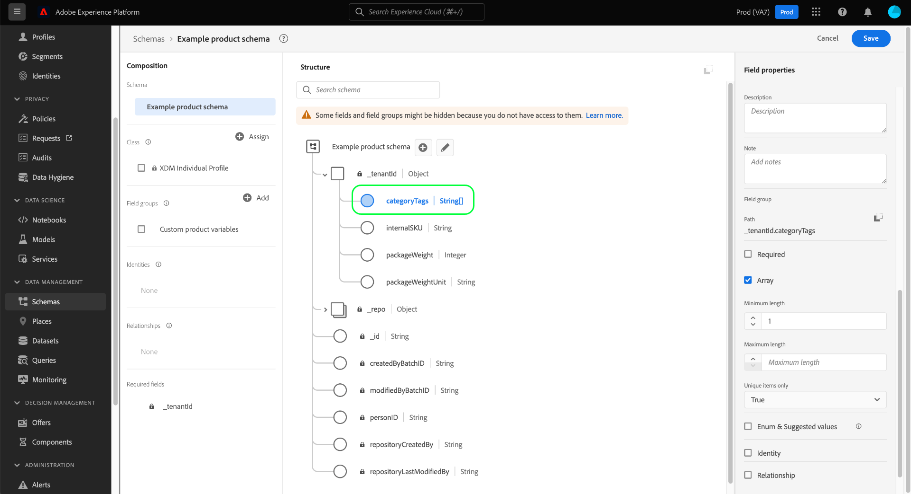

# Een arrayveld definiëren in de gebruikersinterface

Wanneer u een XDM-veld (Experience Data Model) in de Adobe Experience Platform-gebruikersinterface definieert, kunt u dat veld toewijzen als een array.

De inhoud van de array is afhankelijk van het type [!UICONTROL Type] dat voor dat veld is geselecteerd. Als bijvoorbeeld [!UICONTROL Type] van een veld is ingesteld op &quot;[!UICONTROL String]&quot;, geeft het instellen van dat veld als een array het veld aan als een array van tekenreeksen. Als het [!UICONTROL Type] van het gebied aan een multi-gebiedsgegevenstype zoals &quot;[!UICONTROL Postadres]&quot;wordt geplaatst, dan zou het een serie van post-adresvoorwerpen worden die met het gegevenstype in overeenstemming zijn.

Nadat u een nieuw gebied in UI](./overview.md#define) hebt bepaald, kunt u het als seriegebied plaatsen door **[!UICONTROL Serie]** checkbox in het juiste spoor te selecteren.[

Als het selectievakje is ingeschakeld, worden in de rechtertrack extra besturingselementen weergegeven waarmee u de array eventueel verder kunt beperken. Als u een bepaalde beperking niet wilt afdwingen, laat u het veld leeg.

De extra configuratiecontroles voor series zijn als volgt:

| Field, eigenschap | Beschrijving |
| --- | --- |
| [!UICONTROL Minimumlengte] | Het minimale aantal items dat de array moet bevatten om de opname te laten slagen. |
| [!UICONTROL Maximumlengte] | Het maximum aantal items dat de array moet bevatten om de opname te laten slagen. |
| [!UICONTROL Alleen unieke objecten] | Als ingesteld op &quot;[!UICONTROL True]&quot;, moet elk item in de array uniek zijn om opname te laten slagen. |

Als u klaar bent met het configureren van het veld, selecteert u **[!UICONTROL Toepassen]** om de wijziging toe te passen op het schema.

Het canvas wordt bijgewerkt met de wijzigingen die in het veld zijn aangebracht. Het gegevenstype dat naast de veldnaam op het canvas wordt weergegeven, wordt met twee vierkante haakjes (`[]`) toegevoegd om aan te geven dat het veld een array van dat gegevenstype vertegenwoordigt.

## Volgende stappen

In deze handleiding wordt beschreven hoe u een arrayveld in de gebruikersinterface definieert. Zie het overzicht op [het bepalen van gebieden in UI](./overview.md#special) om te leren hoe te om andere XDM gebiedstypes in [!DNL Schema Editor] te bepalen.