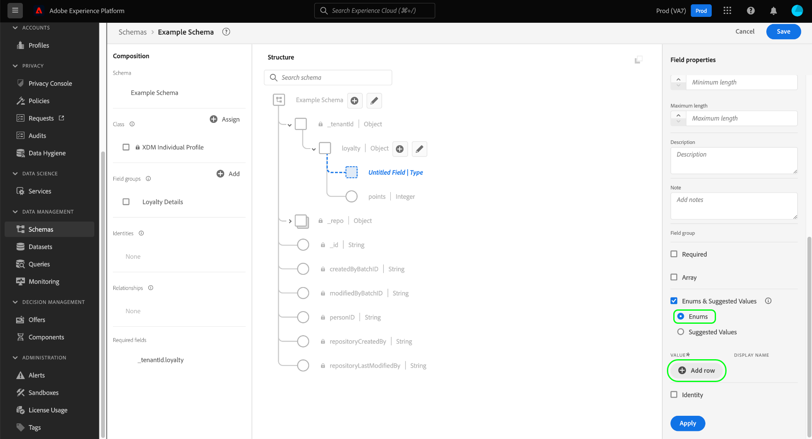

# Opsommingen en voorgestelde waarden definiëren in de gebruikersinterface {#enums-and-suggested-values}

>[!CONTEXTUALHELP]
>id="platform_xdm_enum_suggestedvalue"
>title="Opsommingen en voorgestelde waarden"
>abstract="An **Enum** beperkt een tekenreeksveld zodat alleen gegevens zijn toegestaan die overeenkomen met een vooraf gedefinieerde set waarden die moeten worden ingevoerd. Aan elke opsommingsbeperking kan een **Weergavenaam** die kenmerkdropdowns in de Segmentatie UI bevolkt. **Voorgestelde waarden** voor een veld de opname niet beperken en alleen de weergavenamen bepalen die in Segmentatie worden weergegeven. Als u veelvoudige schema&#39;s hebt die een gebied delen dat tot een gemeenschappelijke klasse of een gebiedsgroep behoort, en u verschillende aantallen of voorgestelde waarden voor dat gebied tussen elk schema bepaalt, worden die waarden samengevoegd en toegevoegd in het unieschema."

In het Model van Gegevens van de Ervaring (XDM), kan een koordgebied een vooraf bepaalde reeks toegelaten of voorgestelde waarden worden gegeven om beter te controleren welke waarden in dat gebied worden opgenomen of hoe het in segmentatie zal gedragen.

**[!UICONTROL Enums]** de waarden die voor een tekenreeksveld kunnen worden ingevoerd, beperken tot een vooraf gedefinieerde set. Als u probeert gegevens in te voeren in een opsommingsveld en de waarde niet overeenkomt met een van de gedefinieerde waarden in de configuratie, wordt invoer geweigerd.

In tegenstelling tot opsommingen, **[!UICONTROL Suggested values]** kunt u een set aanbevolen waarden opgeven voor een tekenreeksveld dat de waarden die het kan invoeren niet beperkt. De voorgestelde waarden hebben daarentegen invloed op de beschikbare vooraf gedefinieerde waarden in het dialoogvenster [Segmenteringsinterface](../../../segmentation/ui/overview.md) wanneer het tekenreeksveld wordt opgenomen als een kenmerk.

Wanneer [een nieuw veld definiëren](./overview.md#define) in de Adobe Experience Platform-gebruikersinterface en het type instellen op [!UICONTROL String]kunt u een [enum](#enum) of [voorgestelde waarden](#suggested-values) voor dat veld.

In dit document wordt beschreven hoe u opsommingen en voorgestelde waarden definieert in het dialoogvenster [!UICONTROL Schemas] UI-werkruimte. Bekijk de volgende video voor een snel overzicht van opsommingen en voorgestelde waarden, inclusief hoe u deze kunt configureren in de gebruikersinterface en de bijbehorende downstreameffecten:

>[!VIDEO](https://video.tv.adobe.com/v/3409501/?quality=12&learn=on)

## Een opsomming definiëren {#enum}

Selecteren **[!UICONTROL Enums and Suggested Values]** selecteert u vervolgens **[!UICONTROL Enums]**. Er worden extra besturingselementen weergegeven, zodat u de waardebeperkingen voor de opsomming kunt opgeven. Als u een restrictie wilt toevoegen, selecteert u **[!UICONTROL Add row]**.

Onder de **[!UICONTROL Value]** moet u de exacte waarde opgeven waarmee u het veld wilt beperken. U kunt desgewenst een mensvriendelijk **[!UICONTROL Display Name]** ook voor de beperking, die beïnvloedt hoe de waarde in segmentatie zal worden vertegenwoordigd.

Doorgaan met gebruik **[!UICONTROL Add row]** om de gewenste beperkingen en facultatieve etiketten aan enum toe te voegen of het schrappingspictogram te selecteren () naast een eerder toegevoegde rij om deze te verwijderen. Als u klaar bent, selecteert u **[!UICONTROL Apply]** om de wijzigingen toe te passen op het schema.

Het canvas wordt bijgewerkt met de wijzigingen. Wanneer u dit schema in de toekomst verkent, kunt u de beperkingen voor het enum gebied binnen het juiste spoor bekijken en uitgeven.

## Voorgestelde waarden definiëren {#suggested-values}

Selecteren **[!UICONTROL Enums and Suggested Values]** selecteert u vervolgens **[!UICONTROL Suggested Values]** om extra besturingselementen weer te geven. Selecteer **[!UICONTROL Add row]** om voorgestelde waarden toe te voegen.

Onder de **[!UICONTROL Display Name]** kolom, verstrek een mensvriendelijke naam voor de waarde aangezien u het in de Segmentatie UI wilt verschijnen. Als u meer voorgestelde waarden wilt toevoegen, selecteert u **[!UICONTROL Add row]** en herhaal dit proces zo nodig. Als u een eerder toegevoegde rij wilt verwijderen, selecteert u  naast de rij in kwestie.

Als u klaar bent, selecteert u **[!UICONTROL Apply]** om de wijzigingen toe te passen op het schema.

>[!NOTE]
>
>Er is een ongeveer vijf-minieme vertraging voor de bijgewerkte voorgestelde waarden van een gebied om in de Segmentatie UI worden weerspiegeld.

### Voorgestelde waarden voor standaardvelden beheren

Sommige velden van standaard XDM-componenten bevatten hun eigen voorgestelde waarden, zoals `eventType` van de [[!UICONTROL XDM ExperienceEvent] class](../../classes/experienceevent.md). Hoewel u aanvullende voorgestelde waarden voor een standaardveld kunt maken, kunt u voorgestelde waarden die niet door uw organisatie zijn gedefinieerd, niet wijzigen of verwijderen. Als u een standaardveld in de gebruikersinterface weergeeft, worden de voorgestelde waarden weergegeven, maar alleen-lezen.

Als u nieuwe voorgestelde waarden voor een standaardveld wilt toevoegen, selecteert u **[!UICONTROL Add row]**. Als u een voorgestelde waarde wilt verwijderen die eerder door uw organisatie is toegevoegd, selecteert u  naast de rij in kwestie.

<!-- ### Removing suggested values for standard fields

Only suggested values that you define can be removed from a standard field. Existing suggested values can be disabled so that they no longer appear in the segmentation dropdown, but they cannot be removed outright.

For example, consider a profile schema where the a suggested value for the standard `person.gender` field is disabled:

In this example, the display name "[!UICONTROL Non-specific]" is now disabled from being shown in the segmentation dropdown list. However, the value `non_specific` is still part of the list of enumerated fields and is therefore still allowed on ingestion. In other words, you cannot disable the actual enum value for the standard field as it would go against the principle of only allowing changes that make a field less restrictive.

See the [section below](#evolution) for more information on the rules for updating enums and suggested values for existing schema fields. -->

## Evolutieregels voor opsommingen en voorgestelde waarden {#evolution}

Nadat een schema met een enum gebied is gebruikt om gegevens in Platform in te voeren, moeten om het even welke verdere veranderingen die in de schemadefinitie worden aangebracht aan de gegevens reeds in het systeem voldoen. In het algemeen kunnen wijzigingen die in een bestaand veld worden aangebracht, alleen dat veld maken **minder** restrictief. Een veld kan niet restrictiever worden gemaakt dan het al is.

Wanneer het over aantallen en voorgestelde waarden aankomt, zijn de volgende regels post-ingesetion van toepassing:

* U **KAN** Voeg voorgestelde waarden voor standaard- en aangepaste velden toe met bestaande voorgestelde waarden.
* U **KAN** Verwijder voorgestelde waarden uit aangepaste velden met bestaande voorgestelde waarden.
* U **KAN** Voeg nieuwe opsommingswaarden toe aan een bestaand aangepast opsommingsveld.
* U **KAN** U kunt de opsommingswaarden van een aangepast veld alleen omzetten in voorgestelde waarden of deze omzetten in een tekenreeks zonder opsomming of voorgestelde waarden. **Deze schakelaar kan niet ongedaan worden gemaakt zodra toegepast.**
* U **KAN NIET** nummers of voorgestelde waarden uit standaardvelden verwijderen.
* U **KAN NIET** Voeg opsommingswaarden toe aan een veld zonder bestaande opsomming.
* U **KAN NIET** minder verwijderen dan alle bestaande opsommingswaarden voor een aangepast veld.
* U **KAN NIET** Schakel van voorgestelde waarden naar een opsomming.

## Regels samenvoegen voor opsommingen en voorgestelde waarden {#merging}

Als de veelvoudige schema&#39;s het zelfde enum gebied met verschillende configuraties gebruiken, en die schema&#39;s inbegrepen in een unie zijn, zijn bepaalde regels van toepassing wanneer het over hoe de enum verschillen met elkaar in overeenstemming worden gebracht. De nauwkeurige regels hangen af van of de schema&#39;s die naar het zelfde standaardgebied verwijzen (als `eventType`) of als ze verwijzen naar hetzelfde aangepaste veldpad in verschillende veldgroepen.

Bij verwijzing naar hetzelfde standaardveld:

* Eventuele extra voorgestelde waarden zijn **AANGEVOEGD** in de unie .
* Updates van de voorgestelde waarden voor dezelfde opsommingssleutel zijn **BIJGEWERKT** in de unie .

Als in verschillende veldgroepen wordt verwezen naar hetzelfde aangepaste veldpad:

* Eventuele extra voorgestelde waarden zijn **AANGEVOEGD** in de unie .
* Als dezelfde extra voorgestelde waarde in meer dan één schema is gedefinieerd, zijn deze waarden **SAMENGEVOEGD** in de unie . Met andere woorden, dezelfde voorgestelde waarde wordt niet twee keer na het samenvoegen weergegeven.

## Beperkingen voor validatie

Vanwege de huidige systeembeperkingen zijn er twee gevallen waarin een enum niet door het systeem wordt gevalideerd tijdens inname:

1. De opsomming wordt gedefinieerd op een [arrayveld](./array.md).
1. De opsomming wordt meer dan één niveau diep gedefinieerd in de schemahiërarchie.

## Volgende stappen

In deze handleiding wordt beschreven hoe u opsommingen en voorgestelde waarden voor tekenreeksvelden in de gebruikersinterface definieert. Raadpleeg de volgende bronnen voor informatie over het beheren van opsommingen en voorgestelde waarden met de API voor schemaregistratie [zelfstudie](../../tutorials/suggested-values.md).

Leer hoe u andere XDM-veldtypen definieert in het dialoogvenster [!DNL Schema Editor], zie het overzicht op [velden definiëren in de gebruikersinterface](./overview.md#special).
