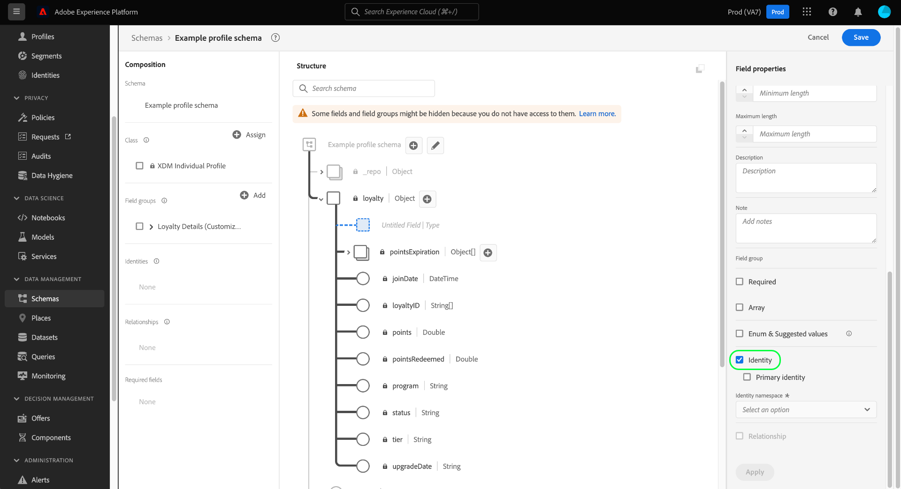

# Identiteitsvelden definiëren in de gebruikersinterface

In het Model van Gegevens van de Ervaring (XDM), vertegenwoordigt een identiteitsgebied een gebied dat kan worden gebruikt om een individuele persoon te identificeren met betrekking tot een verslag of een tijd-reeksgebeurtenis. In dit document wordt beschreven hoe u een identiteitsveld definieert in de gebruikersinterface van Adobe Experience Platform.

## Vereisten

Identiteitsvelden vormen een cruciaal onderdeel van de manier waarop identiteitsgrafieken van klanten in Platform worden samengesteld. Dit beïnvloedt uiteindelijk de manier waarop in realtime-klantprofiel afzonderlijke gegevensfragmenten worden samengevoegd om een volledig beeld van de klant te krijgen. Voordat u identiteitsvelden in uw schema&#39;s definieert, raadpleegt u de volgende documentatie voor meer informatie over de belangrijkste services en concepten met betrekking tot identiteitsvelden:

* [Adobe Experience Platform Identity Service](../../../identity-service/home.md): Bruggen identiteiten over apparaten en systemen, die datasets verbinden samen op de identiteitsgebieden worden bepaald die door de schema&#39;s XDM worden bepaald zij met in overeenstemming zijn.
   * [Naamruimten](../../../identity-service/namespaces.md) van identiteit: Naamruimten definiëren de verschillende typen identiteitsgegevens die betrekking kunnen hebben op één persoon en die een vereiste component zijn voor elk identiteitsveld.
* [Klantprofiel](../../../profile/home.md) in realtime: Gebruikt de grafieken van de klantenidentiteit van hefboomwerkingen om een verenigd consumentenprofiel te verstrekken dat op samengevoegde gegevens van veelvoudige bronnen wordt gebaseerd, die in bijna-real-time wordt bijgewerkt.

## Een identiteitsveld definiëren

Wanneer [een nieuw gebied](./overview.md#define) in UI bepaalt, kunt u het als identiteitsgebied plaatsen door **[!UICONTROL Identity]** checkbox in het juiste spoor te selecteren.

Aanvullende besturingselementen worden weergegeven nadat u het selectievakje hebt ingeschakeld. Als u wilt dat dit veld de primaire identiteit voor het schema is, schakelt u het selectievakje **[!UICONTROL Primaire identiteit]** in.

>[!NOTE]
>
>Voor één schema kunnen veel identiteitsvelden zijn gedefinieerd, maar dit schema kan slechts één primaire identiteit hebben. Alle identiteitsgebieden (primair of anders) dragen aan de identiteitsgrafiek voor een individuele klant bij, maar het Profiel van de Klant in real time gebruikt slechts de primaire identiteit als bron van waarheid wanneer het samenvoegen van gegevensfragmenten samen. Als u een schema voor gebruik in Profiel wilt toelaten, moet het schema een primaire bepaalde identiteit hebben.

Onder **[!UICONTROL Identiteitsnaamruimte]**, gebruik dropdown menu om aangewezen namespace voor het identiteitsgebied te selecteren. De standaardnaamruimten die door Adobe worden verschaft, worden weergegeven samen met aangepaste naamruimten die door uw organisatie zijn gedefinieerd.

Als u klaar bent, selecteert u **[!UICONTROL Toepassen]** om de wijziging toe te passen op het schema.

Het canvas wordt bijgewerkt met de wijzigingen, waarbij het geselecteerde veld een vingerafdruksymbool () krijgt om het aan te duiden als een identiteit. In het linkerspoor, is het identiteitsgebied nu vermeld onder de naam van de klasse of mengeling die het gebied aan het schema verstrekt.

Aangezien alle identiteitsgebieden door gebrek worden vereist, is het gebied nu vermeld onder **[!UICONTROL Vereiste gebieden]** in de linkerspoorstaaf. Als het identiteitsveld is genest binnen de schemastructuur, worden alle bovenliggende velden ook vermeld zoals vereist.

Als u een primaire identiteit voor het schema bepaalde, kunt u nu te werk gaan om [het schema voor gebruik in het Profiel van de Klant in real time ](../resources/schemas.md#profile) toe te laten.

## Volgende stappen

Deze gids besprak hoe te om een identiteitsgebied in UI te bepalen. Aangezien het gegeven gebruikend dit schema wordt opgenomen, zullen de grafieken van uw klantenidentiteit worden bijgewerkt om op de de identiteitsgebieden van het schema te wijzen. Zie de handleiding op de [identiteitsgrafiekviewer](../../../identity-service/ui/identity-graph-viewer.md) voor meer informatie over de persoonlijke grafiek van uw organisatie in de gebruikersinterface.

Zie het overzicht op [het bepalen van gebieden in UI](./overview.md#special) om te leren hoe te om andere XDM gebiedstypes in [!DNL Schema Editor] te bepalen.