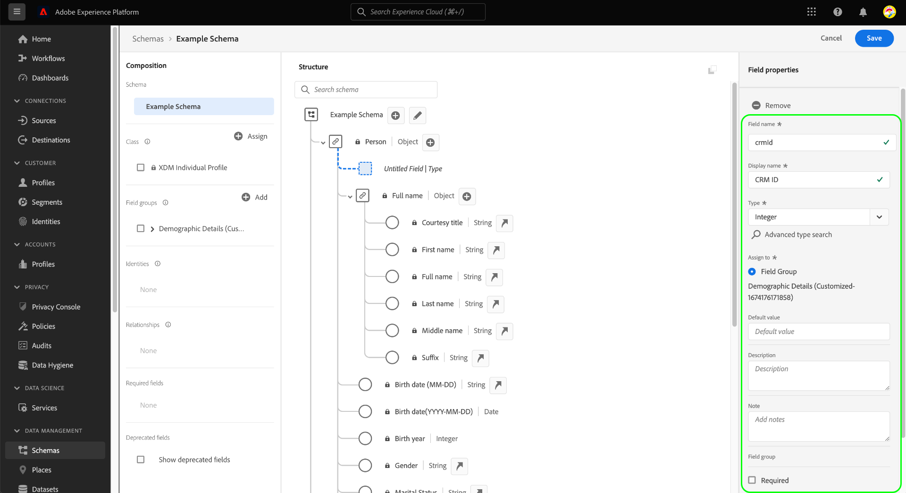

# XDM-velden definiëren in de gebruikersinterface

Met de [!DNL Schema Editor] in de Adobe Experience Platform-gebruikersinterface kunt u uw eigen velden definiëren binnen de XDM-klassen (Custom Experience Data Model) en groepen schemavelden. In deze handleiding worden de stappen beschreven voor het definiëren van XDM-velden in de gebruikersinterface, inclusief de beschikbare configuratieopties voor elk veldtype.

## Vereisten

Deze handleiding vereist een goed begrip van XDM System. Verwijs naar [XDM overzicht](../../home.md) voor een inleiding aan de rol van XDM binnen het ecosysteem van het Experience Platform, en [grondbeginselen van schemacompositie](../../schema/composition.md) om te leren hoe de klassen en de gebiedsgroepen gebieden aan XDM schema&#39;s bijdragen.

Hoewel niet vereist voor deze gids, wordt het geadviseerd dat u het leerprogramma ook [het samenstellen van een schema in UI](../../tutorials/create-schema-ui.md) volgt om zich met de diverse mogelijkheden van [!DNL Schema Editor] vertrouwd te maken.

## Selecteer een bron om velden toe te voegen aan {#select-resource}

Als u nieuwe XDM-velden in de gebruikersinterface wilt definiëren, moet u eerst een schema openen in het veld [!DNL Schema Editor]. Afhankelijk van welke schema&#39;s momenteel beschikbaar aan u in [!DNL Schema Library] zijn, kunt u verkiezen om [een nieuw schema te creëren ](../resources/schemas.md#create) of [een bestaand schema te selecteren om](../resources/schemas.md#edit) uit te geven.

Wanneer u de [!DNL Schema Editor] open hebt, gebruikt u de linkerspoor om de klasse of de gebiedsgroep te selecteren die u gebieden voor wilt bepalen. Als de bron een aangepaste bron is die door uw organisatie is gedefinieerd, verschijnen er besturingselementen voor het toevoegen of bewerken van velden op het canvas. Deze besturingselementen worden naast de naam van het schema weergegeven, evenals alle velden van het objecttype die zijn gedefinieerd onder de geselecteerde klasse of veldgroep.

>[!NOTE]
>
>Als de klasse of de gebiedsgroep u selecteert een kernmiddel is dat door Adobe wordt verstrekt, kan het niet worden uitgegeven en daarom zullen de hierboven getoonde controles niet verschijnen. Als het schema u gebieden aan wilt toevoegen op een kernXDM klasse gebaseerd is en geen aangepaste gebiedsgroepen bevat, kunt u [een nieuwe gebiedsgroep ](../resources/field-groups.md#create) creëren om aan het schema in plaats daarvan toe te voegen.

Als u een nieuw veld aan de bron wilt toevoegen, selecteert u het pictogram **plus (+)** naast de naam van het schema op het canvas of naast het veld van het objecttype dat u onder het veld wilt definiëren.

## Een veld definiëren voor een resource {#define}

Nadat u het pictogram **plus (+)** hebt geselecteerd, wordt een **[!UICONTROL New field]** weergegeven in het canvas, dat zich bevindt binnen een basisobject dat is naamloos voor uw unieke huurder-id (weergegeven als `_tenantId` in het onderstaande voorbeeld). Alle velden die via aangepaste klassen en veldgroepen aan een schema worden toegevoegd, worden automatisch binnen deze naamruimte geplaatst om conflicten met andere velden van door Adobe verschafte klassen en veldgroepen te voorkomen.

In het juiste spoor onder **[!UICONTROL Field properties]**, kunt u de details van de nieuwe gebieden vormen. Voor elk veld is de volgende informatie vereist:

| Field, eigenschap | Beschrijving |
| --- | --- |
| [!UICONTROL Field name] | Een unieke, beschrijvende naam voor het veld. De naam van het veld kan niet worden gewijzigd nadat het schema is opgeslagen.  De naam moet idealiter in camelCase worden geschreven. Het kan alfanumerieke, streepje- of onderstrepingstekens bevatten, maar **mag niet** met een onderstrepingsteken beginnen.<ul><li>**Juist**:  `fieldName`</li><li>**Aanvaardbaar:** `field_name2`,  `Field-Name`,  `field-name_3`</li><li>**Onjuist**:  `_fieldName`</li></ul> |
| [!UICONTROL Display name] | Een mensvriendelijke naam voor het veld. |
| [!UICONTROL Type] | Het type gegevens dat het veld zal bevatten. In dit vervolgkeuzemenu kunt u een van de [standaard scalaire typen](../../schema/field-constraints.md) selecteren die door XDM worden ondersteund, of een van de multiveld [gegevenstypen](../resources/data-types.md) die eerder zijn gedefinieerd in [!DNL Schema Registry].  U kunt ook selecteren  **[!UICONTROL Advanced type search]** om bestaande gegevenstypen te zoeken en te filteren en het gewenste type gemakkelijker te vinden. |

U kunt het veld ook voorzien van een optionele leesbare **[!UICONTROL Description]** voor meer context met betrekking tot het beoogde gebruik van het veld.

>[!NOTE]
>
>Afhankelijk van **[!UICONTROL Type]** u voor het gebied selecteerde, kunnen de extra configuratiecontroles in het juiste spoor verschijnen. Zie de sectie over [typespecifieke veldeigenschappen](#type-specific-properties) voor meer informatie over deze besturingselementen.
>
>De rechterrail biedt ook selectievakjes voor het aanwijzen van speciale veldtypen. Zie de sectie over [speciale veldtypen](#special) voor meer informatie.

Nadat u het veld hebt geconfigureerd, selecteert u **[!UICONTROL Apply]**.

Het canvas wordt bijgewerkt om de naam en het type van het veld weer te geven en het rechterspoor geeft nu naast de andere eigenschappen ook het pad van het veld weer.

U kunt de bovenstaande stappen blijven volgen om meer velden aan het schema toe te voegen. Zodra het schema wordt bewaard, worden zijn basisklasse en gebiedsgroepen ook bewaard als om het even welke veranderingen in hen zijn aangebracht.

>[!NOTE]
>
>Om het even welke veranderingen u aan de gebiedsgroepen of de klasse van één schema aanbrengt zullen in alle andere schema&#39;s worden weerspiegeld die hen aanwenden.

## Type-specifieke veldeigenschappen {#type-specific-properties}

Wanneer u een nieuw veld definieert, kunnen er extra configuratieopties worden weergegeven in de rechtertrack, afhankelijk van de **[!UICONTROL Type]** die u voor het veld kiest. In de volgende tabel worden deze extra veldeigenschappen in combinatie met de compatibele typen weergegeven:

| Field, eigenschap | Compatibele typen | Beschrijving |
| --- | --- | --- |
| [!UICONTROL Default value] | [!UICONTROL String], [!UICONTROL Double], [!UICONTROL Long], [!UICONTROL Integer], [!UICONTROL Short], [!UICONTROL Byte], [!UICONTROL Boolean] | A default value that will be assigned to this field if no other value is provided during ingestion. Deze waarde moet overeenkomen met het geselecteerde type van het veld. |
| [!UICONTROL Pattern] | [!UICONTROL String] | Een [reguliere expressie](https://developer.mozilla.org/en-US/docs/Web/JavaScript/Guide/Regular_Expressions) waaraan de waarde voor dit veld moet voldoen om tijdens inname te worden geaccepteerd. |
| [!UICONTROL Format] | [!UICONTROL String] | Selecteer een optie in een lijst met vooraf gedefinieerde indelingen voor tekenreeksen die de waarde moet bevatten. Beschikbare indelingen zijn: <ul><li>[[!UICONTROL date-time]](https://tools.ietf.org/html/rfc3339)</li><li>[[!UICONTROL email]](https://tools.ietf.org/html/rfc2822)</li><li>[[!UICONTROL hostname]](https://tools.ietf.org/html/rfc1123#page-13)</li><li>[[!UICONTROL ipv4]](https://tools.ietf.org/html/rfc791)</li><li>[[!UICONTROL ipv6]](https://tools.ietf.org/html/rfc2460)</li><li>[[!UICONTROL uri]](https://tools.ietf.org/html/rfc3986)</li><li>[[!UICONTROL uri-reference]](https://tools.ietf.org/html/rfc3986#section-4.1)</li><li>[[!UICONTROL url-template]](https://tools.ietf.org/html/rfc6570)</li><li>[[!UICONTROL json-pointer]](https://tools.ietf.org/html/rfc6901)</li></ul> |
| [!UICONTROL Minimum length] | [!UICONTROL String] | Het minimale aantal tekens dat de tekenreeks moet bevatten voordat de waarde wordt geaccepteerd tijdens de opname. |
| [!UICONTROL Maximum length] | [!UICONTROL String] | Het maximum aantal tekens dat de tekenreeks moet bevatten voordat de waarde wordt geaccepteerd tijdens de invoer. |
| [!UICONTROL Minimum value] | [!UICONTROL Double] | De minimumwaarde voor het Dubbele die tijdens inname moet worden goedgekeurd. Als de ingevoerde waarde precies overeenkomt met de waarde die hier is ingevoerd, wordt de waarde geaccepteerd. Wanneer het gebruiken van deze beperking, &quot;[!UICONTROL Exclusive minimum value]&quot;beperking moet leeg worden gelaten. |
| [!UICONTROL Maximum value] | [!UICONTROL Double] | De maximumwaarde voor het dubbel dat tijdens inname moet worden geaccepteerd. Als de ingevoerde waarde precies overeenkomt met de waarde die hier is ingevoerd, wordt de waarde geaccepteerd. Wanneer het gebruiken van deze beperking, &quot;[!UICONTROL Exclusive maximum value]&quot;beperking moet leeg worden gelaten. |
| [!UICONTROL Exclusive minimum value] | [!UICONTROL Double] | De maximumwaarde voor het dubbel dat tijdens inname moet worden geaccepteerd. Als de ingevoerde waarde precies overeenkomt met de waarde die hier is ingevoerd, wordt de waarde afgewezen. Wanneer u deze beperking gebruikt, moet de beperking &quot;[!UICONTROL Minimum value]&quot; (niet-exclusief) leeg blijven. |
| [!UICONTROL Exclusive maximum value] | [!UICONTROL Double] | De maximumwaarde voor het dubbel dat tijdens inname moet worden geaccepteerd. Als de ingevoerde waarde precies overeenkomt met de waarde die hier is ingevoerd, wordt de waarde afgewezen. Wanneer u deze beperking gebruikt, moet de beperking &quot;[!UICONTROL Maximum value]&quot; (niet-exclusief) leeg blijven. |

## Speciale veldtypen {#special}

Het rechterspoor biedt verschillende selectievakjes voor het aanwijzen van speciale rollen voor het geselecteerde veld. De gebruiksgevallen voor sommige van deze opties vragen om belangrijke overwegingen met betrekking tot uw strategie voor het modelleren van gegevens en hoe u de downstreamservices voor Platforms wilt gebruiken.

Raadpleeg de volgende documentatie voor meer informatie over deze speciale typen:

* [[!UICONTROL Required]](./required.md)
* [[!UICONTROL Array]](./array.md)
* [[!UICONTROL Enum]](./enum.md)
* [[!UICONTROL Identity]](./identity.md) (Alleen beschikbaar voor tekenreeksvelden)
* [[!UICONTROL Relationship]](./relationship.md) (Alleen beschikbaar voor tekenreeksvelden)

Technisch gezien is het geen speciaal veldtype, maar u wordt ook aangeraden de hulplijn te raadplegen bij [het definiëren van objecttype velden](./object.md) voor meer informatie over het definiëren van geneste subvelden als uw schema is gestructureerd.

## Volgende stappen

Deze handleiding gaf een overzicht van hoe u XDM-velden in de gebruikersinterface kunt definiëren. Vergeet niet dat velden alleen aan schema&#39;s kunnen worden toegevoegd met behulp van klassen en veldgroepen. Voor meer informatie over hoe te om deze middelen in UI te beheren, zie de gidsen bij het creëren van en het uitgeven [klassen](../resources/classes.md) en [gebiedsgroepen](../resources/field-groups.md).

Voor meer informatie over de mogelijkheden van de [!UICONTROL Schemas] werkruimte, zie [[!UICONTROL Schemas] werkruimteoverzicht](../overview.md).
