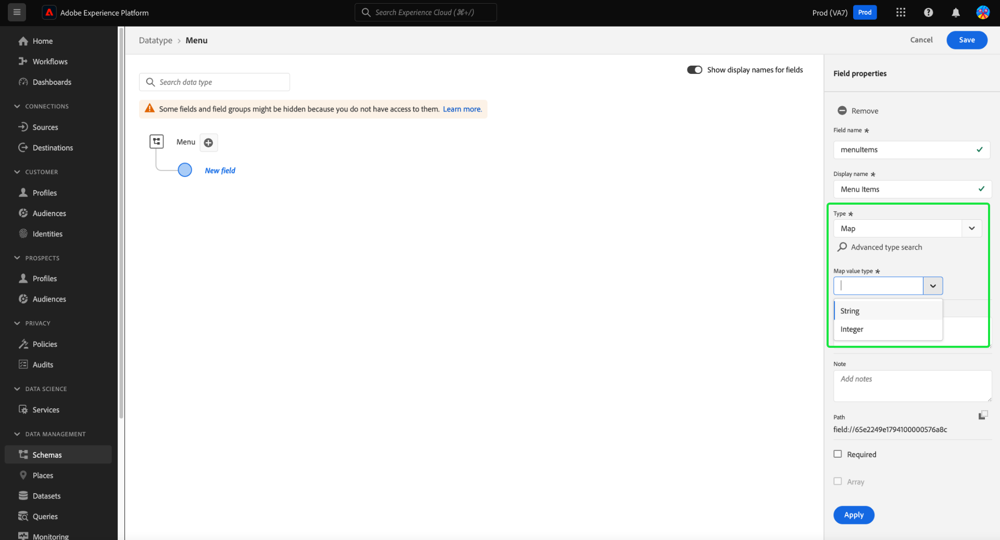

# XDM-velden definiëren in de UI

Met [!DNL Schema Editor] in de Adobe Experience Platform-gebruikersinterface kunt u uw eigen velden definiëren binnen XDM-klassen (Custom Experience Data Model) en groepen schemavelden. In deze handleiding worden de stappen beschreven voor het definiëren van XDM-velden in de gebruikersinterface, inclusief de beschikbare configuratieopties voor elk veldtype.

## Vereisten

Deze handleiding vereist een goed begrip van XDM System. Verwijs naar het [&#x200B; XDM overzicht &#x200B;](../../home.md) voor een inleiding aan de rol van XDM binnen het ecosysteem van Experience Platform, en de [&#x200B; grondbeginselen van schemacompositie &#x200B;](../../schema/composition.md) om te leren hoe de klassen en de gebiedsgroepen gebieden aan XDM schema&#39;s bijdragen.

Terwijl niet vereist voor deze gids, wordt het geadviseerd dat u ook het leerprogramma volgt op [&#x200B; samenstellend een schema in UI &#x200B;](../../tutorials/create-schema-ui.md) om zich met de diverse mogelijkheden van [!DNL Schema Editor] vertrouwd te maken.

## Selecteer een bron waaraan u velden wilt toevoegen {#select-resource}

Als u nieuwe XDM-velden in de gebruikersinterface wilt definiëren, moet u eerst een schema openen in de [!DNL Schema Editor] . Afhankelijk van welke schema&#39;s momenteel beschikbaar aan u in [!DNL Schema Library] zijn, kunt u verkiezen om [&#x200B; een nieuw schema &#x200B;](../resources/schemas.md#create) tot stand te brengen of [&#x200B; een bestaand schema te selecteren om uit te geven &#x200B;](../resources/schemas.md#edit).

Als u [!DNL Schema Editor] hebt geopend, verschijnen er besturingselementen voor het toevoegen van velden op het canvas. Deze besturingselementen worden naast de naam van het schema weergegeven, evenals alle velden van het objecttype die zijn gedefinieerd onder de geselecteerde klasse of veldgroep.

>[!WARNING]
>
>Als u een veld probeert toe te voegen aan een object dat wordt geleverd door een standaardveldgroep, wordt die veldgroep geconverteerd naar een aangepaste veldgroep en is de oorspronkelijke veldgroep niet meer beschikbaar. Zie de sectie op [&#x200B; toevoegend gebieden aan standaardgebiedsgroepen &#x200B;](../resources/schemas.md#custom-fields-for-standard-groups) in de schema&#39;s UI gids voor meer informatie.

Om een nieuw gebied aan het middel toe te voegen, selecteer **plus (+)** pictogram naast de naam van het schema in het canvas, of naast het voorwerp-type gebied dat u het gebied onder wilt bepalen.

Afhankelijk van het feit of u een veld rechtstreeks aan een schema of aan de deel-klasse en -veldgroepen toevoegt, variëren de vereiste stappen voor het toevoegen van het veld. De rest van dit document richt zich op hoe te om de eigenschappen van een gebied ongeacht te vormen waar dat gebied in het schema verschijnt. Voor meer informatie over de verschillende manieren dat de gebieden aan een schema kunnen worden toegevoegd, verwijs naar de volgende secties in de gids van schema&#39;s UI:

* [Velden toevoegen aan veldgroepen](../resources/schemas.md#add-fields)
* [Velden rechtstreeks aan een schema toevoegen](../resources/schemas.md#add-individual-fields)

## De eigenschappen van een veld definiëren {#define}

Na het selecteren van **plus (+)** pictogram, verschijnt placeholder **[!UICONTROL Untitled field]** in het canvas.

In de rechterrail onder **[!UICONTROL Field properties]** kunt u de details van het nieuwe veld configureren. Voor elk veld is de volgende informatie vereist:

| Field, eigenschap | Beschrijving |
| --- | --- |
| [!UICONTROL Field name] | Een unieke, beschrijvende naam voor het veld. De naam van het veld kan niet worden gewijzigd nadat het schema is opgeslagen. Deze waarde wordt gebruikt om het gebied in code en in andere stroomafwaartse toepassingen te identificeren en van verwijzingen te voorzien    De naam zou idealiter in camelCase moeten worden geschreven. Het kan alfanumerieke of onderstrepingstekens bevatten, maar het **kan niet** met een onderstrepingsteken beginnen.<ul><li>**Correct**: `fieldName`</li><li>**Acceptable:** `field_name2`, `fieldName_3`</li><li>**Onjuist**: `_fieldName`</li></ul> |
| [!UICONTROL Display name] | Een weergavenaam voor het veld. Dit is de naam die wordt gebruikt om het veld in het canvas van de Schema-editor weer te geven. De gebiedsnaam kan in de vertoningsnaam worden veranderd gebruikend de [&#x200B; knevel van de vertoningsnaam &#x200B;](../resources/schemas.md#display-name-toggle). |
| [!UICONTROL Type] | Het type gegevens dat het veld zal bevatten. Van dit drop-down menu, kunt u één van de [&#x200B; standaard scalaire types &#x200B;](../../schema/field-constraints.md) selecteren die door XDM, of één van de multi-gebied [&#x200B; gegevenstypes &#x200B;](../resources/data-types.md) worden gesteund die eerder in [!DNL Schema Registry] zijn bepaald.  Nota: Als u het gegevenstype van de Kaart selecteert, dan verschijnt het [!UICONTROL Map value type] bezit.   u kunt **[!UICONTROL Advanced type search]** ook selecteren om bestaande gegevenstypes te zoeken en te filtreren en van het gewenste type gemakkelijker de plaats te bepalen. |
| [!UICONTROL Map value type] | Deze waarde is vereist als u [!UICONTROL Map] selecteert als gegevenstype voor het veld. Beschikbare waarden voor de kaart zijn [!UICONTROL String] en [!UICONTROL Integer] . Selecteer een waarde in de vervolgkeuzelijst met beschikbare opties.  om meer over [&#x200B; type-specifieke gebiedseigenschappen &#x200B;](#type-specific-properties) te leren, zie het bepalen gebiedsoverzicht. |

{style="table-layout:auto"}

U kunt ook een beschrijving en notities opgeven voor elk veld. Gebruik het veld **[!UICONTROL Description]** om context toe te voegen en de functionaliteit van het gegevenstype toewijzing te beschrijven. Dit draagt bij tot het onderhoud en de leesbaarheid van de implementatie. U kunt ook notities toevoegen als aanvulling op de oorspronkelijke beschrijving. Dit zou korrelige en specifieke informatie moeten aanbieden om ontwikkelaars te helpen bij het begrijpen, onderhouden en effectief gebruiken van de kaart binnen de context van codebase. |

>[!NOTE]
>
>Afhankelijk van **[!UICONTROL Type]** u voor het gebied selecteerde, kunnen de extra configuratiecontroles in het juiste spoor verschijnen. Zie de sectie op [&#x200B; type-specifieke gebiedseigenschappen &#x200B;](#type-specific-properties) voor meer informatie over deze controles.
>
>De rechterrail biedt ook selectievakjes voor het aanwijzen van speciale veldtypen. Zie de sectie op [&#x200B; speciale gebiedstypes &#x200B;](#special) voor meer informatie.

Selecteer **[!UICONTROL Apply]** nadat u de configuratie van het veld hebt voltooid.

![&#x200B; de [!UICONTROL Field properties] sectie van de Redacteur van het Schema wordt benadrukt.](../../images/ui/fields/overview/field-details.png)

Het canvas wordt bijgewerkt om het nieuwe toegevoegde veld weer te geven dat zich binnen een object bevindt dat een naamruimte heeft naar uw unieke huurder-id (weergegeven als `_tenantId` in het onderstaande voorbeeld). Alle aangepaste velden die aan een schema worden toegevoegd, worden automatisch binnen deze naamruimte geplaatst om conflicten te voorkomen met andere velden van door Adobe verschafte klassen en veldgroepen. Het rechterspoor geeft nu naast de andere eigenschappen ook het pad van het veld weer.

![&#x200B; een nieuw gebied in het schemadiagram en zijn overeenkomstige weg in de [!UICONTROL Field properties] sectie wordt benadrukt.](../../images/ui/fields/overview/field-added.png)

U kunt de bovenstaande stappen blijven volgen om meer velden aan het schema toe te voegen. Zodra het schema wordt bewaard, worden zijn basisklasse en gebiedsgroepen ook bewaard als om het even welke veranderingen in hen zijn aangebracht.

>[!NOTE]
>
>Om het even welke veranderingen u aan de gebiedsgroepen of de klasse van één schema aanbrengt zullen in alle andere schema&#39;s worden weerspiegeld die hen aanwenden.

## Eigenschappen van specifieke velden {#type-specific-properties}

Als u een nieuw veld definieert, kunnen er aanvullende configuratieopties worden weergegeven in de rechterraster, afhankelijk van de **[!UICONTROL Type]** die u voor het veld kiest. In de volgende tabel worden deze extra veldeigenschappen in combinatie met de compatibele typen weergegeven:

| Field, eigenschap | Compatibele typen | Beschrijving |
| --- | --- | --- |
| [!UICONTROL Map value type] | [!UICONTROL Map] | De eigenschap [!UICONTROL Map value type] wordt alleen weergegeven in de gebruikersinterface als u de waarde Kaart in de vervolgkeuzelijst [!UICONTROL Type] selecteert. U kunt kiezen tussen de waarden voor Tekenreeks en Geheel getal voor Kaart. {width="100" zoomable="yes"}  Nota: Om het even welke types van kaartgegevens die door API worden gecreeerd die of geen Koord of een type van Geheel zijn worden getoond als gegevenstype &#39;[!UICONTROL Complex]&#39;. U kunt geen &quot;[!UICONTROL Complex]&quot;gegevenstypes door UI tot stand brengen. |
| [!UICONTROL Pattern] | [!UICONTROL String] | A [&#x200B; regelmatige uitdrukking &#x200B;](https://developer.mozilla.org/en-US/docs/Web/JavaScript/Guide/Regular_Expressions) dat de waarde voor dit gebied moet in overeenstemming zijn om tijdens opname te worden goedgekeurd. |
| [!UICONTROL Format] | [!UICONTROL String] | Selecteer een optie in een lijst met vooraf gedefinieerde indelingen voor tekenreeksen die de waarde moet bevatten. Beschikbare indelingen zijn: <ul><li>[[!UICONTROL date-time]](https://tools.ietf.org/html/rfc3339)</li><li>[[!UICONTROL email]](https://tools.ietf.org/html/rfc2822)</li><li>[[!UICONTROL hostname]](https://tools.ietf.org/html/rfc1123#page-13)</li><li>[[!UICONTROL ipv4]](https://tools.ietf.org/html/rfc791)</li><li>[[!UICONTROL ipv6]](https://tools.ietf.org/html/rfc2460)</li><li>[[!UICONTROL uri]](https://tools.ietf.org/html/rfc3986)</li><li>[[!UICONTROL uri-reference]](https://tools.ietf.org/html/rfc3986#section-4.1)</li><li>[[!UICONTROL url-template]](https://tools.ietf.org/html/rfc6570)</li><li>[[!UICONTROL json-pointer]](https://tools.ietf.org/html/rfc6901)</li></ul> |
| [!UICONTROL Minimum length] | [!UICONTROL String] | Het minimale aantal tekens dat de tekenreeks moet bevatten voordat de waarde wordt geaccepteerd tijdens de opname. |
| [!UICONTROL Maximum length] | [!UICONTROL String] | Het maximum aantal tekens dat de tekenreeks moet bevatten voordat de waarde wordt geaccepteerd tijdens de invoer. |
| [!UICONTROL Minimum value] | [!UICONTROL Double] | De minimumwaarde voor het Dubbele die tijdens inname moet worden goedgekeurd. Als de ingevoerde waarde precies overeenkomt met de waarde die hier is ingevoerd, wordt de waarde geaccepteerd. Wanneer het gebruiken van deze beperking, moet de &quot;[!UICONTROL Exclusive minimum value]&quot;beperking leeg worden gelaten. |
| [!UICONTROL Maximum value] | [!UICONTROL Double] | De maximumwaarde voor het dubbel dat tijdens inname moet worden geaccepteerd. Als de ingevoerde waarde precies overeenkomt met de waarde die hier is ingevoerd, wordt de waarde geaccepteerd. Wanneer het gebruiken van deze beperking, moet de &quot;[!UICONTROL Exclusive maximum value]&quot;beperking leeg worden gelaten. |
| [!UICONTROL Exclusive minimum value] | [!UICONTROL Double] | De maximumwaarde voor het dubbel dat tijdens inname moet worden geaccepteerd. Als de ingevoerde waarde precies overeenkomt met de waarde die hier is ingevoerd, wordt de waarde afgewezen. Wanneer het gebruiken van deze beperking, &quot;[!UICONTROL Minimum value]&quot;(niet-exclusief) beperking moet leeg worden gelaten. |
| [!UICONTROL Exclusive maximum value] | [!UICONTROL Double] | De maximumwaarde voor het dubbel dat tijdens inname moet worden geaccepteerd. Als de ingevoerde waarde precies overeenkomt met de waarde die hier is ingevoerd, wordt de waarde afgewezen. Wanneer het gebruiken van deze beperking, &quot;[!UICONTROL Maximum value]&quot;(niet-exclusief) beperking moet leeg worden gelaten. |

{style="table-layout:auto"}

## Speciale veldtypen {#special}

Het rechterspoor biedt verschillende selectievakjes voor het aanwijzen van speciale rollen voor het geselecteerde veld. Bij het gebruik van sommige van deze opties moet u rekening houden met uw strategie voor het modelleren van gegevens en met de manier waarop u downstreamservices van Experience Platform wilt gebruiken.

Raadpleeg de volgende documentatie voor meer informatie over deze speciale typen:

* [Kaart](./map.md)
* [[!UICONTROL Required]](./required.md)
* [[!UICONTROL Array]](./array.md)
* [[!UICONTROL Enum]](./enum.md)
* [[!UICONTROL Identity]](./identity.md) (Alleen beschikbaar voor tekenreeksvelden)
* [[!UICONTROL Relationship]](./relationship.md) (Alleen beschikbaar voor tekenreeksvelden)

Terwijl technisch niet een speciaal gebiedstype, wordt het ook geadviseerd dat u de gids op [&#x200B; het bepalen van objecten-type gebieden &#x200B;](./object.md) bezoekt om meer over het bepalen van genestelde subfields te leren als uw schemastructuren.

## Volgende stappen

Deze handleiding gaf een overzicht van hoe u XDM-velden in de gebruikersinterface kunt definiëren. Vergeet niet dat velden alleen aan schema&#39;s kunnen worden toegevoegd met behulp van klassen en veldgroepen. Meer over leren hoe te om deze middelen in UI te beheren, zie de gidsen bij het creëren van en het uitgeven van [&#x200B; klassen &#x200B;](../resources/classes.md) en [&#x200B; gebiedsgroepen &#x200B;](../resources/field-groups.md).

Voor meer informatie over de mogelijkheden van de [!UICONTROL Schemas] werkruimte, zie het [[!UICONTROL Schemas] overzicht van de werkruimte &#x200B;](../overview.md).
