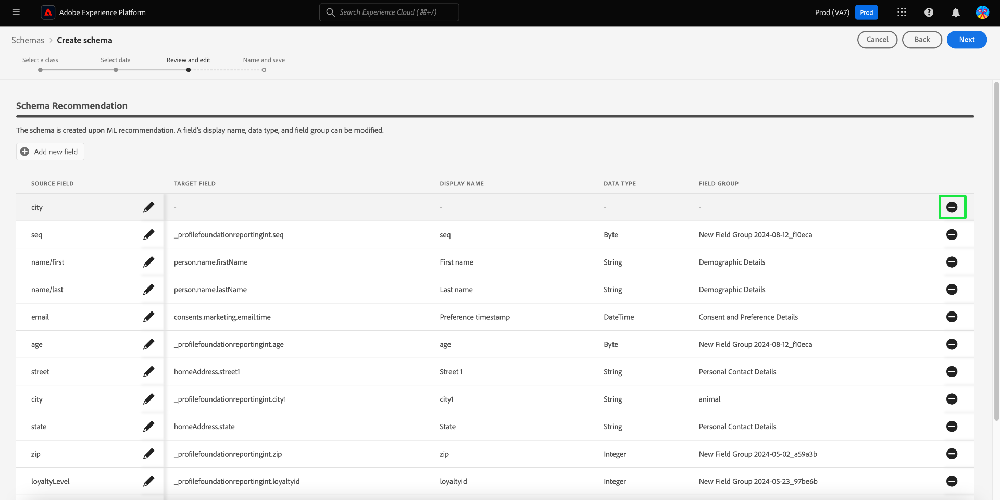

# Machine leren-ondersteund schema maken

>[!AVAILABILITY]
>
>* Het maken van schema&#39;s met leerondersteuning voor machines staat momenteel in bèta. De documentatie en de functionaliteit kunnen worden gewijzigd.

Gebruik ML-algoritmen om een schema te genereren op basis van voorbeeldgegevens. Dit proces bespaart tijd en verhoogt nauwkeurigheid wanneer het bepalen van de structuur, de gebieden, en de gegevenstypes voor grote complexe datasets.

Met het schemageneratie van ML, kunt u nieuwe gegevensbronnen snel integreren en de fouten van handverwezenlijking verminderen. De niet-technische gebruikers kunnen het gebruiken om schema&#39;s te produceren of grote en complexe datasets te beheren zonder enige extra inspanning. Deze hulp versnelt het proces van het krijgen van gegevens tot het verkrijgen van inzicht, aangezien het gemakkelijker maakt om nieuwe gegevensbronnen te combineren en gegevensanalyse uit te voeren.

## Aan de slag

Deze zelfstudie vereist een goed begrip van de vereisten voor het maken van schema&#39;s. Alvorens met deze gids verder te gaan, zou u de [ gids UI aan het creëren van en het uitgeven van schema&#39;s ](./resources/schemas.md) moeten lezen.

Deze gids verklaart hoe te om schema&#39;s tot stand te brengen gebruikend machine het leren (ML) algoritmen om een schema van steekproefgegevens te produceren. Zie de [ handgids van de schemaverwezenlijking ](https://experienceleague.adobe.com/en/docs/experience-platform/xdm/ui/resources/schemas#add-field-groups) voor informatie bij het creëren van schema&#39;s of het document op [ op gebied-gebaseerde werkschema&#39;s in de Redacteur van het Schema ](https://experienceleague.adobe.com/en/docs/experience-platform/xdm/ui/field-based-workflows) om uw begrip van het proces van de schemaverwezenlijking te verbeteren.

>[!NOTE]
>
>U kunt ook een schema samenstellen met de API [!DNL Schema Registry] . Om een schema manueel tot stand te brengen gebruikend API, lees eerst de [[!DNL Schema Registry]  ontwikkelaarsgids ](../api/getting-started.md) alvorens de leerprogramma te proberen op [ creërend een schema gebruikend API ](../tutorials/create-schema-api.md).

## Navigeren naar de workflow Schema maken {#navigate-to-schema-creation-workflow}

Selecteer de **[!UICONTROL Schemas]** -werkruimte in de linkernavigatie van de gebruikersinterface van het platform. De werkruimte van **[!UICONTROL Schemas]** wordt weergegeven. Selecteer **[!UICONTROL Create schema]** om een nieuw schema toe te voegen om een werkschema voor het maken van schema&#39;s te beginnen.

## Een schema maken {#create-a-schema}

Het dialoogvenster [!UICONTROL Create a schema] wordt weergegeven. Selecteer de ]**schemaverwezenlijking 0} ML-Begeleidde **[!UICONTROL Select]**optie, die door wordt gevolgd om uw keus te bevestigen.**[

![ de [!UICONTROL Create a schema] dialoog met [!UICONTROL ML- Assisted] benadrukte.](../images/ui/ml-schema-creation/use-sample-csv.png)

### Een basisklasse selecteren {#select-base-class}

De [!UICONTROL Create schema] -workflow wordt weergegeven. Selecteer een basisklasse voor het schema gevolgd door **[!UICONTROL Next]** .

### Een CSV-bestand uploaden {#upload-csv}

Het **[!UICONTROL Select data]** -werkgebied van de ontwerpworkflow wordt weergegeven. Selecteer in de sectie **[!UICONTROL Upload files]** de sectie **[!UICONTROL Choose files]** of **[!UICONTROL Drag and Drop files]** . Selecteer een .csv- dossier van uw computer om een schema te produceren.

### Gegevens voorvertonen {#preview-data}

In de sectie [!UICONTROL Upload file] wordt de naam weergegeven van het CSV-bestand dat u hebt geïmporteerd en in de sectie **[!UICONTROL Preview]** worden rijen met voorbeeldgegevens uit het bestand dat u hebt geüpload weergegeven. Selecteer **[!UICONTROL Next]** om door te gaan met de workflow.

### Schema controleren en bewerken {#review-schema}

Het **[!UICONTROL Review and edit]** -werkgebied van de ontwerpworkflow wordt nu weergegeven en de computer met leerhulp **[!UICONTROL Schema recommendation]** wordt weergegeven in een tabelweergave. In dit stadium, kunt u, gebieden uitgeven toevoegen of verwijderen uit het geadviseerde schema dat door het machine het leren model wordt geproduceerd. De tabel bevat de volgende velden:

| Veldnaam | Beschrijving |
|------------------|---------------------------------------------------------|
| [!UICONTROL Data table] | De gegevensset of database waar het veld vandaan komt. |
| [!UICONTROL Source Field] | De oorspronkelijke veldnaam van het bronsysteem. |
| [!UICONTROL Target Field] | De veldnaam in het doelsysteem waar de gegevens worden toegewezen. |
| [!UICONTROL Display Name] | De naam die wordt gebruikt om het veld in de gebruikersinterface weer te geven. Deze naam moet gebruikersvriendelijker of beschrijvender zijn. |
| [!UICONTROL Data Type] | Het type gegevens dat in het veld is opgeslagen (bijvoorbeeld `String` , `Date` ). |
| [!UICONTROL Field Group] | Een categorisering van het veld op basis van het gebruik of de context (bijvoorbeeld [!UICONTROL Demographic Details], [!UICONTROL Commerce Details] ). |

#### Veld toevoegen {#add-field}

Als u een veld aan het schema wilt toevoegen, selecteert u **[!UICONTROL Add new field]** .

Het dialoogvenster [!UICONTROL Select field] wordt weergegeven. Het dialoogvenster bevat een diagram van het schema zoals dat momenteel bestaat. Selecteer het gewenste gebied en selecteer **[Uitgezocht]** om een nieuw gebied aan het schema toe te voegen. Selecteer **[annuleert]** om de dialoog indien nodig te sluiten.

Er wordt een nieuwe rij weergegeven in het aanbevolen schema. U kunt het veld nu bewerken.

#### Een veld bewerken {#edit-field}

Als u een veld wilt bewerken, selecteert u het potloodpictogram van de rij die u wilt bewerken. Rechts wordt een deelvenster met details weergegeven waarin u de aangepaste veldtoewijzing kunt bewerken. Het deelvenster Details bevat de deelvensters [!UICONTROL Target field] , [!UICONTROL Display Name] , [!UICONTROL Data Type] en [!UICONTROL Field Group] . Breng de benodigde wijzigingen aan en selecteer **[!UICONTROL Apply]** om te bevestigen. Selecteer opnieuw het potloodpictogram om het detailpaneel te sluiten.

#### Een veld verwijderen {#remove-field}

Als u een veld wilt verwijderen, selecteert u het min-pictogram in een rij die u wilt verwijderen.

>[!CAUTION]
>
>Er wordt geen bevestigingsvenster weergegeven wanneer u dit item verwijdert.

#### Uw aanbevolen schema goedkeuren {#approve}

Om uw geadviseerd schema goed te keuren en het **[!UICONTROL Create schema]** werkschema voort te zetten, selecteer **[daarna]**.

### Schema een naam geven en opslaan {#name-and-save}

Het **[!UICONTROL Name and save]** -werkgebied van de ontwerpworkflow wordt weergegeven. Ga de vertoningsnaam van het a **[Schema]** en een facultatieve beschrijving in. Het **[geproduceerde Schema]** sectie verstrekt een diagram van het ML-geproduceerde schema. Selecteer **[Afwerking]** om het werkschema van de schemaverwezenlijking te voltooien.

### Weergeven in de Schema-editor {#view-in-editor}

De Schema-editor wordt weergegeven met het nieuwe schema dat op het canvas wordt weergegeven. Selecteer **[!UICONTROL Save]** om terug te keren naar de werkruimte van [!UICONTROL Schemas] .

## Volgende stappen

Na het creëren van uw schema, kunt u de Redacteur van het Schema gebruiken om verdere wijzigingen, indien nodig te maken. Uw nieuwe schema is nu klaar om met uw gegevensbronnen te worden geïntegreerd en voor gegevensanalyse worden gebruikt.

Zie [ een bestaande schemagids ](https://experienceleague.adobe.com/en/docs/experience-platform/xdm/ui/resources/schemas#edit) voor meer informatie uitgeven bij het gebruiken van de Redacteur van het Schema.
