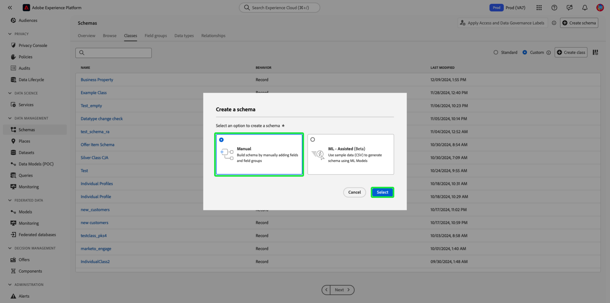

# Klassen maken en bewerken in de gebruikersinterface {#ui-create-and-edit}

>[!CONTEXTUALHELP]
>id="platform_schemas_class_filter"
>title="Standaardfilter of aangepast klassenfilter"
>abstract="De lijst met beschikbare klassen wordt vooraf gefilterd op basis van de manier waarop ze zijn gemaakt. Selecteer het keuzerondje dat u wilt kiezen tussen de opties Standaard en Aangepast. De optie Standaard toont entiteiten die door Adobe zijn gemaakt en bevat zowel de klassen Afzonderlijk XDM profiel als Gebeurtenis voor XDM Experience. De optie Aangepast geeft entiteiten weer die binnen uw organisatie zijn gemaakt. Raadpleeg de documentatie voor meer informatie over het maken en bewerken van klassen."

In Adobe Experience Platform definieert de klasse van een schema de gedragsaspecten van de gegevens die het schema zal bevatten (record of tijdreeks). Bovendien beschrijven de klassen het kleinste aantal gemeenschappelijke eigenschappen die alle die schema&#39;s op die klasse worden gebaseerd zouden moeten omvatten en een manier verstrekken om veelvoudige compatibele datasets worden samengevoegd.

Adobe verstrekt verscheidene standaard (&quot;kern&quot;) klassen van de Gegevens van de Ervaring Model (XDM), met inbegrip van [ XDM Individueel Profiel ](../../classes/individual-profile.md) en [ XDM ExperienceEvent ](../../classes/experienceevent.md). Naast deze kernklassen kunt u ook uw eigen aangepaste klassen maken om specifieke gebruiksgevallen voor uw organisatie te beschrijven.

Dit document biedt een overzicht van het maken, bewerken en beheren van aangepaste klassen in de gebruikersinterface van Experience Platform.

## Vereisten {#prerequisites}

Deze handleiding vereist een goed begrip van XDM System. Verwijs naar het [ XDM overzicht ](../../home.md) voor een inleiding aan de rol van XDM binnen het ecosysteem van Experience Platform, en de [ grondbeginselen van schemacompositie ](../../schema/composition.md) om te leren hoe de klassen aan schema&#39;s XDM bijdragen.

Terwijl niet vereist voor deze gids, wordt het geadviseerd dat u ook het leerprogramma volgt op [ samenstellend een schema in UI ](../../tutorials/create-schema-ui.md) om zich met de diverse mogelijkheden van de Redacteur van het Schema vertrouwd te maken.

## Aan de slag {#getting-started}

Selecteer in de gebruikersinterface van Experience Platform de optie **[!UICONTROL Schemas]** in de linkernavigatie om de werkruimte van [!UICONTROL Schemas] te openen en selecteer vervolgens het tabblad **[!UICONTROL Classes]** . Er wordt een lijst met beschikbare klassen weergegeven.

![ De van klassen binnen het [!UICONTROL Classes] lusje van de [!UICONTROL Schemas] benadrukte werkruimte [!UICONTROL Classes] en [!UICONTROL Schemas].](../../images/ui/resources/classes/available-classes.png)

## Filterklassen {#filter}

De lijst met klassen wordt automatisch gefilterd op basis van de manier waarop ze zijn gemaakt. Met de standaardinstelling worden de klassen weergegeven die door Adobe zijn gedefinieerd. U kunt de lijst ook filteren om de lijsten weer te geven die door uw organisatie zijn gemaakt. Selecteer het keuzerondje dat u wilt kiezen tussen de opties [!UICONTROL Standard] en [!UICONTROL Custom] . De optie [!UICONTROL Standard] geeft entiteiten weer die door Adobe zijn gemaakt en de optie [!UICONTROL Custom] geeft entiteiten weer die binnen uw organisatie zijn gemaakt.

![ het [!UICONTROL Classes] lusje van de [!UICONTROL Schemas] werkruimte met [!UICONTROL Standard] en [!UICONTROL Custom] benadrukte.](../../images/ui/resources/classes/standard-and-custom-classes.png)

>[!TIP]
>
>Gebruik de zoekmogelijkheden om een klasse te filteren of te zoeken op basis van de naam ervan. Zie de gids bij [ het onderzoeken van middelen XDM ](../explore.md) voor meer informatie.

## Een nieuwe klasse maken {#create}

Er zijn twee methoden om een klasse te maken in de gebruikersinterface van Experience Platform, tot en met **[!UICONTROL Create class]** of **[!UICONTROL Create schema]** .

### Klasse maken

Selecteer **[!UICONTROL Create class]** op het tabblad [!UICONTROL Classes] in de werkruimte van [!UICONTROL Schemas] .

![ het [!UICONTROL Classes] lusje van de [!UICONTROL Schemas] werkruimte met [!UICONTROL Create class] benadrukte ](../../images/ui/resources/classes/create-class.png)

Het dialoogvenster [!UICONTROL Create class] wordt weergegeven. Voer een [!UICONTROL Display name] en [!UICONTROL Description] in voor de klasse en kies het bedoelde gedrag van de klasse met de keuzerondjes. Klassen kunnen van het type [!UICONTROL Record] of [!UICONTROL Time-series] zijn. Selecteer **[!UICONTROL Create]** om uw keuzes te bevestigen en terug te keren naar het tabblad [!UICONTROL Classes] .

![ de [!UICONTROL Create class] dialoog met [!UICONTROL Create] benadrukte.](../../images/ui/resources/classes/create-class-dialog.png)

De klasse die u hebt gemaakt, is beschikbaar en wordt weergegeven in de weergave [!UICONTROL Classes] .

![ het [!UICONTROL Classes] lusje van de [!UICONTROL Schemas] werkruimte met de onlangs gecreeerd benadrukte klasse.](../../images/ui/resources/classes/new-class-listing.png)

### Schema maken

U kunt ook een klasse maken door handmatig een schema te maken. Selecteer **[!UICONTROL Create schema]** op het tabblad [!UICONTROL Classes] in de werkruimte van [!UICONTROL Schemas] .

![ het [!UICONTROL Classes] lusje van de [!UICONTROL Schemas] werkruimte met [!UICONTROL Create schema] benadrukte ](../../images/ui/resources/classes/create-schema.png)

Selecteer **[!UICONTROL Manual]** in het dialoogvenster [!UICONTROL Create a schema] dat wordt weergegeven.

>[!NOTE]
>
>Als u de workflow voor het maken van een schema met XML-ondersteuning gebruikt, kunt u een bestand uploaden en XML-algoritmen gebruiken om een aanbevolen schema te genereren. In dat schema creatiewerkschema, te hoeven u niet om de basisklasse voor uw schema te specificeren. Leren hoe ML een schemastructuur kan adviseren die op een csv- dossier wordt gebaseerd, zie de [ machine het leren-bijgewoonde gids van de schemaverwezenlijking ](../ml-assisted-schema-creation.md).

De workflow voor het maken van schema&#39;s wordt weergegeven. Selecteer **[!UICONTROL Other]** in de sectie [!UICONTROL Schema details] . Er wordt een lijst met beschikbare klassen weergegeven. Selecteer **[!UICONTROL Create class]**.

![ het [!UICONTROL Create schema] werkschema met [!UICONTROL Other] die in de [!UICONTROL Schema details] sectie wordt benadrukt.](../../images/ui/resources/classes/other-schema-details.png)

Het dialoogvenster [!UICONTROL Create class] wordt weergegeven. Voer een [!UICONTROL Display name] en [!UICONTROL Description] in voor de klasse en kies het bedoelde gedrag van de klasse met de keuzerondjes. Klassen kunnen van het type [!UICONTROL Record] of [!UICONTROL Time-series] zijn. Selecteer **[!UICONTROL Create]** om uw keuzes te bevestigen en terug te keren naar het tabblad [!UICONTROL Classes] .

![ de [!UICONTROL Create class] dialoog met [!UICONTROL Create] benadrukte.](../../images/ui/resources/classes/create-class-from-schema.png)

De lijst met klassen wordt vernieuwd in de sectie [!UICONTROL Schema details] en de nieuwe klasse wordt automatisch geselecteerd. Selecteer **[!UICONTROL Next]** om door te gaan met het maken van uw schema.

![ de [!UICONTROL Schema details] sectie met de nieuwe geselecteerde klasse en [!UICONTROL Next] benadrukte.](../../images/ui/resources/classes/select-new-class.png)

Nadat u een klasse hebt geselecteerd, wordt de sectie [!UICONTROL Name and review] weergegeven. In deze sectie geeft u een naam en beschrijving op om uw schema te identificeren. &#x200B;De basisstructuur van het schema (verstrekt door de klasse) wordt getoond in het canvas voor u om uw geselecteerde klasse en schemastructuur te herzien en te verifiëren.

Voer in het tekstveld een mensvriendelijke [!UICONTROL Schema display name] in. Voer vervolgens een geschikte beschrijving in om uw schema te identificeren. Wanneer u de schemastructuur hebt herzien en met uw montages gelukkig bent, uitgezocht **[!UICONTROL Finish]** om uw schema tot stand te brengen.

![ de [!UICONTROL Name and review] sectie van het [!UICONTROL Create schema] werkschema met [!UICONTROL Schema display name], [!UICONTROL Description], en [!UICONTROL Finish] benadrukte.](../../images/ui/resources/classes/schema-details.png)

## Velden aan een klasse toevoegen {#add-fields}

Als u een schema hebt waarin een aangepaste klasse wordt gebruikt die is geopend in de Schema-editor, kunt u beginnen met het toevoegen van velden aan de klasse. Om een nieuw gebied toe te voegen, selecteer **plus (+)** pictogram naast de naam van het schema.

>[!IMPORTANT]
>
>Wanneer het bouwen van een schema dat een klasse uitvoert die door uw organisatie wordt bepaald, herinner dat de groepen van het schemagebied voor gebruik slechts met compatibele klassen beschikbaar zijn. Aangezien de klasse die u hebt gedefinieerd nieuw is, worden er geen compatibele veldgroepen weergegeven in het dialoogvenster **[!UICONTROL Add field group]** . In plaats daarvan, zult u nieuwe gebiedsgroepen ](./field-groups.md#create) voor gebruik met die klasse moeten creëren [. De volgende keer dat u een schema samenstelt dat de nieuwe klasse implementeert, worden de gedefinieerde veldgroepen weergegeven en beschikbaar voor gebruik.

>[!IMPORTANT]
>
>Onthoud dat alle velden die u aan een klasse toevoegt, worden gebruikt in alle schema&#39;s waarin die klasse wordt gebruikt. Daarom moet u zorgvuldig overwegen welke velden handig zijn in alle gevallen waarin het schema wordt gebruikt. Als u overweegt om een gebied toe te voegen dat slechts gebruik in sommige schema&#39;s onder deze klasse kan zien, kunt u overwegen toevoegend het aan die schema&#39;s door [ te creëren een gebiedsgroep ](./field-groups.md#create) in plaats daarvan.

Er verschijnt een tijdelijke aanduiding **[!UICONTROL Untitled Field]** in het canvas en de rechterrails worden bijgewerkt om besturingselementen weer te geven waarmee de eigenschappen van het veld worden geconfigureerd. Selecteer onder **[!UICONTROL Assign to]** de optie **[!UICONTROL Class]** .

![ een naamloos gebied op het canvas van de Redacteur van het Schema met Toewijzen aan [!UICONTROL Class] geselecteerd en benadrukt gebiedsbezit 1}.](../../images/ui/resources/classes/assign-to-class.png)

Zie de gids op [ definiërend gebieden in UI ](../fields/overview.md#define) voor specifieke stappen op om het gebied aan de klasse te vormen en toe te voegen. Ga door met het toevoegen van zoveel velden als nodig zijn voor de klasse. Als u klaar bent, selecteert u **[!UICONTROL Save]** om zowel het schema als de klasse op te slaan.

![ het onlangs gecreeerd schema op het canvas van de Redacteur van het Schema, met [!UICONTROL Save] benadrukte.](../../images/ui/resources/classes/save.png)

Als u eerder schema&#39;s hebt gecreeerd die deze klasse gebruiken, zullen de onlangs toegevoegde gebieden automatisch in die schema&#39;s verschijnen.

## Een klasse bewerken (#edit-a-class)

>[!NOTE]
>
>Alleen aangepaste klassen die door uw organisatie zijn gedefinieerd, kunnen volledig worden bewerkt en aangepast. Voor kernklassen die door Adobe worden gedefinieerd, kunnen alleen de weergavenamen voor de bijbehorende velden worden bewerkt binnen de context van afzonderlijke schema&#39;s. Zie de sectie op [ het uitgeven vertoningsnamen voor schemagebieden ](./schemas.md#display-names) voor details.
>
>Als een aangepaste klasse eenmaal is opgeslagen en in gegevensinvoer is gebruikt, kunnen er daarna alleen additieve wijzigingen in worden aangebracht. Zie de [ regels van schemaevolutie ](../../schema/composition.md#evolution) voor meer informatie.

U kunt een klasse bewerken via de schemaworkflow door een bestaand schema te bewerken dat de klasse uitbreidt of door handmatig een schema te maken. Het is niet mogelijk een klasse rechtstreeks te bewerken. Selecteer een bestaande klasse of **[!UICONTROL Create a schema]** vanuit het tabblad [!UICONTROL Browse] in de [!UICONTROL Schemas] -werkruimte.

![ de Redacteur van het Schema met een bestaande klasse en [!UICONTROL Create a schema] benadrukte.](../../images/ui/resources/classes/edit-class-options.png)

Als u verkiest om een nieuw schema tot stand te brengen, zie de sectie op [ creërend een schema ](#create-schema) voor details. Zodra u klaar bent met het creëren van het schema (of na het selecteren van een bestaand schema) zal de Redacteur van het Schema verschijnen. Als u een bestaand klasseveld wilt bijwerken, selecteert u het veld in de schemastructuur. De informatie van het veld zal in de rechterspoorlijn worden weergegeven. Zorg ervoor dat de [!UICONTROL Assign to]
optie **[!UICONTROL Class]** is geselecteerd of uw updates hebben geen invloed op de klasse.

![ de Redacteur van het Schema met een geselecteerd en benadrukt gebied, en het juiste spoor blootgesteld, die [!UICONTROL Assign to] benadrukken.](../../images/ui/resources/classes/edit-existing-field.png)

Breng de gewenste wijzigingen in het veld aan en schuif omlaag in de rechterrails om **[!UICONTROL Apply]** te selecteren om uw wijzigingen op te slaan.

>[!IMPORTANT]
>
> Om het even welke updates u aan gebieden aanbrengt zullen in alle schema&#39;s worden toegepast die die klasse, na de [ regels van schemaevolutie ](../../schema/composition.md#evolution) gebruiken.

![ de Redacteur van het Schema met een geselecteerd gebied en het juiste spoor blootgesteld, die [!UICONTROL Apply] benadrukken.](../../images/ui/resources/classes/save-changes.png)

Om nieuwe gebieden toe te voegen, volg [ gebieden aan een klasse ](#add-fields-to-a-class) gids toevoegen. Als u klaar bent, selecteert u **[!UICONTROL Save]** om zowel het schema als de klasse op te slaan.

![ de Redacteur van het Schema met [!UICONTROL Save] benadrukte.](../../images/ui/resources/classes/save-schema.png)

## De klasse van een schema wijzigen {#schema}

U kunt de klasse van het schema op elk gewenst moment tijdens het eerste ontwerpproces wijzigen voordat het is opgeslagen. Dit moet echter met voorzichtigheid gebeuren, aangezien veldgroepen alleen met bepaalde klassen compatibel zijn. Als u de klasse wijzigt, worden het canvas en alle toegevoegde velden opnieuw ingesteld.
Zie de gids bij [ het creëren van en het uitgeven van schema&#39;s ](./schemas.md#change-class) voor meer informatie.

## Volgende stappen {#next-steps}

In dit document wordt beschreven hoe u klassen kunt maken en bewerken met de gebruikersinterface van Experience Platform. Voor meer informatie over de mogelijkheden van de [!UICONTROL Schemas] werkruimte, zie het [[!UICONTROL Schemas] overzicht van de werkruimte ](../overview.md).

Leren hoe te om klassen te beheren die de Registratie API van het Schema gebruiken, zie de [ gids van het klasseeindpunt ](../../api/classes.md).
