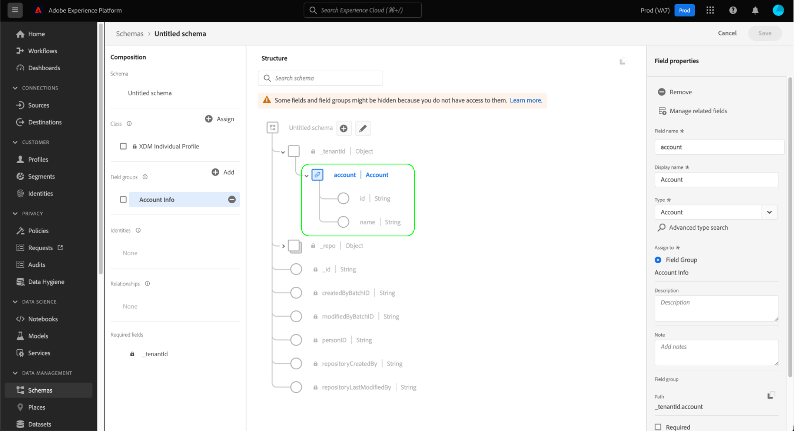

# Gegevenstypen maken en bewerken met de gebruikersinterface {#ui-create-and-edit}

>[!CONTEXTUALHELP]
>id="platform_schemas_datatype_filter"
>title="Standaardfilter of aangepast gegevenstype"
>abstract="De lijst met beschikbare gegevenstypen wordt vooraf gefilterd op basis van de manier waarop ze zijn gemaakt. Selecteer het keuzerondje dat u wilt kiezen tussen de opties Standaard en Aangepast. De optie Standaard toont entiteiten die door Adobe zijn gemaakt en de optie Aangepast geeft entiteiten weer die binnen uw organisatie zijn gemaakt. Raadpleeg de documentatie voor meer informatie over het maken en bewerken van gegevenstypen."

In het Model van Gegevens van de Ervaring (XDM), zijn de gegevenstypes herbruikbare gebieden die veelvoudige subfields bevatten. Terwijl gelijkaardig aan de groepen van het schemagebied in zoverre zij voor het verenigbare gebruik van een multi-gebiedstructuur toestaan, zijn de gegevenstypes flexibeler omdat zij overal in de schemastructuur kunnen worden omvat terwijl de gebiedsgroepen slechts op het wortelniveau kunnen worden toegevoegd.

Adobe Experience Platform biedt vele standaardgegevenstypen die kunnen worden gebruikt voor een groot aantal gangbare praktijkbeheertoepassingen. U kunt echter ook uw eigen aangepaste gegevenstypen definiëren om aan uw unieke bedrijfsbehoeften te voldoen.

>[!NOTE]
>
>Als een veld is gedefinieerd als een specifiek gegevenstype, kunt u niet hetzelfde veld met een ander gegevenstype in een ander schema maken. Deze beperking geldt voor de huurder van uw organisatie.

Deze zelfstudie behandelt de stappen voor het maken en bewerken van aangepaste gegevenstypen in de Experience Platform-gebruikersinterface.

## Vereisten {#prerequisites}

Deze handleiding vereist een goed begrip van XDM System. Verwijs naar het [ XDM overzicht ](../../home.md) voor een inleiding aan de rol van XDM binnen het ecosysteem van Experience Platform, en de [ grondbeginselen van schemacompositie ](../../schema/composition.md) voor hoe de gegevenstypes aan schema&#39;s bijdragen XDM.

Terwijl niet vereist voor deze gids, wordt het geadviseerd dat u ook het leerprogramma volgt op [ samenstellend een schema in UI ](../../tutorials/create-schema-ui.md) om zich met de diverse mogelijkheden van [!DNL Schema Editor] vertrouwd te maken.

## Open de lus [!DNL Schema Editor] voor een gegevenstype {#data-type}

Selecteer in de gebruikersinterface van Experience Platform de optie **[!UICONTROL Schemas]** in de linkernavigatie om de werkruimte van [!UICONTROL Schemas] te openen en selecteer vervolgens het tabblad **[!UICONTROL Data types]** . Er wordt een lijst met beschikbare gegevenstypen weergegeven. De lijst met gegevenstypen wordt automatisch gefilterd op basis van de manier waarop ze zijn gemaakt. Met de standaardinstelling worden de gegevenstypen weergegeven die door Adobe zijn gedefinieerd. U kunt de lijst ook filteren om de lijsten weer te geven die door uw organisatie zijn gemaakt.

![ de [!UICONTROL Schemas] werkruimte met [!UICONTROL Schemas] in de linkernavigatie en [!UICONTROL Data types] benadrukte.](../../images/ui/resources/data-types/data-types-tab.png)

Hier hebt u de volgende opties:

- [Een nieuw gegevenstype maken](#create)
- [Gegevenstypen filteren](#filter)
- [Een bestaand gegevenstype selecteren om te bewerken](#edit)

### Een nieuw gegevenstype maken {#create}

Selecteer op het tabblad **[!UICONTROL Data types]** de optie **[!UICONTROL Create data type]**.

![ het [!UICONTROL Schemas] werkruimte [!UICONTROL Data types] lusje met [!UICONTROL Create data type] benadrukte.](../../images/ui/resources/data-types/create.png)

De lus [!DNL Schema Editor] wordt weergegeven en geeft de huidige structuur van het nieuwe gegevenstype op het canvas weer. Aan de rechterkant van de editor kunt u een weergavenaam en een optionele beschrijving voor het gegevenstype opgeven. Zorg ervoor dat u een unieke en beknopte naam voor uw gegevenstype opgeeft, omdat dit zo is dat het wordt geïdentificeerd wanneer u het aan een schema toevoegt.

Deze zelfstudie maakt een gegevenstype dat een restauratie-eigenschap beschrijft, zodat het gegevenstype de weergavenaam &quot;Restaurant&quot; krijgt.

Van hier, kunt u vooruit aan de [ volgende sectie ](#add-fields) overslaan beginnen gebieden aan het nieuwe gegevenstype toe te voegen.

### Gegevenstypen filteren {#filter}

De lijst met beschikbare gegevenstypen wordt vooraf gefilterd op basis van de manier waarop ze zijn gemaakt. Selecteer het keuzerondje dat u wilt kiezen tussen de opties [!UICONTROL Standard] en [!UICONTROL Custom] . De optie [!UICONTROL Standard] geeft entiteiten weer die door Adobe zijn gemaakt en de optie [!UICONTROL Custom] geeft entiteiten weer die binnen uw organisatie zijn gemaakt.

![ het [!UICONTROL Data types] lusje van de [!UICONTROL Schemas] werkruimte met [!UICONTROL Standard] en [!UICONTROL Custom] benadrukte.](../../images/ui/resources/data-types/standard-and-custom-data-types.png)

### Een bestaand gegevenstype bewerken {#edit}

>[!NOTE]
>
>Zodra een bestaand gegevenstype in een schema wordt gebruikt dat voor gebruik in het Profiel van de Klant in real time is toegelaten, slechts kunnen niet-destructieve veranderingen daarna in dat gegevenstype worden aangebracht. Zie de [ regels van schemaevolutie ](../../schema/composition.md#evolution) voor meer informatie.

Alleen aangepaste gegevenstypen die door uw organisatie zijn gedefinieerd, kunnen worden bewerkt. Selecteer **[!UICONTROL Custom]** om alleen aangepaste gegevenstypen weer te geven die eigendom zijn van uw organisatie.

Selecteer in de lijst het gegevenstype dat u wilt bewerken om de rechtertrack te openen, met daarin de details van het gegevenstype. Vanuit het deelvenster Details kunt u ook een voorbeeldbestand downloaden, de JSON-structuur kopiëren of het gegevenstype aan een pakket toevoegen.

Selecteer de naam van het gegevenstype in de rechterrail om de structuur ervan te openen in de [!DNL Schema Editor] .

![ het [!UICONTROL Data types] lusje van de [!UICONTROL Schemas] werkruimte, met een gegevenstype, [!UICONTROL Custom] en het benadrukte gegevenstype [!UICONTROL Name].](../../images/ui/resources/data-types/edit.png)

## Velden toevoegen aan het gegevenstype {#add-fields}

Begin gebieden aan het gegevenstype toe te voegen, selecteer **plus (+)** pictogram naast het wortel-vlakke gebied in het canvas. Hieronder wordt een nieuw veld weergegeven en de rechtertrack wordt bijgewerkt met besturingselementen voor het nieuwe veld.

Gebruik de besturingselementen in het rechterspoor om de details van het nieuwe veld te configureren. Zie de gids op [ definiërend gebieden in UI ](../fields/overview.md#define) voor specifieke stappen op om het gebied aan het gegevenstype te vormen en toe te voegen.

Het gegevenstype Restaurant vereist een tekenreeksveld voor de naam van het restaurant. Als zodanig wordt [!UICONTROL Field name] ingesteld als &quot;name&quot; en [!UICONTROL Type] als &quot;[!UICONTROL String]&quot;. Selecteer **[!UICONTROL Apply]** om de wijzigingen toe te passen op het veld.

Voeg desgewenst meer velden aan het gegevenstype toe. Het gegevenstype Restaurant heeft nu extra velden voor merk, zitcapaciteit en vloerruimte.

Naast basisvelden kunt u ook andere gegevenstypen nesten binnen het aangepaste gegevenstype. Het gegevenstype Restaurant vereist bijvoorbeeld een veld dat het fysieke adres van de eigenschap vertegenwoordigt. In dit scenario, kunt u een nieuw &quot;adres&quot;gebied toevoegen dat het standaardgegevenstype &quot;[!UICONTROL Postal address]&quot;wordt toegewezen.

Dit toont aan hoe de flexibele gegevenstypes in termen van het beschrijven van uw gegevens kunnen zijn: de gegevenstypes kunnen gebieden gebruiken die ook gegevenstypes zijn, die zelf verdere gegevenstypes kunnen bevatten, etc. Dit staat u toe om gemeenschappelijke gegevenspatronen door uw schema&#39;s te abstract en opnieuw te gebruiken XDM, die het gemakkelijker maken om complexe gegevensstructuren te vertegenwoordigen.

Nadat u alle velden aan het gegevenstype hebt toegevoegd, selecteert u **[!UICONTROL Save]** om de wijzigingen op te slaan en het gegevenstype aan het gegevenstype [!DNL Schema Library] toe te voegen.

## Het gegevenstype toevoegen aan een schema {#add-data-type}

Nadat u een gegevenstype hebt gemaakt, kunt u het in uw schema&#39;s gebruiken. Aangezien XDM-schema&#39;s bestaan uit een klasse en nul of meer veldgroepen, kunnen velden die door een gegevenstype worden verschaft, niet rechtstreeks aan een schema worden toegevoegd. In plaats daarvan moeten ze worden opgenomen in een klasse of een veldgroep.

Begin door de stappen te volgen betrokken met [ toevoegend een gebied aan een klasse ](./classes.md#add-fields) of [ toevoegend een gebied aan een gebiedsgroep ](./field-groups.md#add-fields). Alternatief, kunt u [ beginnen toevoegend een gebied direct aan een schema ](./schemas.md#add-individual-fields) en de ouderklasse of de gebiedsgroep kiezen van daar. Wanneer u **[!UICONTROL Type]** voor het nieuwe gebied kiest, selecteer de naam van uw gegevenstype van het drop-down menu.

## Een object met meerdere velden omzetten in een gegevenstype {#convert}

Wanneer u in [!DNL Schema Editor] een objecttypeveld maakt met meerdere subvelden, kunt u dat veld omzetten in een gegevenstype, zodat u dezelfde veldstructuur kunt gebruiken in een andere klasse of veldgroep.

Als u een objecttypeveld wilt omzetten in een gegevenstype, selecteert u het veld op het canvas. Voordat u het veld converteert, moet u ervoor zorgen dat **[!UICONTROL Display name]** een beschrijving bevat van de gegevens die het object bevat, aangezien dit de naam van het gegevenstype wordt. Wanneer u klaar bent om het veld om te zetten, selecteert u **[!UICONTROL Convert to new data type]** in de rechterrails.

Het canvas werkt het gegevenstype van het gebied van &quot;[!UICONTROL Object]&quot;aan het nieuwe gegevenstype bij. Deze structuur kan nu opnieuw worden gebruikt in andere klassen en veldgroepen door dit gegevenstype te selecteren in het vervolgkeuzemenu **[!UICONTROL Type]** wanneer u een nieuw veld definieert.

## Volgende stappen {#next-steps}

In deze handleiding wordt beschreven hoe u gegevenstypen kunt maken en bewerken met de gebruikersinterface van Experience Platform. Voor meer informatie over de mogelijkheden van de [!UICONTROL Schemas] werkruimte, zie het [[!UICONTROL Schemas] overzicht van de werkruimte ](../overview.md).

Leren hoe te om gegevenstypes te beheren gebruikend [!DNL Schema Registry] API, zie de [ gids van het gegevenstypepunteindpunt ](../../api/data-types.md).
