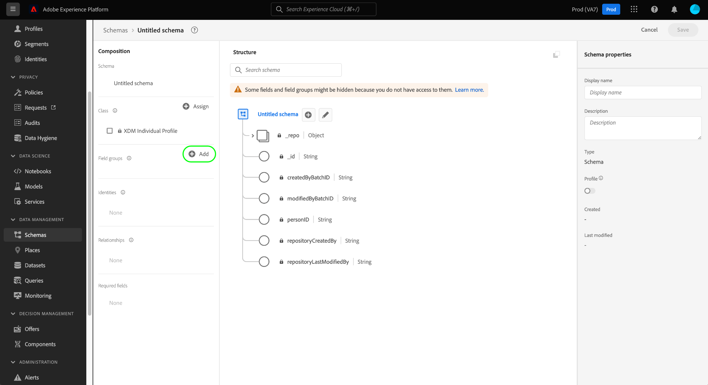
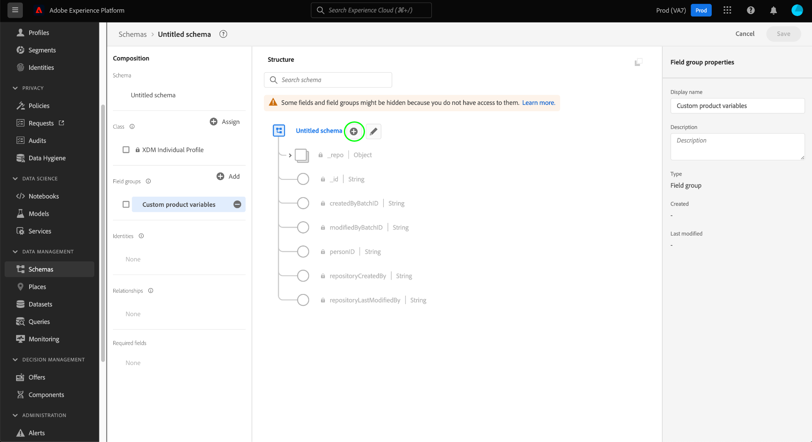
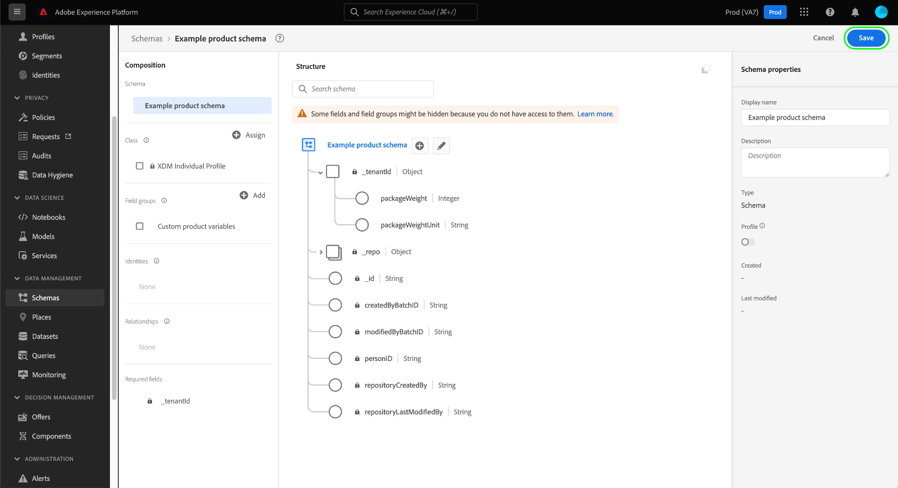

# Groepen schemavelden maken en bewerken in de gebruikersinterface

In het Model van Gegevens van de Ervaring (XDM), zijn de groepen van het schemagebied herbruikbare componenten die één of meerdere gebieden bepalen die bepaalde functies zoals persoonlijke details, hotelvoorkeur, of adres uitvoeren. Veldgroepen moeten worden opgenomen als onderdeel van een schema dat een compatibele klasse implementeert.

Een veldgroep definieert met welke klasse(n) het compatibel is, op basis van het gedrag van de gegevens die de veldgroep vertegenwoordigt (record- of tijdreeks). Dit betekent dat niet alle veldgroepen beschikbaar zijn voor gebruik met alle klassen.

Adobe Experience Platform biedt een groot aantal standaardveldgroepen die een groot aantal gevallen van marketinggebruik bestrijken. U kunt echter ook uw eigen aangepaste veldgroepen maken en bewerken om aanvullende concepten voor uw bedrijf in uw XDM-schema&#39;s te definiëren. Deze gids verstrekt een overzicht van om, aangepaste gebiedsgroepen voor uw organisatie in de UI van het Platform tot stand te brengen uit te geven en te beheren.

## Vereisten

Deze handleiding vereist een goed begrip van XDM System. Verwijs naar [XDM overzicht](../../home.md) voor een inleiding aan de rol van XDM binnen het ecosysteem van het Experience Platform, en [grondbeginselen van schemacompositie](../../schema/composition.md) voor hoe de gebiedsgroepen aan schema&#39;s bijdragen XDM.

Hoewel niet vereist voor deze gids, wordt het geadviseerd dat u het leerprogramma ook [het samenstellen van een schema in UI](../../tutorials/create-schema-ui.md) volgt om zich met de diverse mogelijkheden van [!DNL Schema Editor] vertrouwd te maken.

## Nieuwe veldgroep maken {#create}

Als u een nieuwe veldgroep wilt maken, moet u eerst een schema selecteren waaraan de veldgroep wordt toegevoegd. U kunt verkiezen om [een nieuw schema te creëren](./schemas.md#create) of [een bestaand schema te selecteren om](./schemas.md#edit) uit te geven.

Als u het schema hebt geopend in [!DNL Schema Editor], selecteert u **[!UICONTROL Add]** naast de sectie [!UICONTROL Field groups] in de linkertrack.

Er wordt een dialoogvenster weergegeven met een lijst met bestaande veldgroepen voor uw organisatie. Selecteer **[!UICONTROL Create new field group]** boven in het dialoogvenster. Hier kunt u een **[!UICONTROL Display name]** en **[!UICONTROL Description]** voor de gebiedsgroep verstrekken. Selecteer **[!UICONTROL Add field group]** als u klaar bent.

De [!DNL Schema Editor] verschijnt opnieuw, met de nieuwe gebiedsgroep die in de linkerspoorstaaf wordt vermeld. Aangezien dit een gloednieuwe veldgroep is, biedt deze momenteel geen velden aan het schema en blijft het canvas daarom ongewijzigd. U kunt nu [velden toevoegen aan de veldgroep](#add-fields).

## Een bestaande veldgroep bewerken {#edit}

>[!NOTE]
>
>Alleen aangepaste veldgroepen die door uw organisatie zijn gedefinieerd, kunnen volledig worden bewerkt en aangepast. Voor kernveldgroepen die door Adobe worden gedefinieerd, kunnen alleen de weergavenamen voor hun velden worden bewerkt binnen de context van afzonderlijke schema&#39;s. Zie de sectie op [het uitgeven vertoningsnamen voor schemagebieden](./schemas.md#display-names) voor details.
>
>Nadat een aangepaste veldgroep is opgeslagen en in een schema voor gegevensinvoer is gebruikt, kunnen daarna alleen additieve wijzigingen in de veldgroep worden aangebracht. Zie [regels van schemaevolutie](../../schema/composition.md#evolution) voor meer informatie.

Als u een bestaande veldgroep wilt bewerken, moet u eerst een schema openen waarin de veldgroep wordt gebruikt in de [!DNL Schema Editor]. U kunt [een bestaand schema selecteren om](./schemas.md#edit) uit te geven, of u kunt [een nieuw schema](./schemas.md#create) creëren en de gebiedsgroep in kwestie toevoegen.

Als u het schema hebt geopend in de editor, kunt u [velden toevoegen aan de veldgroep](#add-fields).

## Velden toevoegen aan een veldgroep {#add-fields}

Als u velden wilt toevoegen aan een veldgroep in de [!DNL Schema Editor], selecteert u eerst de naam van de veldgroep in de linkertrack en vervolgens **plus (+)** naast de naam van het schema op het canvas.

Er verschijnt een **[!UICONTROL New field]** in het canvas en de rechterrails worden bijgewerkt om besturingselementen weer te geven waarmee de eigenschappen van het veld worden geconfigureerd. Zie de gids op [het bepalen van gebieden in UI](../fields/overview.md#define) voor specifieke stappen op om het gebied aan de gebiedsgroep te vormen en toe te voegen.

Voeg zo veel velden toe aan de veldgroep. Als u klaar bent, selecteert u **[!UICONTROL Save]** om zowel het schema als de veldgroep op te slaan.

Als dezelfde veldgroep al in andere schema&#39;s wordt gebruikt, worden de toegevoegde velden automatisch in die schema&#39;s weergegeven.

## Volgende stappen

In deze handleiding wordt beschreven hoe u veldgroepen maakt en bewerkt met de gebruikersinterface van het Platform. Voor meer informatie over de mogelijkheden van de [!UICONTROL Schemas] werkruimte, zie [[!UICONTROL Schemas] werkruimteoverzicht](../overview.md).

Meer informatie over het beheren van veldgroepen met de [!DNL Schema Registry] API vindt u in de [eindpuntgids voor veldgroepen](../../api/field-groups.md).