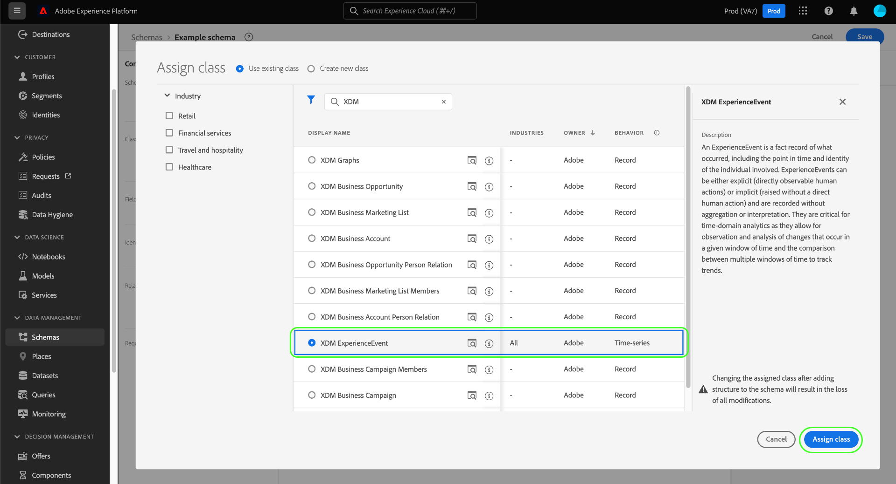

# Schema&#39;s maken en bewerken in de gebruikersinterface

Deze handleiding biedt een overzicht van het maken, bewerken en beheren van XDM-schema&#39;s (Experience Data Model) voor uw organisatie in de gebruikersinterface van Adobe Experience Platform.

>[!IMPORTANT]
>
>De schema&#39;s XDM zijn uiterst aanpasbaar, en daarom kunnen de stappen betrokken bij het creëren van een schema variëren afhankelijk van welk soort gegevens u het schema wilt vangen. Dientengevolge, behandelt dit document slechts de basisinteractie u met schema&#39;s in UI kunt maken, en sluit verwante stappen uit zoals het aanpassen van klassen, mixins, gegevenstypes, en gebieden uit.
>
>Voor een volledige tour van het proces van de schemaverwezenlijking, volg samen met [schemaverwezenlijking leerprogramma](../../tutorials/create-schema-ui.md) om een volledig voorbeeldschema tot stand te brengen en zich met de vele mogelijkheden van [!DNL Schema Editor] vertrouwd te maken.

## Vereisten

Deze handleiding vereist een goed begrip van XDM System. Verwijs naar [XDM overzicht](../../home.md) voor een inleiding aan de rol van XDM binnen het ecosysteem van het Experience Platform, en de [grondbeginselen van schemacompositie](../../schema/composition.md) voor een overzicht van hoe de schema&#39;s worden geconstrueerd.

## Nieuw schema maken {#create}

Selecteer **[!UICONTROL Schema]** in de werkruimte [!UICONTROL Schema] in de rechterbovenhoek maken. In dropdown die verschijnt, kunt u tussen **[!UICONTROL XDM Individual Profile]** en **[!UICONTROL XDM ExperienceEvent]** als basisklasse voor het schema kiezen. U kunt ook **[!UICONTROL Bladeren]** selecteren in de volledige lijst met beschikbare klassen of [in plaats daarvan een nieuwe aangepaste klasse](./classes.md#create) maken.

Nadat u een klasse hebt geselecteerd, wordt [!DNL Schema Editor] weergegeven en wordt de basisstructuur van het schema (opgegeven door de klasse) weergegeven op het canvas. Van hier, kunt u het juiste spoor gebruiken om **[!UICONTROL Naam van de Vertoning]** en **[!UICONTROL Beschrijving]** voor het schema toe te voegen.

U kunt nu beginnen de structuur van het schema te bouwen door [mixins](#add-mixins) toe te voegen.

## Bewerk een bestaand schema {#edit}

>[!NOTE]
>
>Als een schema eenmaal is opgeslagen en gebruikt in gegevensinvoer, kunnen er alleen additieve wijzigingen in worden aangebracht. Zie [regels van schemaevolutie](../../schema/composition.md#evolution) voor meer informatie.

Als u een bestaand schema wilt bewerken, selecteert u het tabblad **[!UICONTROL Bladeren]** en selecteert u vervolgens de naam van het schema dat u wilt bewerken.

>[!TIP]
>
>Met de zoek- en filtermogelijkheden van de werkruimte kunt u het schema gemakkelijker vinden. Zie de handleiding bij [het verkennen van XDM-bronnen](../explore.md) voor meer informatie.

Nadat u een schema hebt geselecteerd, wordt [!DNL Schema Editor] weergegeven met de structuur van het schema die op het canvas wordt weergegeven. U kunt nu [mixins](#add-mixins) aan het schema toevoegen, [namen van veldvertoningen bewerken](#display-names), of [bestaande aangepaste mixins](./mixins.md#edit) bewerken als het schema een van deze mixins gebruikt.

## Mixingen toevoegen aan een schema {#add-mixins}

>[!NOTE]
>
>Deze sectie behandelt hoe te om bestaande mengelingen aan een schema toe te voegen. Als u een nieuwe douanemix wilt tot stand brengen, zie de gids op [creërend en het uitgeven mixins](./mixins.md#create) in plaats daarvan.

Nadat u een schema hebt geopend in het [!DNL Schema Editor], kunt u velden aan het schema toevoegen met behulp van mixins. Selecteer **[!UICONTROL Add]** naast **[!UICONTROL Mixins]** in de linkerrail om te beginnen.

Er wordt een dialoogvenster weergegeven met een lijst met combinaties die u voor het schema kunt selecteren. Aangezien mixins slechts met één klasse compatibel zijn, slechts zullen die mengen die met de geselecteerde klasse van het schema worden geassocieerd worden vermeld. Standaard worden vermelde mixen gesorteerd op basis van hun populariteit in uw organisatie.

U kunt de zoekbalk gebruiken om de gewenste mix te vinden. De mengsels de waarvan naam de vraag aanpast verschijnen bij de bovenkant van de lijst. Onder **[!UICONTROL Standaardvelden]** worden combinaties weergegeven die velden bevatten die gewenste gegevenskenmerken beschrijven.

Schakel het selectievakje in naast de naam van de mix die u aan het schema wilt toevoegen. U kunt meerdere mixen selecteren in de lijst, waarbij elke geselecteerde mix wordt weergegeven in de rechtertrack.

>[!TIP]
>
>Voor elke vermelde mix kunt u de muis boven het informatiepictogram () houden of erop focussen om een korte beschrijving weer te geven van het type gegevens dat door de mix wordt vastgelegd. U kunt het voorproefpictogram () ook selecteren om de structuur van de gebieden te bekijken die de mengeling verstrekt alvorens u besluit om het aan het schema toe te voegen.

Zodra u uw mengen hebt gekozen, uitgezocht **[!UICONTROL voeg mixin]** toe om hen aan het schema toe te voegen.

De [!DNL Schema Editor] verschijnt opnieuw met de mixin-geleverde gebieden die in het canvas worden vertegenwoordigd.

## Een schema inschakelen voor realtime klantprofiel {#profile}

[Klantprofielen ](../../../profile/home.md) in real time komen gegevens uit verschillende bronnen voor om een volledig overzicht van elke individuele klant te maken. Als u de gegevens wilt die door een schema worden gevangen aan dit proces deelnemen, moet u het schema voor gebruik in [!DNL Profile] toelaten.

>[!IMPORTANT]
>
>Om een schema voor [!DNL Profile] toe te laten, moet het een primair bepaald identiteitsgebied hebben. Zie de handleiding bij [het definiëren van identiteitsvelden](../fields/identity.md) voor meer informatie.

Als u het schema wilt inschakelen, selecteert u eerst de naam van het schema in de linkertrack en selecteert u vervolgens de schakeloptie **[!UICONTROL Profiel]** in de rechterrail.

Er verschijnt een pop-upvenster met de waarschuwing dat een schema dat is ingeschakeld en opgeslagen, niet kan worden uitgeschakeld. Selecteer **[!UICONTROL Inschakelen]** om door te gaan.

Het canvas verschijnt weer met de schakeloptie [!UICONTROL Profiel] ingeschakeld.

>[!IMPORTANT]
>
>Aangezien het schema nog niet wordt opgeslagen, is dit het punt van geen terugkeer als u uw mening over het laten van het schema aan het Profiel van de Klant in real time verandert: wanneer u een ingeschakeld schema hebt opgeslagen, kan het niet meer worden uitgeschakeld. Selecteer opnieuw **[!UICONTROL Profiel]** knevel om het schema onbruikbaar te maken.

Om het proces te beëindigen, uitgezocht **[!UICONTROL sparen]** om het schema te bewaren.

Het schema is nu ingeschakeld voor gebruik in het Real-time profiel van de Klant. Wanneer het Platform gegevens in datasets opneemt die op dit schema worden gebaseerd, zullen die gegevens in uw samengevoegde gegevens van het Profiel worden opgenomen.

## Geef vertoningsnamen voor schemagebieden {#display-names} uit

Zodra u een klasse hebt toegewezen en mengsels aan een schema toegevoegd, kunt u de vertoningsnamen van om het even welk van de gebieden van het schema uitgeven, ongeacht of die gebieden door standaard of douaneXDM middelen zijn verstrekt.

>[!NOTE]
>
>Onthoud dat de weergavenamen van velden die tot standaardklassen of -mixen behoren, alleen kunnen worden bewerkt in de context van een specifiek schema. Met andere woorden, het veranderen van de vertoningsnaam van een standaardgebied in één schema beïnvloedt andere schema&#39;s niet die de zelfde bijbehorende klasse of de combinatie gebruiken.

Als u de weergavenaam van een schemaveld wilt bewerken, selecteert u het veld op het canvas. Geef in de rechtertrack de nieuwe naam op onder **[!UICONTROL Weergavenaam]**.

Selecteer **[!UICONTROL Apply]** in het juiste spoor, en het canvas werkt bij om de nieuwe vertoningsnaam van het gebied te tonen. Selecteer **[!UICONTROL Opslaan]** om de wijzigingen toe te passen op het schema.

## Klasse {#change-class} van een schema wijzigen

U kunt de klasse van een schema op om het even welk punt tijdens het aanvankelijke samenstellingsproces veranderen alvorens het schema is bewaard.

>[!WARNING]
>
>Het opnieuw toewijzen van de klasse voor een schema zou met uiterste voorzichtigheid moeten worden gedaan. Mixins zijn alleen compatibel met bepaalde klassen en als u de klasse wijzigt, worden het canvas en alle toegevoegde velden opnieuw ingesteld.

Als u een klasse opnieuw wilt toewijzen, selecteert u **[!UICONTROL Toewijzen]** aan de linkerkant van het canvas.

Er wordt een dialoogvenster weergegeven met een lijst met alle beschikbare klassen, inclusief alle klassen die door uw organisatie zijn gedefinieerd (de eigenaar is &quot;[!UICONTROL Klant]&quot;) en standaardklassen die door Adobe zijn gedefinieerd.

Selecteer een klasse in de lijst om de beschrijving ervan aan de rechterkant van het dialoogvenster weer te geven. U kunt ook **[!UICONTROL klassenstructuur voorvertonen]** selecteren om de velden en metagegevens weer te geven die aan de klasse zijn gekoppeld. Selecteer **[!UICONTROL Klasse toewijzen]** om door te gaan.

Er wordt een nieuw dialoogvenster geopend waarin u wordt gevraagd te bevestigen dat u een nieuwe klasse wilt toewijzen. Selecteer **[!UICONTROL Toewijzen]** om te bevestigen.

Nadat de klassewijziging is bevestigd, wordt het canvas opnieuw ingesteld en gaat alle compositievoortgang verloren.

## Volgende stappen

In dit document worden de basisbeginselen van het maken en bewerken van schema&#39;s besproken in de gebruikersinterface van het Platform. Het wordt sterk geadviseerd dat u [schemaverwezenlijking leerprogramma](../../tutorials/create-schema-ui.md) voor een uitvoerige werkschema voor het bouwen van een volledig schema in UI, met inbegrip van het creëren van douanemengsels en gegevenstypes voor unieke gebruiksgevallen herzien.

Voor meer informatie over de mogelijkheden van de [!UICONTROL Schemas] werkruimte, zie [[!UICONTROL Schemas] werkruimteoverzicht](../overview.md).

Om te leren hoe te om schema&#39;s in [!DNL Schema Registry] API te beheren, zie [schemaeindpuntgids](../../api/schemas.md).