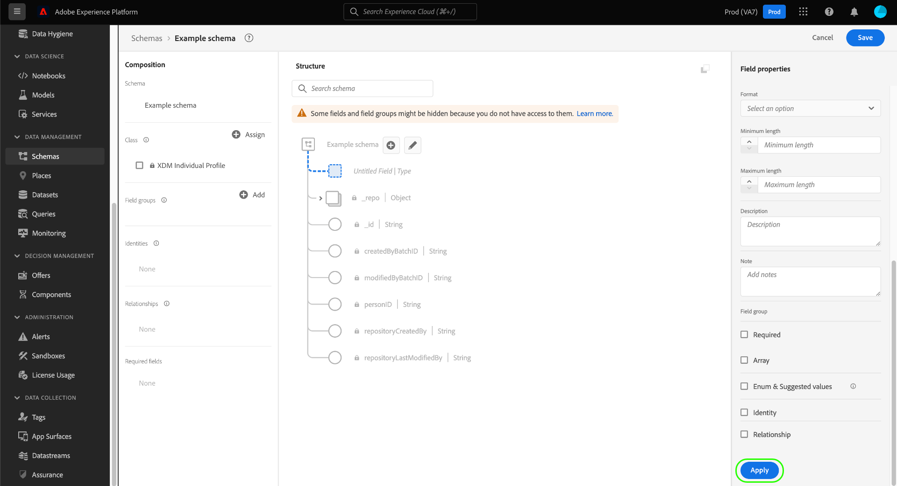

# Schema&#39;s maken en bewerken in de gebruikersinterface {#create-edit-schemas-in-ui}

Deze handleiding biedt een overzicht van het maken, bewerken en beheren van XDM-schema&#39;s (Experience Data Model) voor uw organisatie in de gebruikersinterface van Adobe Experience Platform.

>[!IMPORTANT]
>
>De schema&#39;s XDM zijn uiterst aanpasbaar, en daarom kunnen de stappen betrokken bij het creëren van een schema variëren afhankelijk van welk soort gegevens u het schema wilt vangen. Dientengevolge, behandelt dit document slechts de basisinteractie u met schema&#39;s in UI kunt maken, en sluit verwante stappen uit zoals het aanpassen van klassen, groepen van het schemagebied, gegevenstypes, en gebieden.
>
>Voor een volledige tour van het proces van de schemaverwezenlijking, volg samen met de [&#x200B; zelfstudie van de schemaverwezenlijking &#x200B;](../../tutorials/create-schema-ui.md) om een volledig voorbeeldschema tot stand te brengen en met de vele mogelijkheden van [!DNL Schema Editor] vertrouwd te maken.

## Vereisten {#prerequisites}

Deze handleiding vereist een goed begrip van XDM System. Verwijs naar het [&#x200B; XDM overzicht &#x200B;](../../home.md) voor een inleiding aan de rol van XDM binnen het ecosysteem van Experience Platform, en de [&#x200B; grondbeginselen van schemacompositie &#x200B;](../../schema/composition.md) voor een overzicht van hoe schema&#39;s worden geconstrueerd.

## Een nieuw schema maken {#create}

Selecteer in de werkruimte [!UICONTROL Schemas] de optie **[!UICONTROL Create schema]** in de rechterbovenhoek. Het vervolgkeuzemenu &#39;Schema-type selecteren&#39; wordt weergegeven met opties voor [!UICONTROL Standard] - of [!UICONTROL Relational] -schema&#39;s.

![&#x200B; de werkruimte van Schema&#39;s met [!UICONTROL Create Schema] benadrukte en &quot;Uitgezochte schematype&quot;dropdown getoond &#x200B;](../../images/ui/resources/schemas/create-schema.png).

## Een relationeel schema maken {#create-relational-schema}

>[!AVAILABILITY]
>
>Data Mirror en relationele schema&#39;s zijn beschikbaar aan Adobe Journey Optimizer **Geordende campagnes** vergunninghouders. Zij zijn ook beschikbaar als a **beperkte versie** voor de gebruikers van Customer Journey Analytics, afhankelijk van uw vergunning en eigenschapenactivering. Neem contact op met uw Adobe-vertegenwoordiger voor toegang.

Selecteer **[!UICONTROL Relational]** om gestructureerde, relationele-stijlschema&#39;s met verfijnde controle over verslagen te bepalen. Relationele schema&#39;s steunen primaire zeer belangrijke handhaving, verslag-vlakke versioning, en schema-vlakke verhoudingen door primaire en buitenlandse sleutels. Ze zijn ook geoptimaliseerd voor incrementele inname met behulp van gegevensvastlegging voor wijzigingen en ondersteunen meerdere gegevensmodellen die worden gebruikt in Campagneorganisatie, Data Distiller en B2B-implementaties.

Meer leren, zie [&#x200B; Data Mirror &#x200B;](../../data-mirror/overview.md) of [&#x200B; Relationeel schema &#x200B;](../../schema/relational.md) overzicht.

### Handmatig maken {#create-manually}

>[!AVAILABILITY]
>
>Het uploaden van DDL-bestanden is alleen beschikbaar voor houders van een Adobe Journey Optimizer Orchestrated-campagnelicentie. De gebruikersinterface kan er anders uitzien.

Het dialoogvenster **[!UICONTROL Create a relational schema]** wordt weergegeven. U kunt **[!UICONTROL Create manually]** of [**[!UICONTROL Upload DDL file]**](#upload-ddl-file) kiezen om de schemastructuur te definiëren.

Selecteer **[!UICONTROL Create a relational schema]** in het dialoogvenster **[!UICONTROL Create manually]** en selecteer vervolgens **[!UICONTROL Next]** .

De pagina **[!UICONTROL Relational schema details]** wordt weergegeven. Voer een weergavenaam en een optionele beschrijving in en selecteer vervolgens **[!UICONTROL Finish]** om het schema te maken.

![&#x200B; de relationele mening van schemadetails met [!UICONTROL Schema display name], [!UICONTROL Description], en [!UICONTROL Finish] benadrukte.](../../images/ui/resources/schemas/relational-details.png)

De Schema-editor wordt geopend met een leeg canvas voor het definiëren van de schemastructuur. U kunt velden op de gebruikelijke manier toevoegen.

#### Veld voor versie-id toevoegen {#add-version-identifier}

Als u het bijhouden van versies en het vastleggen van wijzigingsgegevens wilt inschakelen, moet u een veld voor de versie-id in uw schema opgeven. In de Redacteur van het Schema, selecteer plus ( ) naast de schemanaam om een nieuw gebied toe te voegen.

Voer een veldnaam in, bijvoorbeeld `updateSequence` , en kies een gegevenstype **[!UICONTROL DateTime]** of **[!UICONTROL Number]** .

Schakel in de rechtertrack het selectievakje **[!UICONTROL Version Identifier]** in en selecteer **[!UICONTROL Apply]** om het veld te bevestigen.

>[!IMPORTANT]
>
>Een relationeel schema moet een veld voor versie-id bevatten ter ondersteuning van updates op recordniveau en voor het vastleggen van gegevens.

Als u relaties wilt definiëren, selecteert u **[!UICONTROL Add Relationship]** in de Schema-editor om relaties op schemaniveau met primaire/externe sleutels te maken. Zie het leerprogramma op [&#x200B; toevoegend schema-vlakke verhoudingen &#x200B;](../../tutorials/relationship-ui.md#relationship-field) voor meer informatie.

Daarna, ga aan [&#x200B; te werk bepalen primaire sleutels &#x200B;](../fields/identity.md#define-a-identity-field), en [&#x200B; voeg extra gebieden &#x200B;](#add-field-groups) toe zoals nodig. Voor begeleiding op hoe te om veranderingsgegevens toe te laten vangen in de Bronnen van Experience Platform, zie de [&#x200B; gids van de de vangst van veranderingsgegevens vangen &#x200B;](../../../sources/tutorials/api/change-data-capture.md).

>[!NOTE]
>
>Nadat het [!UICONTROL Type] -veld in de [!UICONTROL &#x200B; Schema properties] -zijbalk is opgeslagen, geeft dit aan dat het een [!UICONTROL Relational] -schema is. Dit wordt ook vermeld in de detailszijbalk in de mening van de schemainventaris.
>

### Een DDL-bestand uploaden {#upload-ddl-file}

>[!AVAILABILITY]
>
>Het uploaden van DDL-bestanden is alleen beschikbaar voor houders van een Adobe Journey Optimizer Orchestrated-campagnelicentie.

Gebruik deze workflow om het schema te definiëren door een DDL-bestand te uploaden. Selecteer **[!UICONTROL Create a relational schema]** in het dialoogvenster **[!UICONTROL Upload DDL file]** en sleep vervolgens een lokaal DDL-bestand van uw systeem of selecteer **[!UICONTROL Choose files]** . Experience Platform valideert het schema en geeft een groen vinkje weer als het uploaden van het bestand is gelukt. Selecteer **[!UICONTROL Next]** om het uploaden te bevestigen.

![&#x200B; creeer een relationele schemadialoog met [!UICONTROL Upload DDL file] geselecteerd en [!UICONTROL Next] benadrukt.](../../images/ui/resources/schemas/upload-ddl-file.png)

Het dialoogvenster [!UICONTROL Select entities and fields to import] wordt weergegeven, zodat u een voorvertoning van het schema kunt weergeven. Controleer de schemastructuur, en gebruik de radioknopen en checkboxes om ervoor te zorgen dat elke entiteit een primaire sleutel en gespecificeerde versie-herkenningsteken heeft.

>[!IMPORTANT]
>
>De lijststructuur moet a **primaire sleutel** en a **versie herkenningsteken**, zoals a `updateSequence` gebied van type datetime of aantal bevatten.
>
>Voor het opnemen van veranderingsgegevens, wordt een speciale kolom genoemd `_change_request_type` van typeKoord ook vereist om stijgende verwerking toe te laten. Dit veld geeft het type gegevenswijziging aan (bijvoorbeeld `u` (upsert) of `d` (delete)).

Hoewel vereist tijdens opname, worden de controlecolommen zoals `_change_request_type` niet opgeslagen in het schema en verschijnen niet in de definitieve schemastructuur. Als alles er goed uitziet, selecteert u **[!UICONTROL Done]** om het schema te maken.

>[!NOTE]
>
>De maximale ondersteunde bestandsgrootte voor een DDL-upload is 10 MB.

![&#x200B; de Relationele mening van het schemaoverzicht met ingevoerde getoonde en [!UICONTROL Finish] benadrukte gebieden.](../../images/ui/resources/schemas/entities-and-files-to-inport.png)

Het schema opent in de Redacteur van het Schema, waar u de structuur kunt aanpassen alvorens te bewaren.

Daarna, ga aan [&#x200B; extra gebieden &#x200B;](#add-field-groups) toe, en [&#x200B; voeg extra schema-vlakke verhoudingen &#x200B;](../../tutorials/relationship-ui.md#relationship-field) toe zoals nodig.

Voor begeleiding op hoe te om veranderingsgegevens toe te laten vangen in de Bronnen van Experience Platform, zie de [&#x200B; gids van de de vangst van veranderingsgegevens vangen &#x200B;](../../../sources/tutorials/api/change-data-capture.md).

## Standaardschema maken {#standard-based-creation}

Als u Standaardschematype selecteert in het vervolgkeuzemenu &#39;Selecteer een schematype&#39;, wordt het dialoogvenster [!UICONTROL Create a schema] weergegeven. In dit dialoogvenster kunt u kiezen of u handmatig een schema wilt maken door velden en veldgroepen toe te voegen, of u kunt een CSV-bestand uploaden en XML-algoritmen gebruiken om een schema te genereren. Selecteer een workflow voor het maken van een schema in het dialoogvenster.

### [!BADGE &#x200B; Beta &#x200B;]{type=Informative} Handboek of ML-bijgestaan schemaverwezenlijking {#manual-or-assisted}

Leren hoe u een algoritme van XML kunt gebruiken om een schemastructuur te adviseren die op een csv- dossier wordt gebaseerd, zie de [&#x200B; machine het leren-bijgewoonde gids van de schemaverwezenlijking &#x200B;](../ml-assisted-schema-creation.md). Deze UI-handleiding is gericht op de workflow voor handmatig maken.

### Handmatig schema maken {#manual-creation}

De [!UICONTROL Create schema] -workflow wordt weergegeven. U kunt een basisklasse voor het schema kiezen door **[!UICONTROL Individual Profile]** , **[!UICONTROL Experience Event]** of **[!UICONTROL Other]** te selecteren, gevolgd door **[!UICONTROL Next]** om uw keuze te bevestigen. Zie de documentatie [[!UICONTROL XDM individual profile]](../../classes/individual-profile.md) en [[!UICONTROL XDM ExperienceEvent]](../../classes/experienceevent.md) voor meer informatie over deze klassen.

![&#x200B; het [!UICONTROL Create schema] werkschema met de drie klassenopties en [!UICONTROL Next] benadrukte.](../../images/ui/resources/schemas/schema-class-options.png)

Wanneer u **[!UICONTROL Other]** kiest, wordt een lijst met beschikbare klassen weergegeven. Hier kunt u door bestaande klassen bladeren en deze filteren.

![&#x200B; het [!UICONTROL Create schema] werkschema met [!UICONTROL Other] die in de [!UICONTROL Schema details] sectie wordt benadrukt.](../../images/ui/resources/schemas/other-schema-details.png)

Selecteer een keuzerondje om de klassen te filteren op basis van het feit of ze aangepaste of standaardklassen zijn. U kunt de beschikbare resultaten ook filteren op basis van hun industrie of naar een specifieke klasse zoeken met het zoekveld.

![&#x200B; het [!UICONTROL Create schema] werkschema met de onderzoeksbar, [!UICONTROL Custom], en [!UICONTROL Industries] benadrukte.](../../images/ui/resources/schemas/filter-and-search.png)

Om u te helpen beslissen over de aangewezen klasse, zijn er info en voorproefpictogrammen voor elke klasse. Het infopictogram ( ) opent een dialoogvenster met een beschrijving van de klasse en de industrie waaraan deze is gekoppeld.

Het voorproefpictogram () opent een voorproefdialoog voor de klasse die een schemadiagram en zijn eigenschappen bevat.

Selecteer een willekeurige rij om een klasse te kiezen en selecteer vervolgens **[!UICONTROL Next]** om uw keuze te bevestigen.

![&#x200B; het [!UICONTROL Create schema] werkschema met een klasse die van de lijst van beschikbare klassen wordt geselecteerd en [!UICONTROL Next] benadrukt.](../../images/ui/resources/schemas/select-class.png)

Nadat u een klasse hebt geselecteerd, wordt de sectie [!UICONTROL Name and review] weergegeven. In deze sectie geeft u een naam en beschrijving op om uw schema te identificeren. &#x200B;De basisstructuur van het schema (verstrekt door de klasse) wordt getoond in het canvas voor u om uw geselecteerde klasse en schemastructuur te herzien en te verifiëren.

Voer in het tekstveld een mensvriendelijke [!UICONTROL Schema display name] in. Voer vervolgens een geschikte beschrijving in om uw schema te identificeren. Wanneer u de schemastructuur hebt herzien en met uw montages gelukkig bent, uitgezocht **[!UICONTROL Finish]** om uw schema tot stand te brengen.

![&#x200B; de [!UICONTROL Name and review] sectie van het [!UICONTROL Create schema] werkschema met [!UICONTROL Schema display name], [!UICONTROL Description], en [!UICONTROL Finish] benadrukte.](../../images/ui/resources/schemas/name-and-review.png)

De Schema-editor wordt weergegeven, waarbij de structuur van het schema op het canvas wordt weergegeven. Indien gewenst, kunt u [&#x200B; nu beginnen toevoegend gebieden aan de klasse &#x200B;](../../ui/resources/classes.md#add-fields).

## Een bestaand schema bewerken {#edit}

>[!NOTE]
>
>Als een schema eenmaal is opgeslagen en gebruikt in gegevensinvoer, kunnen er alleen additieve wijzigingen in worden aangebracht. Zie de [&#x200B; regels van schemaevolutie &#x200B;](../../schema/composition.md#evolution) voor meer informatie.

Als u een bestaand schema wilt bewerken, selecteert u de tab **[!UICONTROL Browse]** en selecteert u vervolgens de naam van het schema dat u wilt bewerken. U kunt de zoekbalk ook gebruiken om de lijst met beschikbare opties te verfijnen.

>[!TIP]
>
>Met de zoek- en filtermogelijkheden van de werkruimte kunt u het schema gemakkelijker vinden. Zie de gids bij [&#x200B; het onderzoeken van middelen XDM &#x200B;](../explore.md) voor meer informatie.

Nadat u een schema hebt geselecteerd, wordt de [!DNL Schema Editor] weergegeven met de structuur van het schema die op het canvas wordt weergegeven. U kunt [&#x200B; gebiedsgroepen &#x200B;](#add-field-groups) aan het schema nu toevoegen (of [&#x200B; individuele gebieden &#x200B;](#add-individual-fields) van die groepen toevoegen), [&#x200B; uitgeeft de namen van de gebiedsvertoning &#x200B;](#display-names), of [&#x200B; uitgeeft bestaande groepen van het douaneveld &#x200B;](./field-groups.md#edit) als het schema om het even welk aanwendt.

## Meer acties {#more}

Binnen de Redacteur van het Schema kunt u snelle acties ook voeren om de structuur JSON van het schema te kopiëren of het schema te schrappen als het niet voor het Profiel van de Klant in real time of bijbehorende datasets is toegelaten. Selecteer [!UICONTROL More] boven aan de weergave om een vervolgkeuzelijst met snelle acties weer te geven.

Met de functie voor JSON-structuur kopiëren kunt u zien hoe een voorbeeldlading eruit zou zien terwijl u nog steeds het schema en uw gegevenspipetten maakt. Dit is vooral handig voor situaties waarin het schema complexe structuren voor objecttoewijzingen bevat, zoals een identiteitskaart.

## Schakelen tussen weergavenamen {#display-name-toggle}

Voor uw gemak, verstrekt de Redacteur van het Schema een knevel om tussen de originele gebiedsnamen en de meer leesbare vertoningsnamen te veranderen. Dankzij deze flexibiliteit is het mogelijk uw schema&#39;s beter te detecteren en te bewerken. De knevel wordt gevonden bij het hoogste recht van de mening van de Redacteur van het Schema.

>[!NOTE]
>
>De overgang van veldnamen naar weergavenamen is puur cosmetisch en verandert geen downstreambronnen.

![&#x200B; de Redacteur van het Schema met [!UICONTROL Show display names for fields] benadrukte.](../../images/ui/resources/schemas/display-name-toggle.png)

De vertoningsnamen voor standaardgebiedsgroepen worden geproduceerd maar kunnen worden aangepast, zoals die in de [&#x200B; vertoningsnamen &#x200B;](#display-names) sectie wordt beschreven. De namen van de vertoning worden weerspiegeld over veelvoudige meningen UI, met inbegrip van afbeelding en datasetvoorproeven. De standaardinstelling is uitgeschakeld en geeft de oorspronkelijke waarden van veldnamen weer.

## Veldgroepen toevoegen aan een schema {#add-field-groups}

>[!NOTE]
>
>In deze sectie wordt beschreven hoe u bestaande veldgroepen aan een schema kunt toevoegen. Als u een nieuwe groep van het douanegebied wilt tot stand brengen, zie de gids bij [&#x200B; creërend en het uitgeven gebiedsgroepen &#x200B;](./field-groups.md#create) in plaats daarvan.

Nadat u een schema hebt geopend in de [!DNL Schema Editor] , kunt u velden aan het schema toevoegen via veldgroepen. Selecteer om te beginnen **[!UICONTROL Add]** naast **[!UICONTROL Field groups]** in de linkertrack.

![&#x200B; de Redacteur van het Schema met [!UICONTROL Add] van de [!UICONTROL Field groups] benadrukte sectie.](../../images/ui/resources/schemas/add-field-group-button.png)

Er wordt een dialoogvenster weergegeven met een lijst met veldgroepen die u voor het schema kunt selecteren. Aangezien de gebiedsgroepen slechts met één klasse compatibel zijn, slechts die gebiedsgroepen die met de geselecteerde klasse van het schema worden geassocieerd zullen worden vermeld. Standaard worden vermelde veldgroepen gesorteerd op basis van hun populariteit in uw organisatie.

![&#x200B; de [!UICONTROL Add field groups] dialoog die met de [!UICONTROL Popularity] benadrukte kolom wordt benadrukt.](../../images/ui/resources/schemas/field-group-popularity.png)

Als u de algemene activiteit of het bedrijfsgebied van de gebieden kent u wilt toevoegen, selecteer één of meerdere industrie-verticale categorieën in de linkerspoorstaaf om de getoonde lijst van gebiedsgroepen te filtreren.

![&#x200B; de [!UICONTROL Add field groups] dialoog die met de [!UICONTROL Industry] wordt benadrukt filters en de [!UICONTROL Industry] benadrukte kolom.](../../images/ui/resources/schemas/industry-filter.png)

>[!NOTE]
>
>Voor meer informatie over beste praktijken voor industrie-specifieke gegevens modelleren in XDM, zie de documentatie over [&#x200B; de modellen van de industriegegevens &#x200B;](../../schema/industries/overview.md).

U kunt de zoekbalk ook gebruiken om de gewenste veldgroep te zoeken. Veldgroepen waarvan de naam overeenkomt met de query, worden boven in de lijst weergegeven. Onder **[!UICONTROL Standard Fields]** worden veldgroepen weergegeven die velden bevatten die de gewenste gegevenskenmerken beschrijven.

![&#x200B; de [!UICONTROL Add field groups] dialoog met de [!UICONTROL Standard fields] benadrukte onderzoeksfunctie.](../../images/ui/resources/schemas/field-group-search.png)

Schakel het selectievakje in naast de naam van de veldgroep die u aan het schema wilt toevoegen. U kunt meerdere veldgroepen in de lijst selecteren, waarbij elke geselecteerde veldgroep in de rechtertrack verschijnt.

![&#x200B; het [!UICONTROL Add field groups] dialoog met de benadrukte eigenschap van de checkbox selectie.](../../images/ui/resources/schemas/add-field-group.png)

>[!TIP]
>
>Voor om het even welke vermelde gebiedsgroep, kunt u op het informatiepictogram () bewegen of concentreren om een korte beschrijving van het soort gegevens te bekijken de gebiedsgroep vangt. U kunt het voorproefpictogram () ook selecteren om de structuur van de gebieden te bekijken die de gebiedsgroep verstrekt alvorens u besluit om het aan het schema toe te voegen.

Nadat u de veldgroepen hebt gekozen, selecteert u **[!UICONTROL Add field groups]** om deze aan het schema toe te voegen.

![&#x200B; de [!UICONTROL Add field groups] dialoog met geselecteerde en [!UICONTROL Add field groups] benadrukte gebiedsgroepen.](../../images/ui/resources/schemas/add-field-group-finish.png)

De [!DNL Schema Editor] wordt weer weergegeven met de velden die door de veldgroep worden opgegeven, in het canvas.

![&#x200B; [!DNL Schema Editor] met een getoonde voorbeeldschema.](../../images/ui/resources/schemas/field-groups-added.png)

>[!NOTE]
>
>Binnen de Redacteur van het Schema, worden de standaard (Adobe-geproduceerde) klassen en de gebiedsgroepen vermeld met het hangslotpictogram . Het hangslot verschijnt in de linkerspoorstaaf naast de klasse of de naam van de gebiedsgroep, evenals naast om het even welk gebied in het schemadiagram dat een deel van een systeem-geproduceerde middel is.
>
>

Na het toevoegen van een gebiedsgroep aan een schema, kunt u optioneel [&#x200B; bestaande gebieden &#x200B;](#remove-fields) verwijderen of [&#x200B; nieuwe douanevelden &#x200B;](#add-fields) toevoegen aan die groepen, afhankelijk van uw behoeften.

### Velden verwijderen die zijn toegevoegd uit veldgroepen {#remove-fields}

Nadat u een veldgroep aan een schema hebt toegevoegd, kunt u velden globaal uit de veldgroep verwijderen of ze lokaal uit het huidige schema verbergen. Kennis van het verschil tussen deze acties is van essentieel belang om onbedoelde schemawijzigingen te voorkomen.

>[!IMPORTANT]
>
>Het selecteren **[!UICONTROL Remove]** schrapt het gebied van de gebiedsgroep zelf, die *beïnvloedt alle* schema&#39;s die die gebiedsgroep gebruiken.
>Gebruik deze optie niet tenzij u het gebied uit elk schema wilt **verwijderen dat de gebiedsgroep** omvat.

Als u een veld uit de veldgroep wilt verwijderen, selecteert u het veld op het canvas en selecteert u **[!UICONTROL Remove]** in de rechtertrack. In dit voorbeeld wordt het veld `taxId` van de groep **[!UICONTROL Demographic Details]** getoond.

![&#x200B; De [!DNL Schema Editor] with [!UICONTROL Remove] gemarkeerd. Deze actie verwijdert één enkel gebied.](../../images/ui/resources/schemas/remove-single-field.png)

Als u meerdere velden in een schema wilt verbergen zonder deze uit de veldgroep zelf te verwijderen, gebruikt u de optie **[!UICONTROL Manage related fields]** . Selecteer een willekeurig veld in de groep op het canvas en selecteer vervolgens **[!UICONTROL Manage related fields]** in de rechtertrack.

![&#x200B; [!DNL Schema Editor] met [!UICONTROL Manage related fields] benadrukte.](../../images/ui/resources/schemas/manage-related-fields.png)

Er wordt een dialoogvenster weergegeven met de structuur van de veldgroep. Schakel de velden die u wilt opnemen in of uit met de selectievakjes.

![&#x200B; de [!UICONTROL Manage related fields] dialoog met geselecteerde gebieden en [!UICONTROL Confirm] benadrukte.](../../images/ui/resources/schemas/select-fields.png)

Selecteer **[!UICONTROL Confirm]** om het canvas bij te werken en de geselecteerde velden te weerspiegelen.

### Veldgedrag bij verwijderen of verwijderen van velden {#field-removal-deprecation-behavior}

Gebruik de onderstaande tabel om het bereik van elke actie te begrijpen.

| Actie | Alleen van toepassing op huidig schema | Hiermee wijzigt u de veldgroep | Beïnvloedt andere schema&#39;s | Beschrijving |
|--------------------------|--------------------------------|----------------------|-----------------------|-------------|
| **verwijder gebied** | Nee | Ja | Ja | Hiermee verwijdert u het veld uit de veldgroep. Dit verwijdert het uit alle schema&#39;s gebruikend die groep. |
| **beheer verwante gebieden** | Ja | Nee | Nee | Hiermee verbergt u velden alleen van het huidige schema. De veldgroep blijft ongewijzigd. |
| **verval gebied** | Nee | Ja | Ja | Hiermee markeert u het veld als afgekeurd in de veldgroep. Het is niet meer beschikbaar voor gebruik in om het even welk schema. |

>[!NOTE]
>
>Dit gedrag is consistent in zowel op records gebaseerde als op gebeurtenissen gebaseerde schema&#39;s.

### Aangepaste velden toevoegen aan veldgroepen {#add-fields}

Nadat u een veldgroep aan een schema hebt toegevoegd, kunt u aanvullende velden voor die groep definiëren. Om het even welke gebieden die aan een gebiedsgroep in één schema worden toegevoegd zullen ook in alle andere schema&#39;s verschijnen die die zelfde gebiedsgroep gebruiken.

Als een aangepast veld wordt toegevoegd aan een standaardveldgroep, wordt die veldgroep geconverteerd naar een aangepaste veldgroep en is de oorspronkelijke standaardveldgroep niet meer beschikbaar.

Als u een douanegebied aan een standaardgebiedsgroep wilt toevoegen, verwijs naar de [&#x200B; sectie hieronder &#x200B;](#custom-fields-for-standard-groups) voor specifieke instructies. Als u gebieden aan een groep van het douanegebied toevoegt, verwijs naar sectie over [&#x200B; het uitgeven van de groepen van het douanegebied &#x200B;](./field-groups.md) op de gids van de gebiedsgroepen UI.

Als u geen bestaande gebiedsgroepen wilt veranderen, kunt u [&#x200B; tot een nieuwe groep van het douanegebied &#x200B;](./field-groups.md#create) leiden om extra gebieden in plaats daarvan te bepalen.

## Afzonderlijke velden toevoegen aan een schema {#add-individual-fields}

Met de Schema-editor kunt u afzonderlijke velden rechtstreeks aan een schema toevoegen als u niet een hele veldgroep voor een bepaald gebruiksgeval wilt toevoegen. U kunt [&#x200B; individuele gebieden van standaardgebiedsgroepen &#x200B;](#add-standard-fields) toevoegen of [&#x200B; uw eigen douanevelden &#x200B;](#add-custom-fields) in plaats daarvan toevoegen.

>[!IMPORTANT]
>
>Hoewel de Redacteur van het Schema functioneel u toestaat om individuele gebieden aan een schema direct toe te voegen, verandert dit niet het feit dat alle gebieden in een XDM schema door zijn klasse of een gebiedsgroep moeten worden verstrekt die met die klasse compatibel is. Zoals in de volgende secties wordt uitgelegd, worden alle afzonderlijke velden nog steeds gekoppeld aan een klasse of veldgroep als een belangrijke stap wanneer ze aan een schema worden toegevoegd.

### Standaardvelden toevoegen {#add-standard-fields}

U kunt velden van standaardveldgroepen rechtstreeks aan een schema toevoegen zonder dat u eerst de corresponderende veldgroep hoeft te kennen. Om een standaardgebied aan een schema toe te voegen, selecteer plus (**+**) pictogram naast de naam van het schema in het canvas. Er wordt een tijdelijke aanduiding **[!UICONTROL Untitled Field]** weergegeven in de schemastructuur en de juiste spoorwegupdates om besturingselementen voor de configuratie van het veld zichtbaar te maken.

Typ onder **[!UICONTROL Field name]** de naam van het veld dat u wilt toevoegen. Het systeem zoekt automatisch naar standaardvelden die overeenkomen met de query en geeft deze onder **[!UICONTROL Recommended Standard Fields]** weer, inclusief de veldgroepen waartoe ze behoren.

Sommige standaardvelden hebben dezelfde naam, maar de structuur van deze velden kan afhankelijk zijn van de veldgroep waaruit ze afkomstig zijn. Als een standaardveld is genest in een bovenliggend object in de veldgroepsstructuur, wordt het bovenliggende veld ook opgenomen in het schema als het onderliggende veld wordt toegevoegd.

Selecteer het voorproefpictogram () naast een standaardgebied om de structuur van zijn gebiedsgroep te bekijken en beter te begrijpen hoe het zou kunnen worden genest. Om het standaardgebied aan het schema toe te voegen, selecteer het plusteken ().

 toe

Het canvas wordt bijgewerkt om het standaardveld weer te geven dat aan het schema is toegevoegd, inclusief bovenliggende velden die het is genest onder de structuur van de veldgroep. De naam van de veldgroep wordt ook vermeld onder **[!UICONTROL Field groups]** in de linkertrack. Als u meer velden van dezelfde veldgroep wilt toevoegen, selecteert u **[!UICONTROL Manage related fields]** in de rechtertrack.

### Aangepaste velden toevoegen {#add-custom-fields}

Net als bij de workflow voor standaardvelden kunt u ook uw eigen aangepaste velden rechtstreeks aan een schema toevoegen.

Om gebieden aan het wortelniveau van een schema toe te voegen, selecteer plus (**+**) pictogram naast de naam van het schema in het canvas. Er wordt een tijdelijke aanduiding **[!UICONTROL Untitled Field]** weergegeven in de schemastructuur en de juiste spoorwegupdates om besturingselementen voor de configuratie van het veld zichtbaar te maken.

Typ de naam van het veld dat u wilt toevoegen en het systeem zoekt automatisch naar de desbetreffende standaardvelden. Om een nieuw douanegebied in plaats daarvan tot stand te brengen, selecteer de hoogste optie die met **wordt toegevoegd ([!UICONTROL New Field])**.

Na het verstrekken van een vertoningsnaam en gegevenstype voor het gebied, is de volgende stap het gebied aan een ouderXDM middel toe te wijzen. Als uw schema een douaneklasse gebruikt, kunt u verkiezen om [&#x200B; het gebied aan de toegewezen klasse &#x200B;](#add-to-class) of a [&#x200B; gebiedsgroep &#x200B;](#add-to-field-group) in plaats daarvan toe te voegen. Als uw schema echter een standaardklasse gebruikt, kunt u het aangepaste veld alleen aan een veldgroep toewijzen.

#### Het veld toewijzen aan een aangepaste veldgroep {#add-to-field-group}

>[!NOTE]
>
>In deze sectie wordt alleen beschreven hoe u het veld toewijst aan een aangepaste veldgroep. Als u een standaardgebiedsgroep met het nieuwe douanegebied in plaats daarvan wilt uitbreiden, zie de sectie op [&#x200B; toevoegend douanegebieden aan standaardgebiedsgroepen &#x200B;](#custom-fields-for-standard-groups).

Selecteer onder **[!UICONTROL Assign to]** de optie **[!UICONTROL Field Group]**. Als uw schema een standaardklasse gebruikt, is dit de enige beschikbare optie en door gebrek geselecteerd.

Vervolgens moet u een veldgroep selecteren waaraan het nieuwe veld moet worden gekoppeld. Typ de naam van de veldgroep in de opgegeven tekstinvoer. Als u bestaande aangepaste veldgroepen hebt die overeenkomen met de invoer, worden deze weergegeven in de vervolgkeuzelijst. U kunt ook een unieke naam typen om een nieuwe veldgroep te maken.

>[!WARNING]
>
>Als u een bestaande aangepaste veldgroep selecteert, nemen alle andere schema&#39;s die die veldgroep gebruiken ook het nieuwe toegevoegde veld over nadat u de wijzigingen hebt opgeslagen. Selecteer daarom alleen een bestaande veldgroep als u dit type propagatie wilt gebruiken. Anders kunt u beter een nieuwe aangepaste veldgroep maken.

Selecteer **[!UICONTROL Apply]** nadat u de veldgroep in de lijst hebt geselecteerd.

 toe

Het nieuwe gebied wordt toegevoegd aan het canvas, en is namespaced onder uw [&#x200B; huurder identiteitskaart &#x200B;](../../api/getting-started.md#know-your-tenant_id) om conflicten met standaardXDM gebieden te vermijden. De veldgroep waarmee u het nieuwe veld hebt geassocieerd, wordt ook weergegeven onder **[!UICONTROL Field groups]** in de linkertrack.

>[!NOTE]
>
>De overige velden die door de geselecteerde aangepaste veldgroep worden opgegeven, worden standaard uit het schema verwijderd. Als u enkele van deze velden aan het schema wilt toevoegen, selecteert u een veld dat tot de groep behoort en selecteert u vervolgens **[!UICONTROL Manage related fields]** in de rechtertrack.

#### Het veld toewijzen aan een aangepaste klasse {#add-to-class}

Selecteer onder **[!UICONTROL Assign to]** de optie **[!UICONTROL Class]**. Het invoerveld hieronder wordt vervangen door de naam van de aangepaste klasse van het huidige schema om aan te geven dat het nieuwe veld wordt toegewezen aan deze klasse.

![&#x200B; de [!UICONTROL Class] optie die voor de nieuwe gebiedstoewijzing wordt geselecteerd.](../../images/ui/resources/schemas/assign-field-to-class.png)

Ga door met het configureren van het veld naar wens en selecteer **[!UICONTROL Apply]** als u klaar bent.

![[!UICONTROL Apply] geselecteerd voor het nieuwe veld.](../../images/ui/resources/schemas/assign-field-to-class-apply.png)

Het nieuwe gebied wordt toegevoegd aan het canvas, en is namespaced onder uw [&#x200B; huurder identiteitskaart &#x200B;](../../api/getting-started.md#know-your-tenant_id) om conflicten met standaardXDM gebieden te vermijden. Als u de klassenaam in de linkerrails selecteert, wordt het nieuwe veld weergegeven als onderdeel van de klassenstructuur.

### Aangepaste velden toevoegen aan de structuur van standaardveldgroepen {#custom-fields-for-standard-groups}

Als het schema u werkt een voorwerp-type gebied heeft dat door een standaardgebiedsgroep wordt verstrekt, kunt u uw eigen douanevelden aan dat standaardobject toevoegen.

>[!WARNING]
>
>Om het even welke gebieden die aan een gebiedsgroep in één schema worden toegevoegd zullen ook in alle andere schema&#39;s verschijnen die die zelfde gebiedsgroep gebruiken. Als een aangepast veld wordt toegevoegd aan een standaardveldgroep, wordt die veldgroep geconverteerd naar een aangepaste veldgroep en is de oorspronkelijke standaardveldgroep niet meer beschikbaar.
>
>Als u aan de bètaversie van deze functie hebt deelgenomen, ontvangt u een dialoogvenster met informatie over de standaardveldgroepen die u eerder hebt aangepast. Nadat u **[!UICONTROL Acknowledge]** hebt geselecteerd, worden de weergegeven bronnen geconverteerd naar aangepaste veldgroepen.
>
>

Om te beginnen, selecteer plus (**+**) pictogram naast de wortel van het voorwerp dat door de standaardgebiedsgroep wordt verstrekt.

 toe

Er verschijnt een waarschuwingsbericht waarin u wordt gevraagd te bevestigen of u de standaardveldgroep wilt converteren. Selecteer **[!UICONTROL Continue creating field group]** om door te gaan.

Het canvas verschijnt opnieuw met een naamloze plaatsaanduiding voor het nieuwe veld. Merk op dat de naam van de standaardgebiedsgroep met &quot; ([!UICONTROL Extended])&quot;is toegevoegd om erop te wijzen dat het van de originele versie is gewijzigd. Gebruik vanaf hier de besturingselementen in de rechterspoorstaaf om de eigenschappen van het veld te definiëren.

 wordt toegevoegd

Nadat u de wijzigingen hebt toegepast, wordt het nieuwe veld onder de naamruimte van de huurder-id weergegeven in het standaardobject. Deze geneste naamruimte voorkomt conflicten met veldnamen binnen de veldgroep zelf om te voorkomen dat wijzigingen worden verbroken in andere schema&#39;s die dezelfde veldgroep gebruiken.

 wordt toegevoegd

## Een schema inschakelen voor realtime-klantprofiel {#profile}

>[!CONTEXTUALHELP]
>id="platform_schemas_enableforprofile"
>title="Een schema voor profiel inschakelen"
>abstract="Wanneer een schema voor Profiel wordt toegelaten, nemen om het even welke datasets die van dit schema worden gecreeerd aan het Profiel van de Klant in real time deel, dat gegevens uit ongelijksoortige bronnen samenvoegt om een volledige mening van elke klant te construeren. Als een schema eenmaal is gebruikt om gegevens in te voeren in Profiel, kan het niet worden uitgeschakeld. Raadpleeg de documentatie voor meer informatie."

[&#x200B; Real-Time het Profiel van de Klant &#x200B;](../../../profile/home.md) voegt gegevens van ongelijksoortige bronnen samen om een volledige mening van elke individuele klant te construeren. Als u wilt dat de gegevens die door een schema worden vastgelegd, aan dit proces deelnemen, moet u het schema inschakelen voor gebruik in [!DNL Profile] .

>[!IMPORTANT]
>
>Als u een schema voor [!DNL Profile] wilt inschakelen, moet er een primair identiteitsveld zijn gedefinieerd. Zie de gids op [&#x200B; bepalende identiteitsgebieden &#x200B;](../fields/identity.md) voor meer informatie.

Als u het schema wilt inschakelen, selecteert u eerst de naam van het schema in de linkertrack en vervolgens de **[!UICONTROL Profile]** -toets in de rechterrail.

Er verschijnt een pop-upvenster met de waarschuwing dat een schema dat is ingeschakeld en opgeslagen, niet kan worden uitgeschakeld. Selecteer **[!UICONTROL Enable]** om door te gaan.

Het canvas verschijnt weer met de schakeloptie [!UICONTROL Profile] ingeschakeld.

>[!IMPORTANT]
>
>Aangezien het schema nog niet wordt bewaard, is dit het punt van geen terugkeer als u uw mening verandert over het laten van het schema aan het Profiel van de Klant in real time: zodra u sparen een toegelaten schema, kan het niet meer worden onbruikbaar gemaakt. Selecteer nogmaals de schakeloptie **[!UICONTROL Profile]** om het schema uit te schakelen.

Als u het proces wilt voltooien, selecteert u **[!UICONTROL Save]** om het schema op te slaan.

Het schema is nu ingeschakeld voor gebruik in Real-Time Klantprofiel. Wanneer Experience Platform gegevens in datasets opneemt die op dit schema worden gebaseerd, zullen die gegevens in uw samengevoegde gegevens van het Profiel worden opgenomen.

## Weergavenamen voor schemavelden bewerken {#display-names}

Nadat u een klasse hebt toegewezen en veldgroepen aan een schema hebt toegevoegd, kunt u de weergavenamen van de velden van een schema bewerken, ongeacht of die velden zijn voorzien door standaard- of aangepaste XDM-bronnen.

>[!NOTE]
>
>Onthoud dat de weergavenamen van velden die tot standaardklassen of -veldgroepen behoren, alleen kunnen worden bewerkt in de context van een specifiek schema. Met andere woorden, het veranderen van de vertoningsnaam van een standaardgebied in één schema beïnvloedt andere schema&#39;s niet die de zelfde bijbehorende klasse of de gebiedsgroep gebruiken.
>
>Zodra u veranderingen de vertoningsnamen voor de gebieden van een schema aanbrengt, worden die veranderingen onmiddellijk weerspiegeld in om het even welke bestaande datasets die op dat schema worden gebaseerd.

Wijzig de veldnamen in de weergavenamen door in te schakelen **[!UICONTROL Show display names for fields]** . Als u de weergavenaam van een schemaveld wilt bewerken, selecteert u het veld op het canvas. Geef in de rechtertrack de nieuwe naam onder **[!UICONTROL Display name]** .

Selecteer **[!UICONTROL Apply]** in de rechtertrack en het canvas wordt bijgewerkt om de nieuwe weergavenaam van het veld weer te geven. Selecteer **[!UICONTROL Save]** om de wijzigingen toe te passen op het schema.

## De klasse van een schema wijzigen {#change-class}

U kunt de klasse van een schema op om het even welk punt tijdens het aanvankelijke samenstellingsproces veranderen alvorens het schema is bewaard.

>[!WARNING]
>
>Het opnieuw toewijzen van de klasse voor een schema zou met uiterste voorzichtigheid moeten worden gedaan. Veldgroepen zijn alleen compatibel met bepaalde klassen. Als u de klasse wijzigt, worden het canvas en alle velden die u hebt toegevoegd opnieuw ingesteld.

Als u een klasse opnieuw wilt toewijzen, selecteert u **[!UICONTROL Assign]** links op het canvas.

Een dialoog verschijnt die een lijst van alle beschikbare klassen, met inbegrip van om het even welke die door uw organisatie (de eigenaar wordt &quot;[!UICONTROL Customer]&quot;) wordt bepaald en standaardklassen toont door Adobe worden bepaald.

Selecteer een klasse in de lijst om de beschrijving ervan rechts in het dialoogvenster weer te geven. U kunt ook **[!UICONTROL Preview class structure]** selecteren om de velden en metagegevens weer te geven die aan de klasse zijn gekoppeld. Selecteer **[!UICONTROL Assign class]** om door te gaan.

Er wordt een nieuw dialoogvenster geopend waarin u wordt gevraagd te bevestigen dat u een nieuwe klasse wilt toewijzen. Selecteer **[!UICONTROL Assign]** om te bevestigen.

Nadat de klassewijziging is bevestigd, wordt het canvas opnieuw ingesteld en gaat alle compositievoortgang verloren.

## Volgende stappen {#next-steps}

Dit document behandelt de basisbeginselen van het maken en bewerken van schema&#39;s in de gebruikersinterface van Experience Platform. Het wordt sterk geadviseerd dat u de [&#x200B; zelfstudie van de schemaverwezenlijking &#x200B;](../../tutorials/create-schema-ui.md) voor een uitvoerig werkschema voor de bouw van een volledig schema in UI herziet, met inbegrip van het creëren van de groepen van het douanegebied en gegevenstypes voor unieke gebruiksgevallen.

Voor meer informatie over de mogelijkheden van de [!UICONTROL Schemas] werkruimte, zie het [[!UICONTROL Schemas] overzicht van de werkruimte &#x200B;](../overview.md).

Leren hoe te om schema&#39;s in [!DNL Schema Registry] API te beheren, zie de [&#x200B; gids van het schemaeindpunt &#x200B;](../../api/schemas.md).
