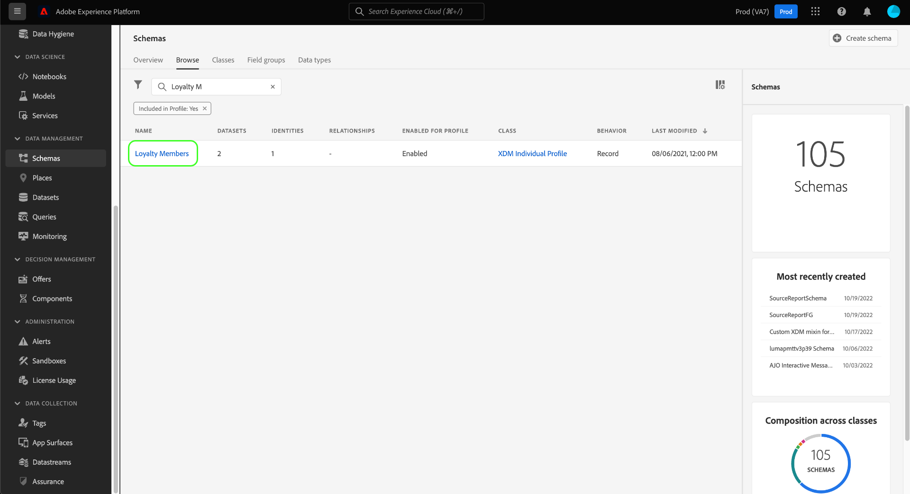

# Schema&#39;s maken en bewerken in de gebruikersinterface

Deze handleiding biedt een overzicht van het maken, bewerken en beheren van XDM-schema&#39;s (Experience Data Model) voor uw organisatie in de gebruikersinterface van Adobe Experience Platform.

>[!IMPORTANT]
>
>De schema&#39;s XDM zijn uiterst aanpasbaar, en daarom kunnen de stappen betrokken bij het creëren van een schema variëren afhankelijk van welk soort gegevens u het schema wilt vangen. Dientengevolge, behandelt dit document slechts de basisinteractie u met schema&#39;s in UI kunt maken, en sluit verwante stappen uit zoals het aanpassen van klassen, groepen van het schemagebied, gegevenstypes, en gebieden.
>
>Voor een volledige tour van het proces van de schemaverwezenlijking, volg samen met [schemaverwezenlijking leerprogramma](../../tutorials/create-schema-ui.md) om een volledig voorbeeldschema tot stand te brengen en met de vele mogelijkheden van [!DNL Schema Editor] vertrouwd te maken.

## Vereisten

Deze handleiding vereist een goed begrip van XDM System. Verwijs naar [XDM overzicht](../../home.md) voor een inleiding aan de rol van XDM binnen het ecosysteem van het Experience Platform, en de [grondbeginselen van schemacompositie](../../schema/composition.md) voor een overzicht van hoe de schema&#39;s worden geconstrueerd.

## Een nieuw schema maken {#create}

Selecteer **[!UICONTROL Create schema]** in de werkruimte [!UICONTROL Schemas] in de rechterbovenhoek. In het vervolgkeuzemenu dat wordt weergegeven, kunt u kiezen tussen **[!UICONTROL XDM Individual Profile]** en **[!UICONTROL XDM ExperienceEvent]** als basisklasse voor het schema. U kunt ook **[!UICONTROL Browse]** selecteren in de volledige lijst met beschikbare klassen of [een nieuwe aangepaste klasse maken](./classes.md#create).

Nadat u een klasse hebt geselecteerd, wordt [!DNL Schema Editor] weergegeven en wordt de basisstructuur van het schema (opgegeven door de klasse) weergegeven op het canvas. Van hier, kunt u het juiste spoor gebruiken om **[!UICONTROL Display name]** en **[!UICONTROL Description]** voor het schema toe te voegen.

U kunt nu beginnen de structuur van het schema te bouwen door [groepen van het schemagebied toe te voegen](#add-field-groups).

## Een bestaand schema bewerken {#edit}

>[!NOTE]
>
>Als een schema eenmaal is opgeslagen en gebruikt in gegevensinvoer, kunnen er alleen additieve wijzigingen in worden aangebracht. Zie [regels van schemaevolutie](../../schema/composition.md#evolution) voor meer informatie.

Als u een bestaand schema wilt bewerken, selecteert u het tabblad **[!UICONTROL Browse]** en selecteert u vervolgens de naam van het schema dat u wilt bewerken.

>[!TIP]
>
>Met de zoek- en filtermogelijkheden van de werkruimte kunt u het schema gemakkelijker vinden. Zie de handleiding bij [het verkennen van XDM-bronnen](../explore.md) voor meer informatie.

Nadat u een schema hebt geselecteerd, wordt [!DNL Schema Editor] weergegeven met de structuur van het schema die op het canvas wordt weergegeven. U kunt nu [veldgroepen toevoegen](#add-field-groups) aan het schema, [namen van veldvertoningen bewerken](#display-names) of [bestaande aangepaste veldgroepen bewerken](./field-groups.md#edit) als het schema een van de volgende toepassingen gebruikt.

## Veldgroepen toevoegen aan een schema {#add-field-groups}

>[!NOTE]
>
>In deze sectie wordt beschreven hoe u bestaande veldgroepen aan een schema kunt toevoegen. Als u een nieuwe aangepaste veldgroep wilt maken, raadpleegt u de handleiding bij [het maken en bewerken van veldgroepen](./field-groups.md#create).

Nadat u een schema hebt geopend in de [!DNL Schema Editor], kunt u velden toevoegen aan het schema door veldgroepen te gebruiken. Selecteer **[!UICONTROL Add]** naast **[!UICONTROL Field groups]** in de linkertrack om te beginnen.

Er wordt een dialoogvenster weergegeven met een lijst met veldgroepen die u voor het schema kunt selecteren. Aangezien de gebiedsgroepen slechts met één klasse compatibel zijn, slechts die gebiedsgroepen die met de geselecteerde klasse van het schema worden geassocieerd zullen worden vermeld. Standaard worden vermelde veldgroepen gesorteerd op basis van hun populariteit in uw organisatie.

Als u de algemene activiteit of het bedrijfsgebied van de gebieden kent u wilt toevoegen, selecteer één of meerdere industrie verticale categorieën in de linkerspoorstaaf om de getoonde lijst van gebiedsgroepen te filtreren.

>[!NOTE]
>
>Voor meer informatie over beste praktijken voor industrie-specifieke gegevensmodellering in XDM, zie de documentatie over [de modellen van industriegegevens](../../schema/industries/overview.md).

U kunt de zoekbalk ook gebruiken om de gewenste veldgroep te zoeken. Veldgroepen waarvan de naam overeenkomt met de query, worden boven in de lijst weergegeven. Onder **[!UICONTROL Standard Fields]** worden veldgroepen weergegeven die velden bevatten die de gewenste gegevenskenmerken beschrijven.

Schakel het selectievakje in naast de naam van de veldgroep die u aan het schema wilt toevoegen. U kunt meerdere veldgroepen in de lijst selecteren, waarbij elke geselecteerde veldgroep in de rechtertrack verschijnt.

>[!TIP]
>
>Voor elke vermelde veldgroep kunt u het informatiepictogram () aanwijzen of activeren om een korte beschrijving weer te geven van het type gegevens dat de veldgroep vastlegt. U kunt het voorvertoningspictogram () ook selecteren om de structuur van de gebieden te bekijken die de gebiedsgroep verstrekt alvorens u besluit om het aan het schema toe te voegen.

Nadat u de veldgroepen hebt gekozen, selecteert u **[!UICONTROL Add field groups]** om deze aan het schema toe te voegen.

De [!DNL Schema Editor] verschijnt opnieuw met de door de veld-groep verschafte velden die op het canvas worden weergegeven.

## Een schema voor realtime klantprofiel inschakelen {#profile}

[Klantprofielen ](../../../profile/home.md) in real time komen gegevens uit verschillende bronnen voor om een volledig overzicht van elke individuele klant te maken. Als u de gegevens wilt die door een schema worden gevangen aan dit proces deelnemen, moet u het schema voor gebruik in [!DNL Profile] toelaten.

>[!IMPORTANT]
>
>Om een schema voor [!DNL Profile] toe te laten, moet het een primair bepaald identiteitsgebied hebben. Zie de handleiding bij [het definiëren van identiteitsvelden](../fields/identity.md) voor meer informatie.

Als u het schema wilt inschakelen, selecteert u eerst de naam van het schema in de linkertrack en vervolgens de **[!UICONTROL Profile]**-schakeloptie in de rechterrail.

Er verschijnt een pop-upvenster met de waarschuwing dat een schema dat is ingeschakeld en opgeslagen, niet kan worden uitgeschakeld. Selecteer **[!UICONTROL Enable]** om door te gaan.

Het canvas verschijnt weer met de schakeloptie [!UICONTROL Profile] ingeschakeld.

>[!IMPORTANT]
>
>Aangezien het schema nog niet wordt opgeslagen, is dit het punt van geen terugkeer als u uw mening over het laten van het schema aan het Profiel van de Klant in real time verandert: wanneer u een ingeschakeld schema hebt opgeslagen, kan het niet meer worden uitgeschakeld. Selecteer opnieuw de **[!UICONTROL Profile]** knevel om het schema onbruikbaar te maken.

Als u het proces wilt voltooien, selecteert u **[!UICONTROL Save]** om het schema op te slaan.

Het schema is nu ingeschakeld voor gebruik in het Real-time profiel van de Klant. Wanneer het Platform gegevens in datasets opneemt die op dit schema worden gebaseerd, zullen die gegevens in uw samengevoegde gegevens van het Profiel worden opgenomen.

## Weergavenamen voor schemavelden bewerken {#display-names}

Nadat u een klasse hebt toegewezen en veldgroepen aan een schema hebt toegevoegd, kunt u de weergavenamen van de velden van een schema bewerken, ongeacht of die velden zijn voorzien door standaard- of aangepaste XDM-bronnen.

>[!NOTE]
>
>Onthoud dat de weergavenamen van velden die tot standaardklassen of -veldgroepen behoren, alleen kunnen worden bewerkt in de context van een specifiek schema. Met andere woorden, het veranderen van de vertoningsnaam van een standaardgebied in één schema beïnvloedt andere schema&#39;s niet die de zelfde bijbehorende klasse of de gebiedsgroep gebruiken.
>
>Zodra u veranderingen de vertoningsnamen voor de gebieden van een schema aanbrengt, worden die veranderingen onmiddellijk weerspiegeld in om het even welke bestaande datasets die op dat schema worden gebaseerd.

Als u de weergavenaam van een schemaveld wilt bewerken, selecteert u het veld op het canvas. Geef in de rechtertrack de nieuwe naam op onder **[!UICONTROL Display name]**.

Selecteer **[!UICONTROL Apply]** in het rechterspoor, en het canvas werkt bij om de nieuwe vertoningsnaam van het gebied te tonen. Selecteer **[!UICONTROL Save]** om de wijzigingen op het schema toe te passen.

## De klasse van een schema wijzigen {#change-class}

U kunt de klasse van een schema op om het even welk punt tijdens het aanvankelijke samenstellingsproces veranderen alvorens het schema is bewaard.

>[!WARNING]
>
>Het opnieuw toewijzen van de klasse voor een schema zou met uiterste voorzichtigheid moeten worden gedaan. Veldgroepen zijn alleen compatibel met bepaalde klassen. Als u de klasse wijzigt, worden het canvas en alle velden die u hebt toegevoegd opnieuw ingesteld.

Als u een klasse opnieuw wilt toewijzen, selecteert u **[!UICONTROL Assign]** aan de linkerkant van het canvas.

Er wordt een dialoogvenster weergegeven met een lijst met alle beschikbare klassen, inclusief alle klassen die door uw organisatie zijn gedefinieerd (de eigenaar is &quot;[!UICONTROL Customer]&quot;) en standaardklassen die door Adobe zijn gedefinieerd.

Selecteer een klasse in de lijst om de beschrijving ervan aan de rechterkant van het dialoogvenster weer te geven. U kunt ook **[!UICONTROL Preview class structure]** selecteren om de velden en metagegevens weer te geven die aan de klasse zijn gekoppeld. Selecteer **[!UICONTROL Assign class]** om door te gaan.

Er wordt een nieuw dialoogvenster geopend waarin u wordt gevraagd te bevestigen dat u een nieuwe klasse wilt toewijzen. Selecteer **[!UICONTROL Assign]** om te bevestigen.

Nadat de klassewijziging is bevestigd, wordt het canvas opnieuw ingesteld en gaat alle compositievoortgang verloren.

## Volgende stappen

In dit document worden de basisbeginselen van het maken en bewerken van schema&#39;s besproken in de gebruikersinterface van het Platform. Het wordt sterk geadviseerd dat u [schemaverwezenlijking leerprogramma](../../tutorials/create-schema-ui.md) voor een uitvoerige werkschema voor het bouwen van een volledig schema in UI, met inbegrip van het creëren van de groepen van het douanegebied en gegevenstypes voor unieke gebruiksgevallen controleert.

Voor meer informatie over de mogelijkheden van de [!UICONTROL Schemas] werkruimte, zie [[!UICONTROL Schemas] werkruimteoverzicht](../overview.md).

Om te leren hoe te om schema&#39;s in [!DNL Schema Registry] API te beheren, zie [schemaeindpuntgids](../../api/schemas.md).
